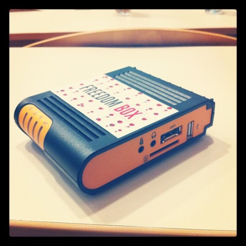

Yesterday was Webcamp time again and the creme de la creme of the [Slovenia](<http://maps.google.com/maps?ll=46.05,14.5&spn=10.0,10.0&q=46.05,14.5 (Slovenia)&t=h> "Slovenia") web scene gathered to bang chests and feel awesome.

\[caption id="" align="alignright" width="300" caption="Freedom Box"]\[/caption]

Or ... well ... a bunch of geeks who had nothing better to do on a Saturday.

There were a bunch of great talks by some marvelous people and I especially liked that there were once more [lightning talks](http://en.wikipedia.org/wiki/Lightning_Talk "Lightning Talk") to finish the day off. Can't remember when was the last time we managed to have those ... actually, I think the last time might have been the original two Barcamps that set off the meme of [unconferences](http://en.wikipedia.org/wiki/Unconference "Unconference") in [Ljubljana](<http://maps.google.com/maps?ll=46.0555555556,14.5083333333&spn=0.1,0.1&q=46.0555555556,14.5083333333 (Ljubljana)&t=h> "Ljubljana").

If I can say that it's a meme since to my knowledge they're organized by the one and only [@gandalfar](http://twitter.com/gandalfar). That guy could make 20 people show up to watch paint dry!

There were two talks that really stuck in my mind. [@jamesvasile](http://twitter.com/jamesvasile) talking about Freedom Box and [@andraz](http://twitter.com/andraz) talking about ... something. I think the point of his talk was mostly that nontechnical founders \[of anything] should prove themselves before pestering technical people to do the heavy lifting and conversely that technical people should be much much more averse to doing heavy lifting and should try their best to reuse whatever crap they can find online.

Really I think he was just talking about what everybody is talking these days, but wrapping it up in shiny pictures and his cool way of presenting stuff.

The Freedom Box by [@jamesvasile](http://twitter.com/andraz) was a much more groundbreaking concept. It's this box thingy that hooks up between your internets provider and the main router for the hosue and automagically makes sure all the data oozing out of your every port is encrypted and somewhat secure.

\[caption id="" align="alignleft" width="300" caption="Angry Birds reception desk"]\[/caption]

An even more interesting concept is that of making self signed certificates trustworthy by embedding a [public key](http://en.wikipedia.org/wiki/Public-key_cryptography "Public-key cryptography") that can be looked up and your identity confirmed ... then there was something about splitting up your key between a lot of friends so each individual doesn't have enough info to attack you, but together they can still stage an intervention ... didn't quite understand that bit.

Oh and apparently there's this new python CMS called [Plone](http://plone.org/ "Plone (software)") that isn't in fact new, but does happen to be used by a lot of the big players that need high security and awesomeness. Can't remember the twitter handle of whomever was presenting this, sorry.

I also want to say that as far as my end is concerned, my talk about _Tools that get you laid_(express.js, backbone.js, underscore.js and ejs and ejs) went quite well. For some reason all the seats in the room were full ... I think people expected something far more interesting to happen than me talking about the technical crap I use to build pet projects.

If anyone's interested, here are the hastily assembled super boring slides with no pictures from my talk:

**[Tools that get you laid](http://www.slideshare.net/Swizec/tools-that-get-you-laid "Tools that get you laid")** 

View more [presentations](http://www.slideshare.net/) from [Swizec Teller](http://www.slideshare.net/Swizec)

See you all next time!

