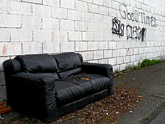

A year ago, to the day, I was sitting in [Om Malik](http://en.wikipedia.org/wiki/Om_Malik)'s office in [San Francisco](<http://maps.google.com/maps?ll=37.7793,-122.4192&spn=0.1,0.1&q=37.7793,-122.4192 (San%20Francisco)&t=h> "San Francisco"). We were discussing a possible writeup about Preona/[LazyReadr](http://yukaii.com/web/lazyreadr/) on [GigaOM](http://www.gigaom.com "Om Malik").

\[caption id="" align="alignright" width="300" caption="postme.me 2nd batch"]\[/caption]

I know it was exactly a year ago because I remember saying something like _"Oh I'm 23 ... wait, I'm 23 TODAY!"_ when he asked how old I was.

About a year before I set out on a voyage that would cement my decision to do [startups](http://en.wikipedia.org/wiki/Startup_company "Startup company"). With the help of some ultra early investorvisers (adviser+investor) I founded my first company and plunged off the deep end; fully expecting to build the plane before my head smashed into the jagged rocks below.

I'd been working practically full time on [Twitulater](http://twitulater.com/ "Twitulater") beforehand, but this was different, this evolved out of that original nugget and I remember thinking to myself "_Shit just got real brah!"_

And it did, it did get real! I was ready to face anything anyone would throw at me. People were saying it's not all fun and games, that startup life is more like a roller coaster. Sure, it was difficult, there were hard times building a product, getting our first government grant ... rebuilding the product again from scratch over that summer because [the iPad](http://www.apple.com/ipad/ "iPad") came out and completely changed the landscape ...

Those two weeks last October - looking for funding in the US, mingling with the [YC](http://www.ycombinator.com "Y Combinator") crowd, going to awesome conferences ... I felt like I was on top of the world! _"Everything I touch turns into gold!",_I thought. Hell, out of all the seasoned veterans in that first [Brezmejnik](http://www.brezmejnik.si/) batch we got the furthest with investors. Us, the young grasshoppers who but a month earlier looked like they wouldn't even have anything to pitch, we got to a verbal "yes" to participate in a round if we can pull it together.

## A lot has changed since then ...

We did not, in fact, manage to pull together a round. The fact I hadn't been making any money (full time startup plus a full time student, yeah, it doesn't work) eventually caught up with me. Around December the first rat fled the ship. Just up and stopped responding to emails.

\[caption id="" align="alignleft" width="300" caption="Image via Wikipedia"][")](http://en.wikipedia.org/wiki/File:RHP-Rollercoaster.jpg)\[/caption]

Then the fighting between cofounders started. It wouldn't even be that bad if there was actual fighting. It was one of those quiet disputes that smack you when you aren't looking.

At some point we stopped talking for three weeks.

_"The product will save us!"_, I thought, _"I need to make the fucking product! I'll finish it myself if I have to!"_

And I did try, for that month, month and a half, I was doing all the frontend and backend programming and trying to figure out where we could muster some money. Instead, I should be acting like a CEO and hiring people. _Actually_ finding money. Realising the product cannot be finished before our negative runway becomes more than [@skatey](http://twitter.com/skatey) can keep up with doing consulting.

Around February Skatey and our investorvisers decided that the shit has gone far enough. Swizec is an idiot, he can't code for shit, he sucks at getting money, why do we even need him? Plus he isn't paying off that debt arising from company expenses he owed to Skatey.

How could I? I was pulling 80+ hour workweeks trying to keep up with all the coding and the exam season was upon me. I had that pesky school to finish!

## They kicked me out.

I was able to negotiate the nullification of my debt to Skatey, but this still left me about 2000 euro in debt.

2000 euro may not sound like a lot, but out of all the work the previous year I think about 800 euro made it into my pocket - I bought a phone and some clothes. Everything else went into the startup either directly or by keeping me from dying of starvation.

What's more, the debt was due in four months ... I was practically bankrupt. If it wasn't for the pasta investment from my parents I'd be forced to live on the street.

Here I was, 23, bankrupt, startup up in flames, the shredded remains of a guy who once thought he could take on the world and win.

I was fed up with my life and myself. I was just about ready to pretty much check out ... if not literally then at least figuratively, kill this blog, kill my twitter account, everything, just get away from the world. I did the next best thing and broke up with my girlfriend of three years. In fact I cheated on her and _then_ broke up with her.

Not the proudest moment of my life.

## It got better

Around that time I also launched [HipsterVision](http://hipstervision.org) ... a fun little project to put me in a better mood. It even got a decent amount of traffic and if I remember correctly at some point got picked up by the [BBC](http://www.bbc.co.uk/ "BBC") on a show about hot new tools online.

But I had no energy to sustain growth. No ideas on how to get more traffic. No brainpower left to even contemplate making anything serious out of that project. Most of all, I simply couldn't afford to work on anything other than quickly getting some job that will enable me to pay off my debts by June, the deadline.

It was April.

\[caption id="" align="alignright" width="240" caption="Image by Matt Niemi via Flickr"]\[/caption]

I did in fact manage to find such a job. But I was miserable, there was nothing about Slovenia that could cheer me up, I had to get away somehow, anyhow, whatever way possible. I wanted to go to the US over the summer, if push comes to shove, I'll go there without money and find a freelancing gig.

A month later the offer from [DoubleRecall](http://doublerecall.com/#top) came that I can join them in [Palo Alto](<http://maps.google.com/maps?ll=37.4291666667,-122.138055556&spn=0.1,0.1&q=37.4291666667,-122.138055556 (Palo%20Alto%2C%20California)&t=h> "Palo Alto, California") during their YC experience.

I ditched my job. Just stopped responding to emails.

Another not very proud moment in my life. It was a soul sucking lucrative job with a bad culture fit. But ditching them like that wasn't a very nice thing to do.

But I paid off my debt by June. Nobody would come knocking at the door to take my socks!

## It is now October.

I'm not quite at the same heights I was a year ago. The [exam fiasco](http://swizec.com/blog/i-suck-at-formal-education-or-does-education-suck/swizec/2564 "I suck at \[formal] education or does education suck?") that was September didn't do much for my mood, but at least I'm not in too much shit financially. Two weeks ago I launched [Postme.me](http://postme.me), which has so far brought in infinitely more profits straight from users than all my previous projects combined. The Startup included.

Actually I think I'm doing pretty great right now.

[Postme.me](http://postme.me) is doing well and getting better, this blog is getting increasingly more traffic, I have two freelancing offers from cool startups in San Francisco on my plate (gonna have to pick), and I'm well set to graduate by next September and free myself geographically.

Definitely the hardest year of my life, but I wouldn't have it any other way.

###### Related articles

- [I couldn't get into YC so I joined a startup that did](http://swizec.com/blog/i-couldnt-get-into-yc-so-i-joined-a-startup-that-did/swizec/1855) (swizec.com)
- [There are so many options now for fledgling startups now for seed investment and advice - YCombinators, Tech Stars, 500 Startups, etc. Should one pursue them all? Is one better than the rest? Does geography of where one is matter? Thanks in advance for](http://bijansabet.com/post/11734181174/there-are-so-many-options-now-for-fledgling-startups) (bijansabet.com)
- [The Previously Strong Startup Employee That Is No Longer Effective](http://davidcummings.org/2011/10/24/the-previously-strong-startup-employee-that-is-no-longer-effective/) (davidcummings.org)
- [Doing a startup taught me the value of staying in school](http://swizec.com/blog/doing-a-startup-taught-me-the-value-of-staying-in-school/swizec/1819) (swizec.com)

