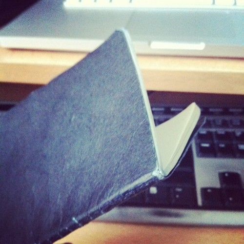
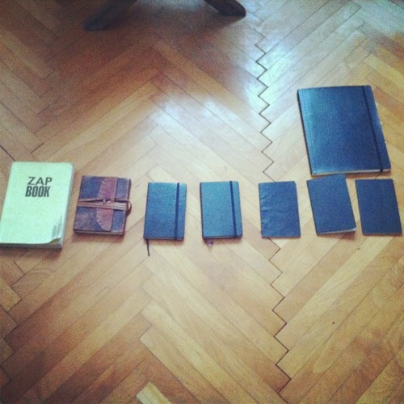

\[caption id="" align="alignright" width="300" caption="Notebook :P"]\[/caption]

Ever since I was a wee lad I thought I might one day write an epic book that at least two people will read. I realize now it's difficult to write a book when you're coding all the time.

The internet doesn't help either.

However something good did come out of this obsession with writing - at some point in high school I realized it would be incredibly useful to always keep a notebook on hand to jot down any idea that might pop up at an unexpected time.

And so the notebook fetishism began.

My first pocket notebook looked more like a collection of post-it notes inside a cardboard case thing. Of course it proved unwieldy to keep in my pocket and needless to say it eventually broke down so much it seems I've thrown it out ... can't find it anywhere.

Here's all the notebooks that survived through the years, ordered roughly in chronologically. The right-most three I'm using right now (the big one and two under it) ... ok, actually the totally rightmost one is still waiting to begin its career. There's also a fake moleskine in there; that first black notebook from the left.

\[caption id="" align="alignnone" width="500" caption="Notebooks! About 4 missing due to utter death"]\[/caption]

It's taken me _years_ to discover the wonder that is [Moleskine](http://www.moleskine.com/ "Moleskine"). Now sure, some might say it's an overpriced notebook designed to take money away from hapless hipsters.

But I think Moleskine is really the [Apple](http://www.apple.com "Apple") of notebooks, which again will say to most people that it's an overpriced piece of kit designed to take money away from hapless hipsters. Their latest PR blunder aside, I have to say I really love these things - probably won't be buying any other brand in the foreseeable future.

At least not for the ones I like to keep in my pocket. That big moleskine right there? Yeah, that was kind of stupid, sure I love it to bits, but _17 euro_ for a notebook with ~200 pages that for some reason isn't even hardcover? O.o

Moleskine just seems to care more about details than most other notebooks I've tried. Where else does each notebook come with a tracking number and a note that should there be anything funky, you should just report _that particular_ notebook and the particular quality assurance person in charge of that particular notebook will be thwapped over the nose?

I'm sure the marketing story coming with each notebook is bullshit, but it feels nice that they even care enough to include it.

However, the ultimate test came when I started using the ultra skinny ones. You know, the one you can _actually_ keep in your backpocket at all times so you literally never find yourself without a notebook as long as you aren't naked.

\[caption id="" align="alignnone" width="500" caption="Two months in the backpocket"]\[/caption]

Kept it there, nice and cosy next to my arse, for two months every day. Sat on it, sweated on it when it was hot and I was in a hurry, did unspeakably horrible things to it ... nothing happened. Sure it looks battered and the covers are bent and crinkley. But not a single paper fell out, the stitching is still perfect ... the cover didn't even start layering!

Any other notebook I've had felt like it was about to die after a week of staying in my pocket ... papers starting to fall out, the back breaking ... things like that.

Anyone else a fan of notebooks that just work?

###### Related articles

- [Notably Cute Notebooks](http://www.fabsugar.com/Notably-Cute-Notebooks-39487) (fabsugar.com)
- [Mini Review: Rhodia 5×5 Grid Pad No. 10](http://nopenintended.wordpress.com/2011/10/15/mini-review-rhodia-5x5-grid-pad-no-10/) (nopenintended.wordpress.com)
- [A Little House Notebook](http://practicalpages.wordpress.com/2011/10/12/a-little-house-notebook/) (practicalpages.wordpress.com)
- [Moleskine Alternatives For GTD Hacking](http://www.newcommbiz.com/moleskine-alternatives-for-gtd-hacking/) (newcommbiz.com)
- [Notes on notebooks](http://r.zemanta.com/?u=http%3A//www.guardian.co.uk/books/booksblog/2011/jul/07/notebooks-euchtterm1917-moleskine&a=48111636&rid=dc5e50b1-edaa-44e7-973a-9d2ca31bb15a&e=baf2d7bbfdb45fbc4d8b138bbfe622d2) (guardian.co.uk)

