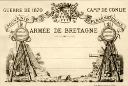

The first [postcard](http://en.wikipedia.org/wiki/Postcard "Postcard") is said to have appeared in 1840 - it was a hand painted design on a piece of thick paper, sent with a penny black stamp to the writer [Theodore Hook](http://en.wikipedia.org/wiki/Theodore_Hook "Theodore Hook"). \[caption id="" align="alignright" width="250" caption="First postcard"]\[/caption] Since then not much has changed, the stock image postcards appeared in1848 as part of some sort of advertising. The modern postcard was born around 1870 when [Camp Conlie](http://en.wikipedia.org/wiki/Camp_Conlie "Camp Conlie") started offering stock postcards with photos of the place to send home as a memory. _tl;dr -> [postme.me](http://postme.me) is making postcards cool again_ And that pretty much cemented the fate of the postcard. For the past 140 years they have mostly been seen as a way to send a picture of where you were for vacation back home to family or friends. The most variance happens in the form of holiday greeting cards, sometimes you'll see a postcard with a cheesy joke as well ... I think I've seen all 10 already. And they're the kind of joke your dad finds funny. That's it. _That_ is a _five billion dollar industry_. Or so I've heard ... either way, something as lame as that is big business. How nobody has gone and poked in this hive before is beyond belief. Then suddenly, in early 2011, disruptors start popping up. Suddenly everyone thinks you should be able to send postcards electronically and easily. Just take a photo with your iphone or something, click a few buttons, and voila, some hapless victim gets a nice postcard. Now you can go on vacation and send back home what you actually see. A beautiful picture, filtered to the 70's, and everybody is happy. [Sincerely even got a 3 million dollar investment](http://techcrunch.com/2011/10/26/sincerely-raises-3-million-to-deliver-real-world-postcards-holiday-cards-on-the-way/) last week for doing just that - letting people send boring postcards more easily. There's also [picplum](https://www.picplum.com/), which lets people mail gorgeously printed photos and was funded by YC this summer. Boring. A huge 140 year old industry and the best disruption we can come up with is making it marginally easier to use? What the hell is wrong with everyone!? There is a whole generation of people coming out of college and into the working world right now who have grown up with the internet. A generation of people who don't really care about holiday greetings or sending memories of their travels to family. But we share _so many_ pictures every freaking day. Imgur is booming right now, it's the 4chan for the everyman and it is absolutely brimming with silly pictures ... often seasonal and very meaningful pictures. When my friend had a birthday two weeks ago she didn't get a single [greeting card](http://en.wikipedia.org/wiki/Greeting_card "Greeting card"). She got ten silly pictures on facebook and somebody even made her a custom rage comic. That's right, a rage comic just to wish her a happy birthday. But that comic will be gone in the millions of other pictures within months. Or maybe she downloaded it and it will be gone in 5 years when her hard drive fails. Perhaps 10 years if she's really careful with backups. (not to mention the thousands other pictures vying for the same sliver of attention on that hard drive) What if instead she got that rage comic as a postcard, delivered to her address in all its glory, ready to be pinned on a wall? I think it would be much awesomer. What about Christmas? I haven't gotten or sent a christmas card in so long I can hardly remember the tradition existing. But every year I see hundreds of funny pictures on the topic of Christmas donning the internets. I think it would be superb if some of those made it onto postcards to my friends. When I started [postme.me](http://postme.me) I didn't have a vision, I just wanted to make something fun. But I think there is an underlying reason why everyone likes the idea so much, young people don't care about boring, we want fun postcards.

###### Related articles

-   [Postcards From The Edge](http://blog.firstchoice.co.uk/postcards-from-the-edge/) (firstchoice.co.uk)
-   [Postcard Posers - February](http://blogs.ancestry.com/uk/2011/02/10/postcard-posers-february/) (blogs.ancestry.com)
-   [I sent the "man with a restless spirit" a postcard](http://gemakarolina.wordpress.com/2011/10/31/i-sent-the-man-with-a-restless-spirit-a-postcard/) (gemakarolina.wordpress.com)
-   [Create & Send A Real Postcard With Your Phone Using Postcard On The Run](http://www.makeuseof.com/tag/create-send-real-postcard-phone-postcard-run/) (makeuseof.com)
-   [Vintage Halloween: Haunted Postcards from the 1910s](http://www.brainpickings.org/index.php/2011/10/31/nypl-vintage-halloween-postcards/) (brainpickings.org)

