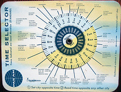

\[caption id="" align="alignright" width="240" caption="Image by Telstar Logistics via Flickr"]\[/caption]

A couple of days ago I started refactoring some code to handle [timezones](http://en.wikipedia.org/wiki/Lists_of_time_zones "Lists of time zones") better. The problem manifests as a single time appearing at different times in different parts of the application. Granted, a lot of it is more of a UX problem along the lines of my rant on why [computers don't handle timezones intuitively](http://swizec.com/blog/why-dont-computers-understand-timezones/swizec/2288 "Why don’t computers understand timezones?"). But there's a deeper issue with the fact that the codebase is handling timezones rather naively. Until a week ago I would have done it exactly the same way.

## Naive approach

Usually when people first implement timing in an application they (or rather we) don't really care about timezones. You just take a timestamp and store it in a database. This suffices for most use cases ... sure the times are in whatever timezone your server is set to but as long as you're using the same server for everything and you're only using times for timestamps when objects were inserted into the database and for logging ... It's just not a problem. Then you are faced with a distributed environment and suddenly all those timestamps start acting funny, or maybe you have users in different timezones and you want to display times to them. Still an easy problem to solve; just handle all times as UTC internally and translate to the proper timezone when producing outputs. Easy as pie right? And then you notice strange things happen around daylight savings. Suddenly 3am happens twice on the 31st of October in Slovenia ... but the same thing only happens a week later in the US. And some states in the US don't even observe [DST](http://en.wikipedia.org/wiki/Daylight_saving_time "Daylight saving time") and now what do you do?

## pyTZ

Those ambiguous periods are the main thing pytz takes care of. To be perfectly honest I never even considered this problem before reading the documentation and having my mind blown. There's just so much intricacies over keeping up to date on what each timezone is doing and what particular timezone a user is in right now ... it's insane! Even though [pytz](http://pypi.python.org/pypi/pytz) claims they don't take care of ambiguous periods like Poland rewinding their clocks half an hour in 1915 to start using [CET](http://en.wikipedia.org/wiki/Central_European_Time "Central European Time"), they're still pretty vital for everything else. Of course you'll still want to handle all times internally as UTC otherwise doing time arithmetic can get quite hairy, although pytz can supposedly handle that too ... but at least now it should be possible to correctly get the [UTC time](http://en.wikipedia.org/wiki/Coordinated_Universal_Time "Coordinated Universal Time") out of user input and then correctly display the result. An example:

    from datetime import datetime
    from pytz import *

    eastern = timezone('US/Eastern')
    loc_dt = eastern.localize(datetime(2011, 11, 2, 7, 27, 0))
    print loc_dt
    # 2011-11-02 07:27:00-04:00

    ljubljana = timezone("Europe/Ljubljana")
    print loc_dt.astimezone(ljubljana)
    # 2011-11-02 12:27:00+01:00

## Conclusion

Turns out there's much more to timezones than one might think. Just goes to show why all those _other_ coders are spending so much time on trivial stuff ... nothing is really trivial. Nothing. And let's not even get into [leap seconds](http://en.wikipedia.org/wiki/Leap_second "Leap second").

###### Related articles

-   [Dealing with Timezones in Python](http://lucumr.pocoo.org/2011/7/15/eppur-si-muove/) (lucumr.pocoo.org)
-   [Timestamps and timezones...](http://thebloggingpath.com/2011/08/28/timestamps-and-timezones/) (thebloggingpath.com)
-   [Just Say No to Online Calendars...](http://www.sebastianmarshall.com/just-say-no-to-online-calendars) (sebastianmarshall.com)
-   [What every programmer should know about time](http://unix4lyfe.org/time/) (unix4lyfe.org)

