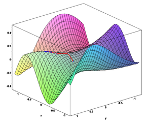

You know how most programmers find functional coding to be ever so slightly mind bending and how it's somewhat difficult to wrap one's head around working with variables whose state you cannot change and lazy evaluations and all manner of odd things?


\[caption id="" align="alignright" width="300" caption="Image via Wikipedia"][](http://commons.wikipedia.org/wiki/File:Gradient_ascent_%28surface%29.png)\[/caption]


The thing I've had most trouble with and still do actually, is coding in a functionally clean manner, using more recursion, cleaner abstractions and so on. Just as I thought I was almost starting to get kind of good at this, a bunch of people proved me wrong when I [crowdsourced some elegance](http://swizec.com/blog/crowdsourcing-elegance/swizec/2608 "Crowdsourcing elegance").


Yeah, some people are _really_ good at this functional stuff.


And then one day ml-class introduced me to [mathematical programming](http://en.wikipedia.org/wiki/Optimization_%28mathematics%29 "Optimization (mathematics)") with Octave. Sure, I've done some Octave before at school, but that was just enough to get my feet wet - basic syntax and stuff. Or maybe I just paying enough attention to really grasp the awesome things I was being shown.


Either way, I feel as if over the past two weeks, doing [machine learning](http://en.wikipedia.org/wiki/Machine_learning "Machine learning") homework in Octave has opened a whole new world of striving for elegance and purity in my code. If I thought functional was mindbending, this stuff is _ripping my face off_.


Apparently when you take a naive loop and make it into something beautiful it's called vectorization in this field. The interesting bit here is that all you really need to perform optimization of epic proportions is some math fu, no translating the problem into something else, no looking at it from five different perspectives ... just maths and then some.


Using the [gradient descent](http://en.wikipedia.org/wiki/Gradient_descent "Gradient descent") algorithm for [logistic regression](http://en.wikipedia.org/wiki/Logistic_regression "Logistic regression") as an example, in particular calculating the cost function:


\[caption id="attachment_2867" align="alignnone" width="647" caption="Professor Ng explaining the cost function"][](./img/blog-wp-content-uploads-2011-11-Screen-Shot-2011-11-04-at-12.32.27-PM.png)\[/caption]


Although I think this might have been exactly the perfect example for the code below ... it's difficult to search through videos for this stuff.


The naive approach could be something like this (didn't actually run the code):

```
J = 0;
for i = 1:m
  J += =y(i)*log(sigmoid(theta*X(i,:))-(1-y(i)*log(1-sigmoid(theta*X(i,:));
end

J = J/m;

for j = 1:size(theta)
   grad(j) = 0;
   for i = 1:m
      grad(j) += (sigmoid(theta*X(i,:))-y(i))*X(i,j);
   end
   grad(j) = grad(j)/m;
end
```

But all those lops aren't really necessary, all they are basically doing is [matrix multiplication](http://en.wikipedia.org/wiki/Matrix_multiplication "Matrix multiplication"), which gives us a nice way to vectorize the whole thing:

```
J = (1/m)*sum(-y'*log(sigmoid(X*theta))-(1-y')*log(1-sigmoid(X*theta)));

grad = (1/m)*(sigmoid(X*theta)-y)'*X;
```

The difference in elegance absolutely blows my mind and I can't wait to see what other wonders I discover through this Octave thing in the course of this semester.


Pretty much all my octave can be found in the [ml-class-homework repository](https://github.com/Swizec/ml-class-homework). But I'm sure I'll end up modeling more algorithms in this thing.

###### Related articles

- [12 steps to running gradient descent in Octave](http://flowingmotion.jojordan.org/2011/10/16/12-steps-to-running-gradient-descent-in-octave/) (flowingmotion.jojordan.org)
- [Machine Learning Ex4 - Logistic Regression](http://www.r-bloggers.com/machine-learning-ex4-%e2%80%93-logistic-regression/) (r-bloggers.com)
- [Machine Learning Ex 5.2 - Regularized Logistic Regression](http://www.r-bloggers.com/machine-learning-ex-5-2-%e2%80%93-regularized-logistic-regression/) (r-bloggers.com)

[](http://www.zemanta.com/ "Enhanced by Zemanta")