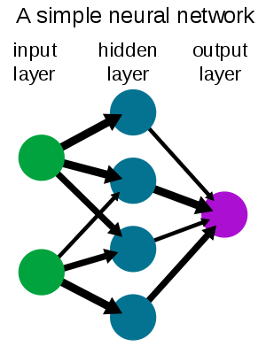

Last night I was consumed with watching lessons from the [online machine learning class at Stanford](http://ml-class.org). The topic was [neural networks](http://en.wikipedia.org/wiki/Neural_network "Neural network"), or rather the finer points of forward and [back propagation](http://en.wikipedia.org/wiki/Backpropagation "Backpropagation").

Every time I have wanted to learn how neural networks work it just didn't click. Anyone I asked mostly just waved their hands and said that something magical happens and ... but let's start at the beginning.

The basics of neural networks is that you have neurons that are connected to other neurons. At one end you enter your input data and on the other end the neural network produces some numbers according to what it has learned. Everyone can imagine this much and it's not really difficult to visualise.

It looks like a bunch of circles with arrows:

\[caption id="" align="aligncenter" width="300" caption="Image via Wikipedia"]\[/caption]

Anyone who's studied this a tad further can tell you the connections between neurons are very \\important and the weights associated with them are somehow used in calculating stuff. Not a hard concept to grasp - every neuron outputs a number that is multiplied with the weight on each connection before being fed as an input into the next neuron.

Where it always got a bit hairy for me was trying to understand _what do the neurons do?_ The most I could get out of anyone supposedly knowing this stuff is that "it calcualtes stuff". Yes but _how? What_ does it do? What exactly?

Nobody knew.

Last night I finally figured it out! Neurons don't do anything. They don't even exist per se. In fact a neural network looks pretty damn odd inside a computer, it's really just a matrix of weights.

What happens when you're doing forward propagation (using a learned network) is simply this:

1. Take the outputs from the previous layer (a vector of numbers)
2. Multiply with a vector of weights (the arrows)
3. Apply the cost function (this becomes the new layer)

Then you just repeat this for all the layers and that's that. That is literally all that happens.

In the end you are left with a vector of numbers representing the output layer, which you then just have to correctly interpret.

The part I don't have completely figured out yet is the backpropagation. This is the bit where neural networks learn how to do their magic. Basically backpropagations sets those weights from step 2 via a simple [hill climbing algorithm](http://en.wikipedia.org/wiki/Hill_climbing "Hill climbing") ... it is essentially a way to calculate the gradient of the cost function so that you can correctly change the weights to achieve ever lower differences between what you're supposed to know and what you actually know. Eventually you hope to achieve a [global minimum](http://en.wikipedia.org/wiki/Maxima_and_minima "Maxima and minima"), but you are guaranteed to at least achieve a local minimum and not being able to tell whether it's global.

That's it. That is really all there is to it. Neural networks are just a nice way to visualise a sequence of matrix multiplications. And I guess it's easier to get grants for "neural networks" than "sequence of matrix multiplications" ...

###### Related articles

- [Tradeoffs and constraints on neural representation in networks of cortical neurons.](http://www.citeulike.org/user/fbaroni/article/7490581) (citeulike.org)
- [Training of Neural Network](http://vql89.wordpress.com/2011/10/26/training-of-neural-network/) (vql89.wordpress.com)
- [Unique Neural Networks Make Leo Trader Pro A Unique And Profitable Forex Trading System](http://joeyjardins.wordpress.com/2011/10/22/unique-neural-networks-make-leo-trader-pro-a-unique-and-profitable-forex-trading-system/) (joeyjardins.wordpress.com)
- [Artificial Intelligence Finds Fossil Sites](http://www.scientificamerican.com/article.cfm?id=artificial-intelligence-finds-fossil-sites) (scientificamerican.com)

