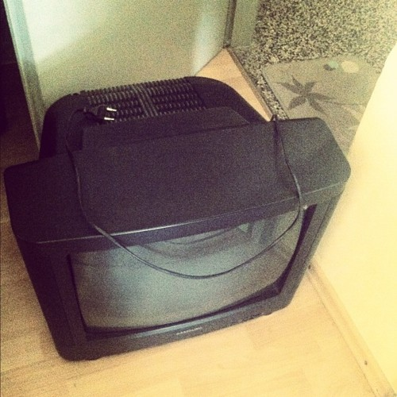
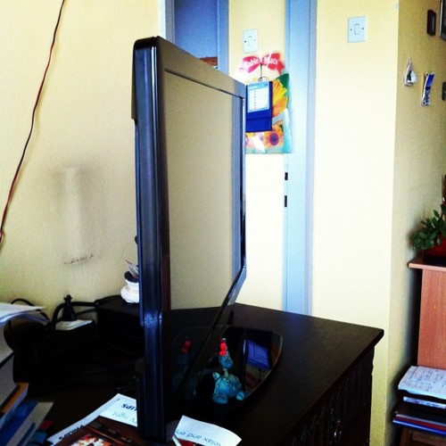

The television set I grew up with left our place yesterday. It's actually kind of odd, as my hometown has changed year to year, as I went to different schools, changed my computers, my tastes in culture, even most of the furniture I'm using ... the one thing that has always stayed the same was the family television set.

\[caption id="" align="alignright" width="350" caption="The old telly"]\[/caption]

I still sort of remember the shopping trip when we brought it home with my dad. I must have been around four years old, which would make that TV around twenty years old now.

Twenty long years.

And now it's gone. It went quietly, without fanfare, nobody gave it two thoughts. As simple as moving a big lump of glass and electronics and plastic down four flights of stairs without a lift. For the last year you even had to use a toothpick to turn on our dear telly, and lately the image was all flickery and without colour.

And then we plugged in the new one.

Holy mother of god, what televisions have done in the past 20 years! That thing is a freaking computer!

Hell, you have to politely ask it to recognise all manners of external devices, even the set-top-box needs to politely introduce itself! The menus and dials indicate that something as simple as a sound system needs a warm introduction as well.

\[caption id="" align="alignleft" width="350" caption="Sexy new telly"]\[/caption]

Yep, that telly rules the living room and _it knows it_. I'm sure whenever the television is off it sings _[sexy and I know it](http://www.youtube.com/watch?v=wyx6JDQCslE&ob=av3e)_ quietly in its own ear.

The most technologically interesting bit I've found so far is the ethernet port on the back.

Apparently you can connect the television (should I be calling this thing a stripped down computer?) to your home network and stream movies right from a computer - obvious choice here would be my linux box holding the collection of roughly 960GB of video ... why do I have that much again? Guess that happens when you have FTTH.

There's problem with this epic feature though. The telly is still not a computer and can't just browse stuff on the network. Nope, needs something called a [UPnP Media Server](http://en.wikipedia.org/wiki/UPnP_AV_media_server "UPnP AV media server") to stream the files. Unfortunately, the internet is very scarce with information about this (or I suck at looking for it), but the best I've found so far is [MediaTomb](http://mediatomb.cc/).

No luck so far getting the TV to recognise this server exists on the network and playing the files. Brilliant success playing HD movies from a portable disk though ...

Another useful feature on these modern television set things is the internet. Sure, it's a stripped down internet reduced to a bunch of icons, sometimes called apps, that you can use discretly rather as a proper browser, but hey, when was the last time you watched youtube and vimeo videos on a telly?

Or used facebook and twitter for that matter?

There's probably some way to hack this, there's bound to be support for a real browser deep down in the bowels of this OS ... but I will restrain myself from looking for it. This is the family telly, not one of my computers and is not a playground.

Oh and perhaps most surprising of all, the UX is _good_.Up to par with, if not better than, with iOS. No joke. Philips knows what they're doing. I was highly surprised!

Now if only Siol put a UX even remotely as good on their set-top-box I'm sure everyone would be a happy camper.

edit: I just discovered that the telly does in fact have a full blown browser

