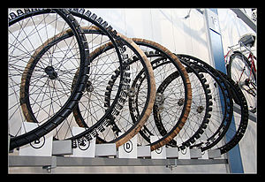

As a freelancer with a tinge of an online presence I often get to be picky about whom I work with. In a sense this ties into my post about [the mindset of the current generation](http://swizec.com/blog/we-are-not-generation-sell/swizec/2926 "We are not generation sell")- I'm not picky because I get so many offers, I'm picky because I like to enjoy my work.

\[caption id="" align="alignright" width="240"] Image by konishiroku\_ via Flickr\[/caption]

This is why I only work with startups.

Yes, I've worked with nonstartups before, I no longer want to; enough of that nonsense. Nonstartups are just inherently annoying and horrible to work with, rather than filling me with a sense of pride those projects always make me feel feel like I just sold my body to the ugliest hairyest guy on the block (not that I've done this before, I'm guessing)

So what are the top few reasons I love working with startups?

**1. Working directly with calling-the-shots people**

Having a direct contact to people calling the shots is very \\important for me. It allows me to get a sense for what they actually want, rather than just what words are coming out of their mouth. This way I can focus my efforts on what really matters when it matters - sometimes it's just better to Get It Working than doing it right.

In a big corporation orders trickle down through a chain, getting reimagined and reinterpreted on every step and when they finally get to you, there's only a sense of what you were told to do and all sense of what matters is lost.

**2. Impact**

Directly tied to the sense of context, is having an impact in the company. When somebody is just starting out with their product, you're helping to shape their vision, you can give good feedback and make use of your experience - in a sense you're helping somebody achieve their dream and that's a Great Feeling (tm).

Working as an emotionless engineer, a faceless cog who just gets his part done in the big machine ... well I'm sure you can imagine how that doesn't even begin to compare.

**3. The fast pace**

\[caption id="" align="alignleft" width="240"] Image by aginorz via Flickr\[/caption]

A great thing of a small team is the fast pace everything moves at. Since you're talking directly to those in charge and everyone shares the vision at least a bit (otherwise why work for this startup?) everything moves quickly. An idea is pushed into the system and a couple of days later it can be implemented and tested.

Conversely when working with an established organization, somebody gets an idea, there is a meeting for those responsible of the creative vision shaping, then a meeting between a representative of the leader class and a representative of the implementation class. Then the implementation class has a meeting of their own. By the time you start working on something months might have passed and even the original idea-giver has probably already lost passion.

**4. Interesting work**

\[caption id="" align="alignright" width="300"] Image via Wikipedia\[/caption]

The work at startups is usually more interesting as well. Might be because I enjoy working with new technologies and startups are likelier to take a risk with new technology. Or maybe it's just because I like working on products helping actual people rather than faceless hypothetical entities.

A pain point working for established companies is that you often edn up working on internal tools aimed at internal tools aimed at internal people for internal purposes. Sometimes they never even get pushed into production because some boss up high was fired and the new one must assert his rule.

**5. No politics**

I haven't personally had to deal with a lot of politics, but I've talked to people working in government all their lives - some times it feels like the sole reason they even go to work is to deal with the other people working there.

You know, instead of doing their job.

**6. Self-organization**

What I love about small teams comes directly from the fact there are no people whose sole purpose in life is looking after you. Because everyone in a small team is a focused professional a sense of trust is built; people no longer feel like they have to check up on everythign everyone does, you can just give the team some loosely defined orders and they'll figure it out.

\[caption id="" align="alignleft" width="300"] Image via Wikipedia\[/caption]

Startups in general care more about results than how you actually do something. If you can make a good case for why you chose to do something they way you chose to do it, and if it works, nobody really cares.

In a corporation with many layers of management it becomes much more \\important for managers to feel useful and so they get int he way. This is also a self-fullfiling prophecy since all the good people leave and in the end you actually \_need\_ tiger management.

**7. Simpler money on clearer terms**

Wasn't sure if I should include this at first, but it's kind of \\important.

When it comes to money, big organizations and government-like entities are always convoluted, take forever to pay up and it never goes smoothly. Probably stems from the fact that everyone involved has their cushy job, gets paid a fixed amount of money on the same date every month and they simply have no empathy for the poor freelancer trying to make a living client to client.

I mean, obviously, why should it be a problem to deliver a project quickly and then wait a month to get paid? And what do you mean you're annoyed when it takes us two weeks to process the paperwork because that one guy is on vacation?

Almost no matter how much you charge these people it always feels like you aren't being paid enough to deal with their bullshit.

In a startup there's none of that. Everyone involved is much more down to earth and respects the feeling of urgency when it comes to money. I like that.

## Conclusion

To sum it all up, working for startups is more enjoyable and personal, more interesting on a technical level and generally free of that feeling like you're trying to run with an open parachute strapped to your back.

Anyone working with big corps care to disagree?

###### Related articles

- [How to keep your startup employees](http://holykaw.alltop.com/how-to-keep-your-startup-employees) (holykaw.alltop.com)
- [4 Questions to Ask Startups Before Pitching](http://freelanceswitch.com/the-business-of-freelancing/pitching-to-startups/) (freelanceswitch.com)
- [When Good People Work on Bad Startups](http://davidcummings.org/2011/07/30/when-good-people-work-on-bad-startups/) (davidcummings.org)
- ["Build something people want" is not enough](http://avichal.wordpress.com/2011/11/14/build-something-people-want-is-not-enough/) (avichal.wordpress.com)
- [Looking To Hire Top Talent For Your Startup? Here Are Five Things You Should Know.](http://techcrunch.com/2011/11/14/looking-to-hire-top-talent-for-your-startup-here-are-five-things-you-should-know/) (techcrunch.com)
- [How to know when to leave your startup](http://venturebeat.com/2011/10/24/how-to-know-when-to-leave-your-startup/) (venturebeat.com)

