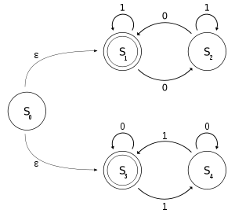

\[caption id="" align="alignright" width="300" caption="Image via Wikipedia"][](http://commons.wikipedia.org/wiki/File:NFAexample.svg)\[/caption]


The other day [@HairyFotr](http://twitter.com/HairyFotr) and [@zidarsk8](http://twitter.com/zidarsk8) were doing some [codegolfing](http://en.wikipedia.org/wiki/Code_golf) with implementations of [nondeterministic finite state machine](http://en.wikipedia.org/wiki/Nondeterministic_finite-state_machine "Nondeterministic finite-state machine")and asked me to blog their results.


For those of us who often forget what all of this computer science mumbo jumbo means, here's a quick explanation from wikipedia:

> In the [theory of computation](http://en.wikipedia.org/wiki/Theory_of_computation "Theory of computation"), a **nondeterministic finite state machine** or **nondeterministic finite automaton (NFA)** is a [finite state machine](http://en.wikipedia.org/wiki/Finite_state_machine "Finite state machine") where for each pair of state and input symbol there may be several possible next states.

Essentially they were looking for the shortest implementation of an algorithm that can take a bunch of states, go through all of them on each step and then backtrack to find the solution.


@zidarsk8 doesn't really know python all that well so his way to optimize things was basically "SHORTEN ALL THE CODES!" and as a result he came up with this line _nobody_ understands.

```
state = [st for s in state for st in states[(s,letter)]]
```

At first it looks just like a double loop. But then you notice the right-most for is taking the list to iterate over from its own body, which is the iterator of the left-most for loop ...


What?


Seriously, if you can explain how this works you win a lot of internets, eternal fame and I might just send you a box of cookies.


Here's the whole implementation in case you were wondering

```
from optparse \import OptionParser
from collections \import defaultdict

def run(beseda):
       a, states = open("machine.txt") ,defaultdict(list)
       state, final= a.readline().split()[1:],a.readline().split()[1:]
       [states[(i.split()[0], i.split()[1])].append(i.split()[3]) for i in a]
       for letter in word:
               state = [st for s in state for st in states[(s,letter)]]
       return any(i in state for i in final)

print [(b,"YES") if run(b) else (b,"NO") for b in OptionParser().parse_args()[1]]
```

According to our best debugging efforts it works as advertised ... even though we can't actually understand _why_ or how it's even possible that python knows what to do.


For curiosity's sake, here's @HairyFotr's [Scala](http://www.scala-lang.org/ "Scala (programming language)") implementation

```
object NKA extends App {
    \import scala.collection.mutable._
    val gates = new HashMap[(String,Char), ListBuffer[String]]
    val lines = io.Source.fromFile("avtomat.txt").getLines.toSeq
    val (init,finals) = (lines(0).split(" ")(1),lines(1).split(" ").tail)
    lines.tail.tail.map(_.split(" ")).foreach 
        {s => gates.getOrElseUpdate((s(0),s(1)(0)), ListBuffer()) += s(3)}

    def crawl(state:String, input:String):Boolean = 
        (input!="" && (false /: gates.getOrElse((state,input(0)), return false))
            {_ || crawl(_, input.tail)}) || (input=="" & finals.contains(state))

    args.foreach(in => println(in + (if(crawl(init,in)) ": YES" else ": NO")))
```

If you ask me, this looks like a bunch of gibberish and even HairyFotr says it isn't the prettiest Scala code out there. But hey, this is codegolf, all that matters is minimizing those keystrokes!


To conclude, two challenges:

1. Explain how that line of python works
2. Come up with a shorter solution ... I'm guessing golfscript is a good choice

PS: I was serious about those cookies


PPS: an example of what the automata decription looks like <http://pastebin.com/QLW1BfFj>

###### Related articles

- [when should we use a sequential workflow and when should we use state machines?](http://nikhatshahin.wordpress.com/2011/11/13/when-should-we-use-a-sequential-workflow-and-when-should-we-use-state-machines/) (nikhatshahin.wordpress.com)
- [Why Scala seems difficult but really isn't](http://markusjais.com/why-scala-seems-difficult-but-reallyisnt/) (markusjais.com)
- [Dictionary of Algorithms and Datastructures](http://xlinux.nist.gov/dads//) (xlinux.nist.gov)
- [An observation on writing line-processing loop code](http://eli.thegreenplace.net/2011/10/28/an-observation-on-writing-line-processing-loop-code/) (eli.thegreenplace.net)
- [Non-Deterministic Infinite-State Automaton](http://minimalj.wordpress.com/2011/09/05/non-deterministic-infinite-state-automaton/) (minimalj.wordpress.com)

[](http://www.zemanta.com/ "Enhanced by Zemanta")