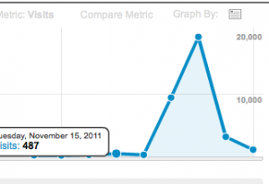

Somewhere around June this year I set a challenge for myself. I wanted a sustained 20k visitors every month on swizec.com by the end of the calendar year.

\[caption id="attachment_3032" align="alignright" width="300" caption="It's a spike!"]\[/caption]

The only real step towards this goal was to start blogging regularly. At first I would blog exactly twice a week on specific days, eventualy I started blogging daily.

Here's the strange thing - it actually worked.

By blogging every day I have ensured not all of my posts will be super brilliant, but the sheer amount of practice I'm getting has meant that even on my worst days I can simply sit down and pump something out. Even if it's dreck, even if I feel nobody will be interested. Such posts only end up as a reminder for people that hey, there's this blog, you sometimes like it ... it's still alive. Just letting you know!

Last week something strange happened.

I filled my monthly "quota" in a single week ... somehow my little [personal blog](http://en.wikipedia.org/wiki/Blog "Blog") managed to garner the attention of 32,820 visitors. What's stranger still, 96% of these visits were from Friday to Sunday. Mostly because of two posts.

Not sure exactly what happened, but apparently people love being told that startups are awesome and [why I love working for them](http://swizec.com/blog/why-i-only-work-with-startups/swizec/2936 "Why I only work with startups"). Another thing that really seems to pique people's interests are [strange lines of python](http://swizec.com/blog/strangest-line-of-python-you-have-ever-seen/swizec/3012 "Strangest line of python you have ever seen").

\[caption id="attachment_3026" align="alignnone" width="719" caption="A good blogging week"]\[/caption]

Those two posts together have been tweeted 242 and G+'d 38 times. Strangely though, this does not beat the record holder - a post about [apple's ping being a big pile of steaming dung](http://swizec.com/blog/apples-ping-is-a-big-pile-of-steaming-dung/swizec/1444 "Apple’s Ping is a big pile of steaming dung") - which managed to get 248 tweets on its own.

But all these visits and tweets and comments (about 30 per post) don't mean a single thing without the very \\important metric of how many people actually read them?

I'm happy to say that the post about startups was read to its completion by about 38% of visitors - for a 1000+ word behemot that's _a lot_ on the internet. The python post also did remarkably well with a 65% completion rate! Yay!

I think the python post can easily be explained by all the expert pythoners looking for the punchline since it turned out that line wasn't so much strange as me and my friends are stupid.

\[caption id="attachment_3027" align="alignnone" width="678" caption="Even long posts can have good completion rates"]\[/caption]

\[caption id="attachment_3028" align="alignnone" width="685" caption="Short confusing posts do \_very\_ well"]\[/caption]

You might think the stats for the python post are poisoned by the [startup](http://en.wikipedia.org/wiki/Startup_company "Startup company") post doing so well, but according to [google analytics](http://www.google.com/analytics "Google Analytics") there was so much significantly more traffic on the python post that this is practically negligible. In fact you can see this in the above cutoff, 11k people on 17th paragraph, and only 1700 on the 18th paragraph, which the python post doesn't have.

However, I am happy to say that the post about startups has proven remarkably resiliant and it still got more than 1000 visitors even yesterday.

Wonder if I'll ever manage to repeat something like this.

Also, mixpanel thinks I'm problematic despite my life-time AppSumo account thing.

\[caption id="attachment_3036" align="alignnone" width="645" caption="Mixpanel crying"]\[/caption]

###### Related articles

- [Top 10 Tips to Tweet your way to 1000's of Followers](http://blog.socialmaximizer.com/tweet-your-way-to-1000%e2%80%99s-of-followers/) (socialmaximizer.com)
- [Helping improve the documentation of Python](http://eli.thegreenplace.net/2011/07/12/helping-improve-the-documentation-of-python/) (eli.thegreenplace.net)
- [Urwid For Python, A Ncurses Library](http://www.nicosphere.net/urwid-for-python-a-ncurses-library-2541/) (nicosphere.net)
- ["Startup rollercoaster" isn't even the half of it](http://swizec.com/blog/startup-rollercoaster-isnt-even-the-half-of-it/swizec/2712) (swizec.com)

