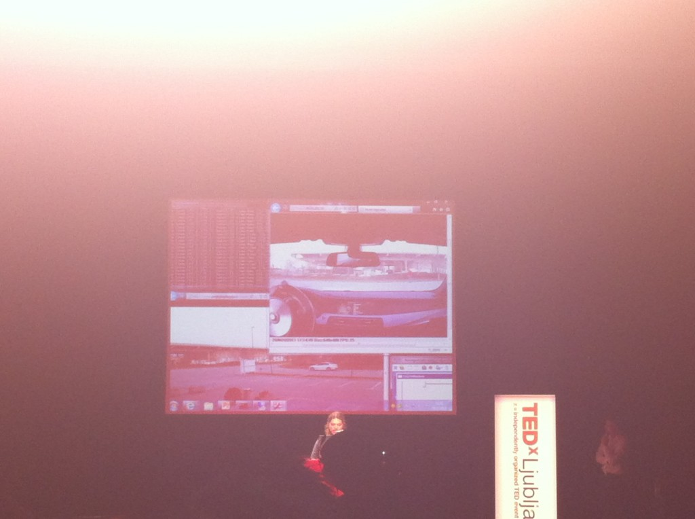

Sunday saw the eighth [TEDx](http://www.ted.com/tedx "TEDx")event in Ljubljana and through immense luck I was able to attend despite forgetting to reserve a ticket. \[caption id="attachment_3042" align="alignright" width="402" caption="Driving a car over the internets"]\[/caption] Twitter is kind of cool like that, you ask if there's any way to sneak into a sold out event happening the next day, somebody says they don't need their ticket and then does everything needed to get the organizer to change the ticket. Thanks [@freeeky](http://twitter.com/freeeky) for being awesome like that! I manage to get into the event and two things happened - I couldn't for the life of me connect to the wi-fi, and I was seated in the back back row so was mostly looking at the cameraman's head. Nontheless, it was a kickass event! Really happy I managed to attend. I mostly remember the brilliant talk by Jure Aleksejev - he was the only person there without something specific to show. He had only a message and the flawless rhetoric delivery of someone who is really really good at rhetoric. You can see about five minutes of his talk in my bootleg crappy video, but it should give you some idea of how cool he was to listen to.  The message was basically that Slovenia is a country doing stupid things. We think we'll be able to fix our economy and become awesome by emulating the large western empires, except we forget we aren't actually a large country and should therefore pay attention to _creating_ wealth instead of simply shuffling it around. Another brilliant talk was by Luka Manjolovič, if for naught else than he _drove a car_over the internets. That's right ladies and gentlemen, a _live demo_ right there on stage. Through the internets! That's guts right there. Oh and it worked too. All the other talks were pretty awesome as well. Jure Brečko deserves a special shout out for being epic enough to give us a candid charming presentation full of natural charm. You can't fake something like that. Plus he invented a cheap and effective way to do some \\important farm stuff I won't even pretend to understand, a full five hours before deadline! Score! I hate to be a sourpuss, but one presentation stuck out for being ... simply bad. I don't know if it was nerves, or she didn't prepare well, but that was not [TED](http://www.huffingtonpost.com/news/ted "TED")-level presenting there. Not going to name names, just going to say that it made me giggle when she said with special pride that against what her childhood friend said, she did not end up a garbage collector, nope, she's a graduate sociologist! Yep. On a more positive note. Burekwood was a brilliant cartoon. Kudos to all the 12 year olds for making it, charming story. The perfect way to finish off the [TED talks](http://www.ted.com/talks "TED Talks"). Can't find the video of burekwood right now, but hopefully the official videos will be available in no time. PS: I wish I had some good pics to show, but I don't

###### Related articles

- [TEDx 2011: Embracing Risk (Live-Blog)](http://midd-blog.com/2011/11/05/tedx-2011-embracing-risk/) (midd-blog.com)
- [TEDxYouth : Play, Learn, Build, Share.](http://willsmath.wordpress.com/2011/11/18/tedxyouth-play-learn-build-share/) (willsmath.wordpress.com)
- [tedx youth](http://chaikadai.wordpress.com/2011/11/20/tedx-youth/) (chaikadai.wordpress.com)
- [I'm In Love With Ljubljana](http://www.wanderingearl.com/im-in-love-with-ljubljana/) (wanderingearl.com)

