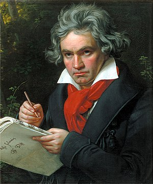

A lot has been said about The Zone - that magical place where doing something you love becomes instantly self-rewarding and you pull yourself along until you emerge on the other end. Slightly confused, a bit shaggy and you wonder why on earth are you hungry. \[caption id="" align="alignright" width="300" caption="Image via Wikipedia"]\[/caption]In fact, a couple of hours passed since you started working. You didn't notice. The code is beyond any level you think yourself capable of achieving and when you try to understand how it works ... it doesn't really make sense. But it works, passes all the tests, is beautiful and elegant. Feeding yourself might be a good idea as well. The Zone happened to me a lot more when I was younger. There's something about being 12 years old and creating what you believe to be an operating system that destroys any and all distractions. They simply don't exist. In those days a comet could have landed on my head and although dead, I wouldn't have been distracted. Now I have the internet, a bunch of stuff on my mind and nobody to remind me I should eat and sleep - getting in The Zone is harder. And when I was little I thought two weeks of coding was a sprint, now anything more than a single night feels like a marathon ... because I get more done, I think. For the past couple of months I've done a lot to figure out how I can get in The Zone better and I think music is a big part of it. Choosing just the perfect music for the perfect time is hard, but doable. Another \\important bit is that when I find it very very difficult to focus, I must go somewhere where there are a lot of distractions. Counter-intuitive, I know, but it works. I either blast three songs at once, or go to a coffee shop. Coffee shops are awesome. Something about everyone walking around, having conversations, music blasting out of the speakers and a nice cup of tea combined with a comfy chair really works wonders for my concentration. Maybe because my brain is so taxed that it simply has to focus just to function? The interesting bit is that my taste of music when coding changes a lot more than normally. It's also very different from the music I usually listen to in that same day. Lately my favourite has been [Mozart](http://www.last.fm/music/Wolfgang%2BAmadeus%2BMozart "Wolfgang Amadeus Mozart") and, of all things, [Tchaikovsky](http://www.last.fm/music/%25D0%259F%25D1%2591%25D1%2582%25D1%2580%2B%25D0%2598%25D0%25BB%25D1%258C%25D0%25B8%25D1%2587%2B%25D0%25A7%25D0%25B0%25D0%25B9%25D0%25BA%25D0%25BE%25D0%25B2%25D1%2581%25D0%25BA%25D0%25B8%25D0%25B9 "Пётр Ильич Чайковский") ... how the Nutcracker makes for good coding music is incomprehensible, but there you go, it does. [Beethoven](http://www.last.fm/music/Ludwig%2Bvan%2BBeethoven "Ludwig van Beethoven") is also a good choice, especially the more dramatic pumping symphonies. At other times I prefer something witha bit more bass. Skrillex has worked particularly well for a while, then there's a [Tetris](http://en.wikipedia.org/wiki/Tetris "Tetris") remix playlist I made on [Spotify](http://www.spotify.com/ "Spotify") that does wonders for my productivity. About a hundred versions of the same freaking song and it's just awesome. All things considered, the only thing that really matters for getting in the zone is that my environment not be silent and distraction free. My brain simply can't handle that ... What kind of music do you listen to when working? Spotify gives me this unlimited jukebox, but I need to know what to look for.

###### Related articles

- [Music Review: New York Philharmonic With Jeffrey Kahane - Review](http://r.zemanta.com/?u=http%3A//www10.nytimes.com/2011/11/24/arts/music/new-york-philharmonic-with-jeffrey-kahane-review.html%3F_r%3D5&a=63778269&rid=2c25175d-98f5-474c-bd1b-1c285ad79c0a&e=0c912b022057ed62cf99f3bcfdd4e73b) (nytimes.com)
- [Facebook's Music Partners Spotify, Rdio, Mog hit Music HTML Code](http://blog.ziggytek.com/2011/10/25/facebooks-music-partners-spotifyrdiomog-hit-music-html-code/) (ziggytek.com)
- [Spotify Playlists: Reliving My Past](http://solitaryhorizons.com/2011/11/28/spotify-playlists-reliving-my-past/) (solitaryhorizons.com)

