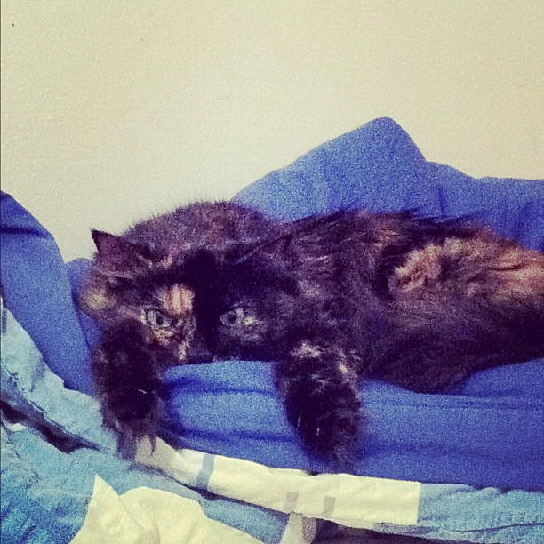
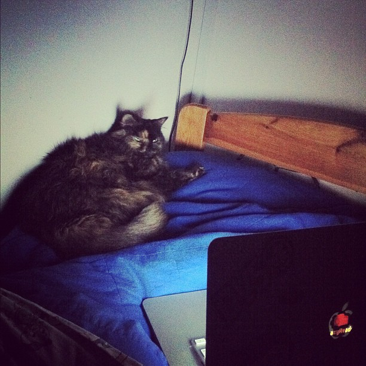

Over the weekend my cat got seriously ill. She hasn't been eating well for a while, but you know how cats are, they always pull through and with a very hairy kitty you don't even notice there's any [weight loss](http://en.wikipedia.org/wiki/Weight_loss "Weight loss"). \[caption id="" align="alignright" width="367" caption="My cat"]\[/caption] I mean, I've seen her avoid eating for several days simply to extort getting tastier food. This time though it was serious - we took her to a vet. Turns out she nearly died and even now we won't know if she's going to pull through until Friday (tomorrow). But that's not what I want to talk about. I want to compare what it's like visiting a veterinary with a sick pet and what it's like for a sick human to visit a regular doctor.

## A tale of two doctors

The vet was very busy. They had an emergency surgery going on, there was a dog that needed a long procedure done and we ended up waiting for half an hour before the vet could give the kitty a proper examination. When we got in, through profuse apologies over our half an hour wait, he immediately started explaining possible reasons for the cat's weight loss and explained in detail which tests will be performed. The cat was then sedated, blood was taken and he immediately took it to another room to perform bloodwork. Something about checking kidney, liver and pancreas function. While we were waiting he took on some other pets, but kept coming to check back on us every five minutes or so while the bloodwork was being done - presumably by a machine. The whole thing took about twenty minutes and showed a pretty grim picture. There was a fair chance Kitty had aids because her [white cell count](http://en.wikipedia.org/wiki/Complete_blood_count "Complete blood count") was practically zero and it looked like her liver might be completely fried. We were shown graphs and carefully explained what they meant. After the aids test came back negative an assistant shaved the cat's tummy and the vet performed ultrasound. I got to see my cat's innards and even though I couldn't really tell what was going on the vet explained it pretty well - not only giving me an aloof explanation and symptoms, but carefully explained the reasoning behind everything he said. Save for picking apart words, I couldn't really understand what he was saying, but the fact he explained everything was very reassuring. Made it look like he wasn't just pulling things out of his arse. Cat has some sort of bacterial infection of the liver and now we have to take her back every day for shots, feed her a carefully selected diet and tomorrow we'll know if she's making a recovery and will be able to eat her meds as pills. Looks good so far, she's started eating pretty well. That's a good sign I think. Oh and the special diet, the medicine we have to give her - all provided by the vet, he even lent us a kitty box so we can transport her to and fro easier since we've lent ours to my gran. The whole visit was over with in about two hours. And the vet spent another five minutes at the end to profusely apologize about the half an hour wait.

### Compare that to my last brush with healthcare.

A few years ago I got really sick. The kind of sick where a proud doctor-disliking 20-something crawls out of his bedroom one day and asks his mother to take him to the doctor. \[caption id="" align="alignleft" width="367" caption="Geeky cat"]\[/caption] When we got there it wasn't particularly busy, but we were first reprimanded that we dared come when my personal doctor wasn't working and are forcing somebody else to work. Imagine that! And we didn't even have an appointment or anything, how dare we!? I had such a high fever I wasn't really processing everything, but the doctor said it looks like I might have something weird so I should probably get some bloodwork done. They sent me to a whole other part of the building, where I had to wait in another [waiting room](http://en.wikipedia.org/wiki/Waiting_room "Waiting room") until somebody could draw my blood. While waiting I got really lightheaded and nearly collapsed into the blood letting chair. I think a couple of nurses actually jumped up and caught me so I didn't fall to the ground. Eventually I made my way back down to the original doctor and waited in the waiting room. When it was finally my turn again i was told that I have some sort of viral [angina](http://en.wikipedia.org/wiki/Angina_pectoris "Angina pectoris"), which is odd since angina's are usually bacterial infections. But whatever. I was told not to leave home for at least a month since one of the symptoms is swelling of internal organs and any physical exertion could rupture my spleen ... I think with a ruptured spleen you bleed out in a couple of minutes? Nevertheless, I was given antibiotics, because maybe, just maybe, it wasn't a viral angina after all, or it might be both types of angina at once. What? This meant a trip to the pharmacy before going home as well ... The whole thing lasted something like four hours, I visited several different doctors - luckily in the same general building - and was eventually told that the simple act of walking around could kill me.

## Public vs. private?

But that's [public medicine](http://en.wikipedia.org/wiki/Public_health "Public health") for you. This probably isn't really a comparison between vets and human doctors, but a comparison between private and public medicine, which really makes me wish I could afford [private medicine](http://en.wikipedia.org/wiki/Private_healthcare "Private healthcare") and that if I do in fact start affording private medicine, that doesn't mean I have to keep giving god knows how much money to public medicine.

###### Related articles

-   [Uninsured pet owners charged more by vets](http://money.marksandspencer.com/news/2010/09/uninsured-pet-owners-charged-more-by-vets/7310/) (money.marksandspencer.com)
-   [I've been sick.... :( But now I'm all better!](http://lillij.wordpress.com/2011/11/05/i%e2%80%99ve-been-sick%e2%80%a6-but-now-i%e2%80%99m-all-better/) (lillij.wordpress.com)
-   [One third of pets may be overweight, say vets](http://money.marksandspencer.com/news/2010/07/one-third-of-pets-may-be-overweight,-say-vets/7169/) (money.marksandspencer.com)

