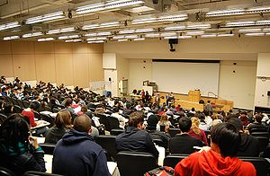

\[caption id="" align="alignright" width="300" caption="Image via Wikipedia"]\[/caption]

As I prepare to study for the subject that has been the bane of my existence for the past two years (by writing this blog post instead) I can't help but draw a comparison between how classes in my real world university are going and the classes I'm taking as part of Stanford's online experiment offering this year.

Granted, the medium of a real world [lecture hall](http://en.wikipedia.org/wiki/Lecture_hall "Lecture hall") and an online set of videos is very different so I might be comparing apples to oranges. But there is something inherently wrong with the fact I have actively been trying to pass a class for two years and failing, whereas I'm getting scores in the 70% and 80% range on both online classes.

Even though the subject making my university experience somewhat horrible is [probability and statistics](http://en.wikipedia.org/wiki/Probability_and_statistics "Probability and statistics"), which is supposed to be the raw basis for both [artificial intelligence](http://en.wikipedia.org/wiki/Artificial_intelligence "Artificial intelligence") and [machine learning](http://en.wikipedia.org/wiki/Machine_learning "Machine learning").

Something is wrong with this picture, probably me though.

I believe the main difference is one of attitude. You go into most classes at my faculty expecting to struggle and fail, it's just the way it is around here. Failure isn't only an option, it's a way of life. Regardless, failure isn't applauded, it's not even encouraged, in fact it is frowned upon by everyone.

## Failure isn't encouraged, it's a given

Stranger still, the professors themselves expect people to fail. Not all of them, some are actually quite nice and very good at teaching. For others it almost seems like grading coursework is a final act of irony. The probability and statistics class, for example, considers it a pass if you solve 20% of your homework.

\[caption id="" align="alignleft" width="180" caption="Image by surekat via Flickr"]\[/caption]

Imagine this contrived situation, _answering 20% correct_is success.

And of course you're only allowed to take the quizzes once. Because how else are you going to learn? Surely being given a single chance to answer a question, being told that it's wrong (without an explanation as to how) and not being allowed to try again is the best way to learn.

Compare this with stanford's online classes - and I wonder if their real world classes are the same - the teaching is so good that after a single listening to the lecture you can get an 80% correct. Sure, you might say they are somewhat easier than the homework/quizzes I'm used to around here, but it's a lot more encouraging.

Most of all, getting decent grades and being _encouraged_ to retake the quizzes until you get 100% and are certain you understand the material ... well it's a much better experience than being explained something once, not getting very satisfying answers to questions and then being hammered into the ground with coursework.

I guess the fundamental difference is this: the online classes convey a sense of teaching, the real world classes convey a sense of putting you in your place and jumping hoops.

###### Related articles

- [Can 35,000 People Learn Anything from an Online Class?](http://www.pbs.org/mediashift/2011/12/can-35000-people-learn-anything-from-an-online-class339.html) (pbs.org)
- [Idaho Becomes Fourth State to Require Online Classes](http://r.zemanta.com/?u=http%3A//www.usnews.com/education/blogs/high-school-notes/2011/11/14/idaho-becomes-fourth-state-to-require-online-classes%3Fs_cid%3Drss%3Ahigh-school-notes%3Aidaho-becomes-fourth-state-to-require-online-classes&a=62408570&rid=61d3b5e3-d63b-477b-90f4-b25053c55190&e=fc335af921ace5855315cd443776ac64) (usnews.com)
- [Model thinking and game theory: more free online classes](http://strategyprofs.wordpress.com/2011/11/30/model-thinking-and-game-theory-online-classe/) (strategyprofs.wordpress.com)
- [Stanford's Free Computer Science Courses](http://www.i-programmer.info/news/150-training-a-education/3361-stanfords-free-computer-science-courses.html) (i-programmer.info)
- [Tech Talk: myEdu online class management](http://hashcampuslife.wordpress.com/2011/12/04/tech-talk-myedu-online-class-management/) (hashcampuslife.wordpress.com)

