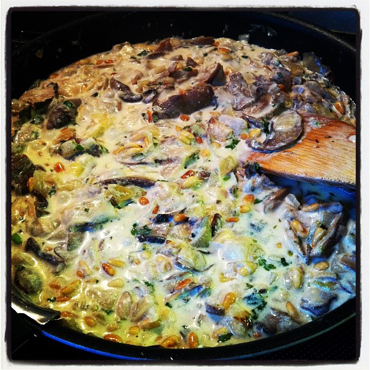
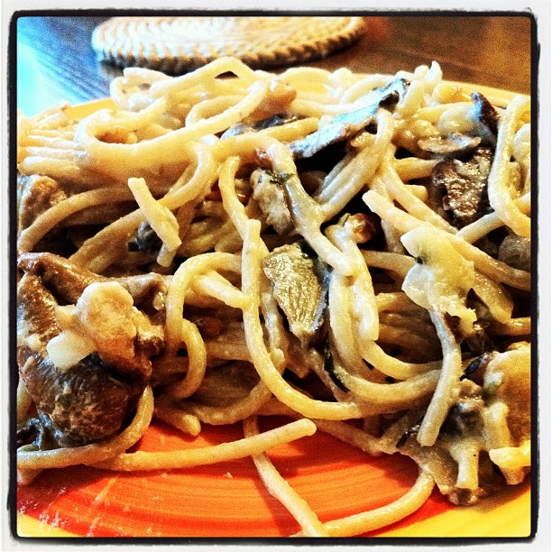

Every few days an email from Gojee winds up in my inbox with pictures of delicious delicious food to make me hungry. This week something came up that I _wanted._It was a food so delicious looking I couldn't get it ouf o my head.

[Wild Mushroom Stroganoff](http://www.gojee.com/food/links/wild-mushroom-stroganoff).

\[caption id="attachment_3157" align="alignnone" width="682" caption="Wild Mushrom Stroganoff - what I wanted to make"]\[/caption]

After begging every female I know to make this, I finally resorted to making it myself today. Sure enough, right after I decided to make it myself a friendly female decided to lend a helping hand! Bastards.

By some act of magic or divine will I actually managed to buy all the correct ingredients on my first try, unlike when I was making cake.

\[caption id="attachment_3159" align="alignnone" width="446" caption="Apparently dry mushrooms need to be soaked ..."]\[/caption]

\[caption id="attachment_3160" align="alignnone" width="704" caption="Chop chop chop"]\[/caption]

That pan has butter in it! Butter! Terribly against any modern notion of not-very-fatty food, but it makes all the difference.

\[caption id="" align="alignnone" width="490" caption="Right before the last integration testing"]\[/caption]

\[caption id="" align="alignnone" width="490" caption="Actually looks tastier in the pan"]\[/caption]

Somehow my version didn't look that much like foodporn, but damn it was delicious! Definitely going to be making this again and I think I should start using Gojee more often. They actually have some good food there.

###### Related articles

- [Cheers to Gojee, now with 200,000 members and Drinks recipes](http://thenextweb.com/insider/2011/11/10/cheers-to-gojee-now-with-200000-members-and-drinks-recipes/) (thenextweb.com)
- [Visually Beautiful Recipe Curation Site Gojee Raises $1.2M From Mitch Kapor And Others](http://techcrunch.com/2011/09/14/visually-beautiful-recipe-curation-site-gojee-raises-1-2m-from-mitch-kapor-and-others/) (techcrunch.com)
- [Link Lovin': Tofu Mushroom Stroganoff](http://rollinoatstampa.com/2011/09/17/link-lovin-tofu-mushroom-stroganoff/) (rollinoatstampa.com)
- [Visually Beautiful Recipe Curation Site Gojee Adds Drinks To The Mix](http://techcrunch.com/2011/11/10/visually-beautiful-recipe-curation-site-gojee-adds-drinks-to-the-mix/) (techcrunch.com)

