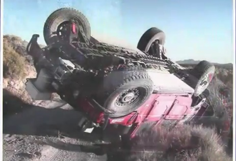

\[caption id="" align="alignright" width="370" caption="A DARPA challenge loser"]\[/caption]

_Science Wednesday is a category I've wanted to create for a while. It will feature a weekly summary of an interesting academic article or other piece of science that I find - the primary reason being to force me into reading original sources and hopefully give you guys something interesting._

Even though the world is a-buzz with news of a possible higgs boson discovery, I decided to start off Science Wednesday with excerpts from this week's lecture on robotics at ai-class.com. [Sebastian Thrun](http://en.wikipedia.org/wiki/Sebastian_Thrun "Sebastian Thrun") talked about Stanford's autonomous vehicles and how the Stanford Racing Team managed to snag victory at the DARPA challenge a couple years ago.

And when I say "snag victory", I mean [Stanley](http://en.wikipedia.org/wiki/Stanley_%28vehicle%29) was the only car to even finish the race. The way they did this is really impressive and by now the technology has become so advanced the Google cars can drive in normal traffic on regular San Francisco roads!

That was the inspirational _OMG THIS IS AWESOME_ part of the lecture.

Two algorithms are essential to achieving this: localization and [path planning](http://en.wikipedia.org/wiki/Motion_planning "Motion planning").

### Localization

For localization they use something called [monte carlo localization](http://en.wikipedia.org/wiki/Monte_Carlo_localization "Monte Carlo localization"). It uses a particle filter as the beating heart of the approach - it sounds all fancy, but it's really quite a simple approach.

Basically the idea is that you take measurements from your sensors and randomly scatter some points on your likely location. Then you compare measurements with whatever you know is correct for each point and assign appropriate weights - basically saying "Ok, if I am on a road marking there is a 90% chance the sensor will say 'White'".

After some normalization you take points with the most weight and move them forward a bit, adding some scatter and eventually you become very certain of your location on the road because the algorithm converges into a single point.

### Path planning

For path planning two approaches are used. [Dynamic programming](http://en.wikipedia.org/wiki/Dynamic_programming "Dynamic programming") is used to plan the path and a modified [A\* algorithm](http://en.wikipedia.org/wiki/A%2A_search_algorithm "A\* search algorithm") is used to plan the actual movement within the map.

\[caption id="" align="alignright" width="210" caption="Image via Wikipedia"]\[/caption]

Dynamic programming enables the robot to find the shortest path from current state to goal. The approach is actually pretty simple - just backtracking from the goal to the start and subtracting the cost of movement, if you have stochastic actions (e.g. sometimes going forward makes you go left) you have to perform the whole calculation a few times until the algorithm converges.

To plan the actual movement a modified A\* algorithm is used. The biggest difference is that the algorithm works in a continous world instead of discrete and the cost estimation function considers limitations in the robot's movement.

And here are two shiny videos that show off these two concepts.

So there you have it, the basics for making a car that drives itself :)

###### Related articles

- [Self-Drive Cars Tested In America](http://www.confused.com/news/motoring/car-insurance/self-drive-cars-tested-in-america-295336137) (confused.com)
- [Here's What DARPA Wants to See From Their Crowdsourced UAV](http://spectrum.ieee.org/automaton/robotics/military-robots/heres-what-darpa-wants-to-see-from-their-crowdsourced-uav) (spectrum.ieee.org)
- [Inflatable Robots - Safe and a Lot of Fun!](http://www.i-programmer.info/news/169-robotics/3395-inflatable-robots-safe-and-a-lot-of-fun.html) (i-programmer.info)
- [Google develops self-driving car](http://www.confused.com/news/motoring/car-insurance/google-develops-self-driving-car-3702181519) (confused.com)
- [AI at the Crossroads - predicting who is going to run a red light](http://www.i-programmer.info/news/105-artificial-intelligence/3413-ai-at-the-crossroads-predicting-who-is-going-to-run-a-red-light.html) (i-programmer.info)
- [An algorithm that makes robots appear more human \[Video\]](http://io9.com/5842760/an-algorithm-that-makes-robots-appear-more-human) (io9.com)
- [This Week In Bots: The Locomotion Edition](http://www.fastcompany.com/1770045/this-week-in-bots-the-locomotion-edition) (fastcompany.com)

