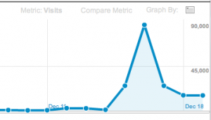

\[caption id="attachment_3220" align="alignright" width="300" caption="A traffic spike"]\[/caption]

On Thursday I published my most popular post to date _[Why programmers work at night](http://swizec.com/blog/why-programmers-work-at-night/swizec/3198 "Why programmers work at night")_. After writing I was certain it wasn't that interesting, sure it might be HN frontpage worthy - it never got there - but other than that I felt it wasn't a very informative post, just musings of a hacker who has always loved the night-time.

The internets had other plans. Some guy posted it on [reddit](http://reddit.com/ "Reddit") about half an hour after I published and for the next 30 or so hours it was at the top of /r/programming. Even showing up on the main frontpage briefly according to people on [Twitter](http://twitter.com "Twitter"), I wouldn't know, my reddit karma is 4.

As is the trend when extraordinary traffic happens on a personal site, I will now ~~brag about~~ share the stats.

Analytics for the last four days:

- 167,939 visits
- 157,707 uniques
- 188,707 pageviews

The peak day was Friday and saw just over 89k visitors. Because gAnalytics offers that real-time thingy, I can also say that the peak traffic I saw was about 600 concurrent visitors and for the first five or so hours it was up on reddit, the mean was something like 400 [concurrent users](http://en.wikipedia.org/wiki/Concurrent_user "Concurrent user").

\[caption id="attachment_3221" align="alignnone" width="713" caption="30 day analytics"]\[/caption]

If you're so awesome this doesn't sound like a lot - my usual monthly traffic is around 30k visitors. We are talking about _four days_ here.

There was also a lot of social madness:

- 1,714 points on reddit (2,866 upvotes, 1,152 downvotes)
- 40 upvotes on HN, no frontpage, just people submitting the article over the four days
- 627 G+
- 2,877 tweets
- 550+ tweets mentioning me next to the link (hard to measure since search API only returns up to 1500 results)
- 288 new followers on twitter ... I should probably take the time to follow some back
- unknown amount of facebook likes, because I never quite got around to setting up the widget or Insights properly
- 475 comments on reddit
- 173 comments on my blog
- some emails directly to me
- three or four people looking for a freelancer
- [somebody even translated the post to Russian](http://ak-26.ru/?p=1258)

How all of this happened? I honestly haven't a clue, there are tens if not hundreds of posts on this blog more deserving of such infamy, but I guess people like a good pat on the back and an easy _"Yeah totally. I can totally agree with that!"._

The best bit of feedback came not from programmers, all of them were just "Yeah me too!" or "You're an idiot!", nope, the best were their wives and people who have to live with programmers claiming that now they can finally understand their werewolf programmer and how it thinks. Makes me feel I accomplished something with the post :)

Oh and the most surprising thing here? The post was 900 words long! Should be a death sentence on the [intarwebs](http://en.wikipedia.org/wiki/Internet "Internet"), but I guess I made good enough points early on so people still wanted to share. My fancy [mixpanel](http://www.mixpanel.com "Mixpanel") analytics says about **42%**of readers made it through all the twenty-two paragraphs.

\[caption id="attachment_3222" align="alignnone" width="667" caption="Paragraph funnel"]\[/caption]

Broken down for referrers:

- 46% people from G+ finished reading (plus.url.google.com)
- 45% people from twitter (t.co)
- 43% people from mobile facebook (m.facebook.com)
- 41% people from facebook (www.facebook.com)
- 39% people from reddit (www.reddit.com)

An interesting note here, this list is ordered in exactly the inverse of amount of people referred. [Reddit](http://reddit.com/ "Reddit") drove the most traffic, but it also drove the shittiest traffic, while G+ brought the least, but the most people finished reading.

Although I think the days of that analytic might be numbered, mixpanel will get fed up with me and I won't be able to afford the service :(

\[caption id="attachment_3223" align="alignnone" width="444" caption="Mixpanel datapoints"]\[/caption]

Edit: fixed the facebook widget, it reports 7k likes.

###### Related articles

- [Reddit Marketing Guide](http://blog.kissmetrics.com/reddit-marketing-guide/) (kissmetrics.com)
- [A Web Marketer's Guide to Reddit](http://www.distilled.net/blog/social-media/a-web-marketers-guide-to-reddit/) (distilled.net)
- [Linking a user's reddit account with my site with out storing their reddit password](http://stackoverflow.com/questions/8566537/linking-a-users-reddit-account-with-my-site-without-storing-their-reddit-passwo) (stackoverflow.com)
- [Reddit did 1.8 BILLION page views in the last 30 days, with 28m unique visitors](http://thenextweb.com/insider/2011/10/31/reddit-did-1-8-billion-page-views-in-the-last-30-days-with-28m-unique-visitors/) (thenextweb.com)
- [Top 10 Tips to Tweet your way to 1000's of Followers](http://blog.socialmaximizer.com/tweet-your-way-to-1000%e2%80%99s-of-followers/) (socialmaximizer.com)

