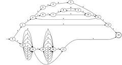

\[caption id="" align="alignright" width="240" caption="Image by jl_2 via Flickr"]\[/caption]

This morning there was a link going around listing the [15 papers you should read to understand node.js's background](https://plus.google.com/111191895515210271225/posts/HN2ZTbf7Cgg). A large portion of the list is devoted to the comparison of thread- and event- based models of execution. Since I hear a lot about event loops being better than threads, I read _[The problem with threads](http://www.eecs.berkeley.edu/Pubs/TechRpts/2006/EECS-2006-1.pdf)_ written in 2006 by one Edward A. Lee, a professor at Berkeley.

> If the next generation of programmers makes more intensive use of [multithreading](http://en.wikipedia.org/wiki/Thread_%28computer_science%29 "Thread (computer science)"), then the next generation of computers will become nearly unusable.

And this bleak future is almost inevitable when you think about it. The rule of [Moore's law](http://en.wikipedia.org/wiki/Moore%27s_law "Moore's law") has been changing from faster chips, to more and more cores. And yet the only software making good use of multiple cores are what Lee calls "[embarrassingly parallel](http://en.wikipedia.org/wiki/Embarrassingly_parallel "Embarrassingly parallel")" applications - those that simply split themselves into independent processes.

Problems with threads stem from sharing memory space. Without proper care this can lead to a situation where one thread changes a piece of data, while the other is reading it. Now you have two threads that both have a different understanding of what the value of a certain variable is.

While in theory solvable with semaphores, locks and so on, without very proper care this can then lead to deadlocks - more \\importantly, taking care of interleaving threads is _very hard._You are essentially facing a [nondeterministic machine](http://en.wikipedia.org/wiki/Nondeterministic_finite-state_machine "Nondeterministic finite-state machine") and trying to understand it through a poor abstraction that doesn't make use of your natural ability to deal with concurrency.

Lee also makes the case that this isn't merely a problem of syntax or tools, but that threads are a fundamentally flawed model of computation. I won't burden you with his whole proof/argumentation (page 3 to 5). The gist is that

> /../ given a sequental program and an initial state, you have a defined sequence of events. Any two programs can be compared - they are equivalent if they halt for the same initial states and the final state is the same. When threads are introduced these essential properties are lost /../ if two threads can provide the next action, we can no longer compare two programs, we might be able to compare all interleavings, but on a [multithreaded](http://en.wikipedia.org/wiki/Thread_%28computer_science%29 "Thread (computer science)") envrionment even that is lost since we'd have to know about all the other programs as well.

Essentially the problem is this - the core abstraction of computation is a deterministic assembly of deterministic components, but threads are inherently nondeterministic. The car analogy Lee provides is trying to compose an [internal combustion engine](http://en.wikipedia.org/wiki/Internal_combustion_engine "Internal combustion engine") out of a pot of iron, hydrocarbon and oxygen molecules randomly moving according to thermal forces.

This is so bad in practice even using very strict and rigid engineering principles, doesn't help. In early 2000 Lee started the [Ptolemy Project](http://ptolemy.eecs.berkeley.edu "Ptolemy Project (computing)"), a project designing concurrent embedded systems. But this is also an experiment in battling threads with rigorous engineering discipline - they developed a code maturity rating system, design reviews, [code reviews](http://en.wikipedia.org/wiki/Code_review "Code review"), nightly builds, the works. Reviewers included concurrency experts and there are regression tests with 100% code coverage.

When the system started being used in 2000 no problems were observed until a deadlock on April 26th, 2004. Just the fact they know the exact date this happened tells a lot about how rigorously engineering principles are applied. Still, a very serious problem took _four years_ to be discovered.

Many other approaches exist that try to combat this problem, but they either wallow in obscurity or aren't very effective; perhaps the most effective is the use of higher-order principles like [MapReduce](http://en.wikipedia.org/wiki/MapReduce "MapReduce"), which aim to break the problem into tiny fractions that can be computed separately and then combining the results.

An interesting solution Lee proposes is using the so-called Rendezvous pattern, which as far as I can tell is a generalization of MapReduce, with the use of a nondeterministic merge, so that each part of the program is executing deterministically and [nondeterminism](http://en.wikipedia.org/wiki/Nondeterministic_algorithm "Nondeterministic algorithm") is only used in a single spot on the network - where threads _actually_ have to interact. Lee proposes using this with some sort of coordination language, so that programmers aren't burdened with learning new ways of implementing their solutions (a historically _very_ slow process), but can assemble different solutions almost like [Lego](http://www.lego.com/ "Lego")'s.

Lee concludes that concurrency in software is difficult, but much of it is our own fault due to using poor abstractions. To deal with concurrency in a robust and predictable manner, we should stop using threads and focus on using nondeterminism only where it is warranted.

###### Related articles

- [Better multithreading offered by Columbia U researchers](http://go.theregister.com/feed/www.theregister.co.uk/2011/11/03/peregrine_multithreading/) (go.theregister.com)
- [Major Breakthrough Improves Software Reliability and Security | The Fu Foundation School of Engineering & Applied Science - Columbia University](http://powersthatbeat.wordpress.com/2011/11/12/major-breakthrough-improves-software-reliability-and-security-the-fu-foundation-school-of-engineering-applied-science-columbia-university/) (powersthatbeat.wordpress.com)
- [Worker threads and a controller thread](http://stackoverflow.com/questions/8458576/worker-threads-and-controller-thread-synchronization) (stackoverflow.com)
- [What does really happen if I access a singleton in a multithreaded Program](http://stackoverflow.com/questions/8007465/what-does-really-happen-if-i-access-a-singleton-in-a-multithreaded-program) (stackoverflow.com)
- [Multithreading performance](http://stackoverflow.com/questions/8363864/multithreading-performance) (stackoverflow.com)
- [Major breakthrough improves software reliability and security](http://www.eurekalert.org/pub_releases/2011-11/cu-mbi110211.php) (eurekalert.org)
- [Access violation in a multithreaded application, C++](http://stackoverflow.com/questions/4430388/access-violation-in-a-multithreaded-application-c) (stackoverflow.com)

