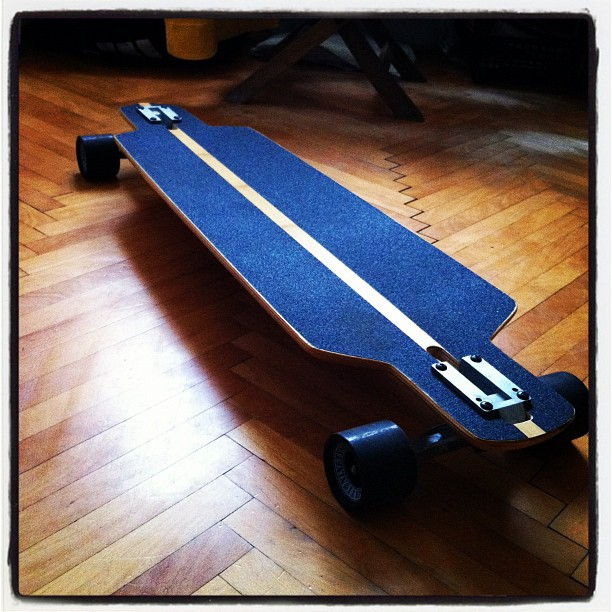
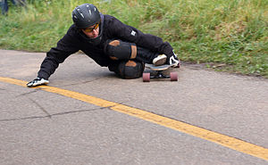
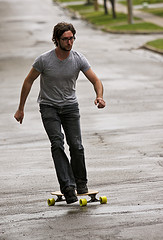

\[caption id="" align="alignright" width="300" caption="My longboard"]\[/caption] Today has been such an epically clumsy day - knocking over everything I touch, nearly killing random people in the street and myself in the process - that I just had to share with everyone. Reading this might give you a good chuckle at my expense :) Let's start at the beginning then, shall we? The day started out as any other day would. I woke up, looked at the internet, exercised, had a shower, ate some breakfast ... pretty normal stuff right there. Then I had a friend come over and I somehow managed to apply my knee to her ankle in what looked like an extremely painful manner. Judging from her shriek and holding her leg like the best football star in the champion's league. On my way to class I nearly tripped over an unwitting pedestrian. But hey, these things happen sometimes, people don't look where they're going and traveling on a longboard doesn't make a lot of noise while still being quite fast for a sidewalk. Plus people don't really expect to meet a guy traveling on a longboard when it's below zero outside ... I think. Then at a stoplight I nearly tripped over another pedestrian. She was just sort of standing there and I wasn't very efficient with my breaking and I think she got a bit spooked when I suddenly ran past her as I jumped off my longboard, narrowly avoiding killing her. Got overtaken by a classmate on a bike and he offered to pull me to class to make the whole affair much quicker. I agreed ... but it took me five tries to get a decent grip on his backpack. In the process I nearly killed another pedestrian. Actually, two pedestrians, they were suddenly in my way and I awkwardly jumped off the longboard so it sort off got between their legs and they're quite lucky neither of them accidentally stepped on it because that would be a pretty nasty fall. A hundred meters after this incident there was a car idly parked over the sidewalk - and when I say parked, I mean there was a guy chatting on the phone while lazily manuevering a big SUV into his garage thing. \[caption id="" align="alignleft" width="300" caption="Image via Wikipedia"]\[/caption] Had to jump off the longboard. Nearly killed another pedestrian who was just waiting there for the car to move. Not ten minutes later we approached a stoplight with great speed and I couldn't decide what to do. Should I jump off? But we're going too fast for me to run. Should I just brake? But I'm not stable enough at this speed for driving with one foot ... and if I just wait until I lose speed I'll end up a hundred meters beyond the crossroads. So I did the stupidest thing possible - kept hanging on to the backpack and trying to break like that. Ended up nearly taking the guy over his handlebars. Lost my footing on the longboard and before I knew it I was standing in the middle of a busy crossroads picking up the damn thing from the ground. Luckily nobody ran me over. Not sure how many pedestrians I nearly killed on my way home from class, but at one point I nearly smashed into the side of a car who didn't see me crossing the road. Not even a hint of trying to stop, was just plain going and I had to jump off the longboard at the last minute with about a meter to spare. Then I went to an event at the Cyberpipe, again with a longboard. At this point I seriously stopped counting the number of pedestrians magically winding up in my way and almost ending up killed. It's all just a blur, indistinctive people always winding up riiiiiight where I want to go. As if by magic! An even more interesting thing happened on my way back home. I was passing a group of pedestrians and another group suddenly appeared out of nowhere so people took up almost the entire sidewalk. Somehow managed to swerve around everyone and just as I was about to propel myself forward I suddenly lost balance and try to catch my footing. \[caption id="" align="alignleft" width="163" caption="Longboarding"]\[/caption] Sure enough, to catch my footing I stepped on the longboard and shot it from underneath me with great speed. Didn't fall but did have to run after the damn thing. Just when I almost caught it, the longboard went off the sidewalk and into the street. Ran after it, but there was a bus and ... hey, it's going to come out the other end right!? It did come out the other end, or rather somewhat to the side and juuuust as I was about to pick it up, it approached a car. And the light turned green. The driver not noticing anything started off and drove right over the front-left side of my longboard, shooting it up into the air about a meter and right in my fucking leg. The longboard then bounced off my bone and under the bus again narrowly missing being run over by a very huge tyre. Not counting another guy who nearly ran me over because he didn't see my crossing the street, the rest of the trip home was rather uneventful. Should I be happy I'm alive?

###### Related articles

-   [Erickson Longboards](http://www.coolhunting.com/design/erickson-longbo.php) (coolhunting.com)
-   [Army of skateboarders takes over downtown streets](http://www.thestar.com/news/article/1052107--army-of-skateboarders-takes-over-downtown-streets) (thestar.com)
-   [Wake and Bake To This Chill Longboarding Sesh \[VIDEO\]](http://coedmagazine.com/2011/12/10/chill-original-longboarding-country-roads-session-video/) (coedmagazine.com)

