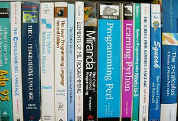
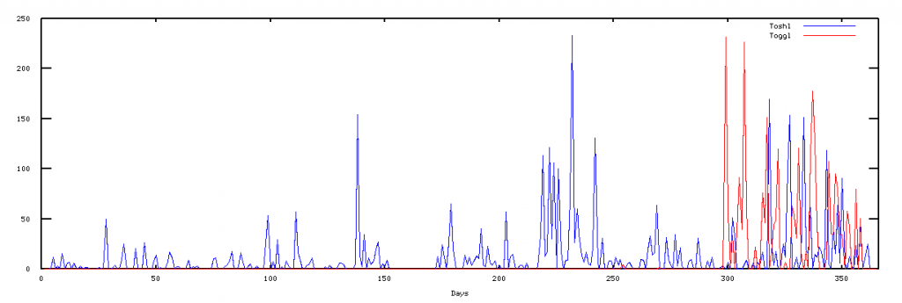

_I’m taking a sabbatical week over the holidays. This week’s posts will serve as a sort of report of what I got up to the previous day instead of the usual schedule – wish me luck that I achieve even half of what I’d like to._ \[caption id="" align="alignright" width="300" caption="Image via Wikipedia"]\[/caption] After I managed to get the [toggl and toshl datasets](http://swizec.com/blog/sabbatical-week-day-1-toshl-and-toggl-datasets/swizec/3277 "Sabbatical week day 1: Toshl and Toggl datasets") on Monday it was time to do something useful with them yesterday. Turns out, I'm not very good at doing useful things with datasets because my biggest achievement of the day was coming up with a plot of the data. You know that all awesome [data format](http://en.wikipedia.org/wiki/Data "Data") that is [JSON](http://json.org "JSON")? Every [programming language](http://en.wikipedia.org/wiki/Programming_language "Programming language") except Java has a nice and easy interface for loading and saving right into native [data structures](http://en.wikipedia.org/wiki/Data_structure "Data structure"). This makes it perfect and all 'round awesome! So it seemed only natural that my node.js scripts for fetching data would be storing it in JSON for future use. Or so I thought. If there is one thing I learned in [ml-class](http://ml-class.com) it's that one should always take some time to first model their [machine learning algorithm](http://en.wikipedia.org/wiki/Machine_learning "Machine learning") in a mathematical language like matlab/octave before implementing in a production-like language. Something about how all those [matrix operations](http://en.wikipedia.org/wiki/Matrix_%28mathematics%29 "Matrix (mathematics)") are easier and how having a language created especially for the task makes it all that easier to play around. I guess octave is to machine learning as [InDesign](http://www.adobe.com/products/indesign/main.html "Adobe InDesign") or Illustrator are to web design? Turns out not only doesn't [Octave](http://www.gnu.org/software/octave/ "GNU Octave") have a native way of reading JSON, but even when you find a library it is _impossible_ to say _Here is a file, make it a string yo!_ Just doesn't work. All files need to have a format or something ... it's really quite silly. Luckily there was a simple solution - just dump the data as a column of numbers and Octave couldn't have been happier about it. As mentioned, I didn't get very far, this graph is the extent of my achievements yesterday: \[caption id="attachment_3283" align="alignnone" width="717" caption="Toshl and Toggl plotted"]\[/caption] Just for fun I tried running linear regression on this data and, as expected, it failed horribly. The lowest cost is a function along the lines of _y =__-6.5541e+88\*x +__-4.8840e+90_ ... I'm not even sure coming up with fake-ish quadratic and cubic function elements would do much good in this case and since I only have a single parameter neural networks wouldn't do much good either. And either way, anything that comes even close to modeling this data will suffer from horrible overfitting and won't be much use anyway ... luckily I have some other ideas I can try.

###### Related articles

- [Sabbatical week day 1: Toshl and Toggl datasets](http://swizec.com/blog/sabbatical-week-day-1-toshl-and-toggl-datasets/swizec/3277) (swizec.com)
- [Visualizing Gestures as Paths](http://www.r-bloggers.com/visualizing-gestures-as-paths/) (r-bloggers.com)
- [Why is a harp shaped how it is](http://wiki.answers.com/Q/Why_is_a_harp_shaped_how_it_is) (wiki.answers.com)
- [Octave select a file?](http://stackoverflow.com/questions/7451757/octave-select-a-file) (stackoverflow.com)
- [Plotting a density map](http://www.tablix.org/~avian/blog/archives/2011/11/plotting_a_density_map/) (tablix.org)
- [12 steps to running gradient descent in Octave](http://flowingmotion.jojordan.org/2011/10/16/12-steps-to-running-gradient-descent-in-octave/) (flowingmotion.jojordan.org)
- [Down-to-earth principal components analysis in 5 steps](http://flowingmotion.jojordan.org/2011/12/04/down-to-earth-principal-components-analysis-in-5-steps/) (flowingmotion.jojordan.org)

