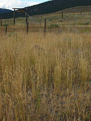

Yesterday I received the best gift ever - a day completely off. Free.

\[caption id="" align="alignright" width="180" caption="Image by m.gifford via Flickr"]\[/caption]

_What's so special about a day off_, you might think, _I have like two every week!_ Or if you're more like me, you're thinking _Psh! Dude, I get a day off almost every month._

This was different - I had a day off from _me_.

None of my little rituals. No exercise in the morning. Not a single cup of tea. No jotting down random-ish actions into [Daytum](http://www.daytum.com/ "Daytum"). No tweeting. No instagraming. No marking down every bite into [myfitnesspal](http://www.myfitnesspal.com/). No time trackers. No email. Nothing.

Even wrote the [750words](http://750words.com/) at almost midnight.

For a whole day I completely threw away every little thing I do day after day that doesn't bring a rush of oxytocin there and then. Yes, I will continue doing all those things today, no, none of it is particularly useful, yes, they all tickle the nerd inside me.

I took one more step. I didn't worry about the pile of email I'd return to. The day's lull in my data, or the delay in stuff I'm working on.

A day like there's no tomorrow! Carpe Diem is fine and all, but dear god we all take it so seriously. When did we collectively forget to _enjoy ourselves_? That Carpe Diem wasn't \[just] about working day and night to get the upper hand on your competition ...

It felt great and against all expectations, my life is not a barren wasteland today.

I didn't devolve into a fumbling beast, all my good \[and bad] habits are still there. I'm still posting my daily blog. Still tweeting like mad. And still dutifully recording all the useless data about my life. I will even do some work despite Jan 2nd being a public holiday.

If you didn't do anything even remotely like this yesterday - shame on you! You're an even bigger nutcase than I am!

Give it a try tomorrow, I dare you.

###### Related articles

- [Carpé Diem 2012](http://hopenrecovery.wordpress.com/2011/12/30/carpe-diem-2012/) (hopenrecovery.wordpress.com)
- [Carpe Diem](http://stephenhilder.wordpress.com/2011/12/30/carpediem/) (stephenhilder.wordpress.com)
- [Carpé Diem 2012](http://rd2recovery.wordpress.com/2011/12/30/carpe-diem-2012/) (rd2recovery.wordpress.com)
- [2012 Goals](http://jpshealthylivingblog.wordpress.com/2011/12/30/2012-goals/) (jpshealthylivingblog.wordpress.com)

