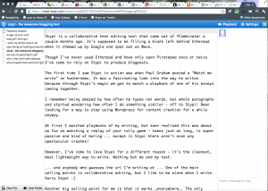

Stypi is a collaborative text editing tool that came out of [YCombinator](http://www.ycombinator.com "Y Combinator") a couple months ago. It's supposed to be filling a blank left behind [Etherpad](http://etherpad.com/ "Etherpad test") when it chewed up by Google and spat out as [Wave](http://wave.google.com/ "Google Wave"). \[caption id="attachment_3320" align="alignright" width="300" caption="This post in Stypi"]\[/caption] Though I've never used Etherpad and have only seen [Piratepad](http://piratepad.net/ "PiratePad") once or twice I've come to rely on Stypi to produce blogposts. The first time I saw Stypi in action was when [Paul Graham](http://paulgraham.com "Paul Graham (computer programmer)") posted a "Watch me write" on hackernews. It was a fascinating look into the way he writes because through Stypi's magic we got to watch a playback of one of his essays coming together. I remember being amazed by how often he typos not words, but whole paragraphs and started wondering how often I do something similar - off to Stypi! Been looking for a way to stop using Wordpress for content creation for a while anyway. At first I watched playbacks of my writing, but soon realised this was about as fun as watching a replay of your rally game - takes just as long, is super passive and kind of boring ... except in Stypi there aren't even any spectacular crashes! However, I've come to love Stypi for a different reason - it's the cleanest, most lightweight way to write. Nothing but me and my text. ... and anybody who guesses the url I'm writing at ... One of the main selling points is collaborative editing, but I like to be alone when I write. Sorry Stypi :) Another big selling point for me is that it works \_everywhere\_. The only contender so far has been iA Writer, but that only works on [MacOS](http://www.apple.com/macosx/ "Mac OS") and costs money. But I really enjoy writing on my [Linux box](http://www.kernel.org/ "Linux") as well. All in all it's the perfect drafting tool that really encourages good drafting and rewriting principles. Especially because my better posts take about two or three rewrites before they're good enough.

###### Related articles

-   [Stypi founders have a plan to reinvent Google Wave (video)](http://venturebeat.com/2011/09/26/stypi/) (venturebeat.com)
-   [Four short links: 10 November 2011](http://radar.oreilly.com/2011/11/four-short-links-10-november-2-2.html) (radar.oreilly.com)
-   [Y Combinator Demo Day (S11): The Ultimate Roundup](http://techcrunch.com/2011/08/23/y-combinator-demo-day-the-ultimate-roundup/) (techcrunch.com)
-   [Silicon Alley Insider: Y Combinator Unveils Its Biggest-Ever Batch Of Startups: 63 Companies](http://www.businessinsider.com/y-combinator-unveils-its-biggest-ever-batch-of-startups-63-companies-2011-8) (businessinsider.com)
-   [Cool Tools](http://emkaytsg.wordpress.com/2011/10/30/cool-tools/) (emkaytsg.wordpress.com)
-   [Etherpad hackathon announced for early 2012](http://etherpad.org/2011/12/06/etherpad-international-hackathon-2012/) (etherpad.org)

