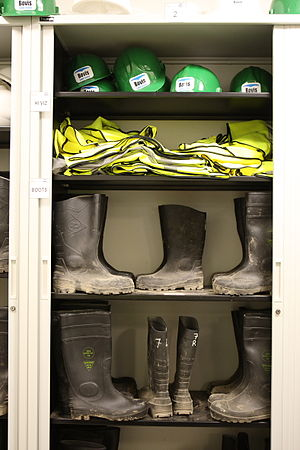

\[caption id="" align="alignright" width="192" caption="Image by Morning Calm News via Flickr"][](http://www.flickr.com/photos/28486074@N08/4972036859)\[/caption] This post is a summary of Eli Gottlieb's thesis on the [Deca programming language](http://decac.googlecode.com/files/Deca%20Thesis.pdf) from May 2011. In short _Deca is a language designed to provide the advanced features of sophisticated, [high-level programming languages](http://en.wikipedia.org/wiki/High-level_programming_language "High-level programming language")while still programming as close as possible to the bare metal. It brings in the functional, object-oriented and generic programming paradigms without requiring a garbage collector or a threading system._

> Since it is a programming-language thesis, it is also dedicated to every programmer who ever wanted a better language but could not use a virtual machine or a run-time library. To them I dedicate this thesis and say: _I am become type theory, destroyer of minds._

## Problems of systems programming

I once contemplated doing some Linux kernel hacking, but decided to lie down until the feeling passes. That is my closest brush with systems programming and after reading this thesis - yikes. Essentially the problems are what you'd expect when dealing with hardware-imposed limitations, lacking useful abstractions and safety features - in fact, you're usually the one creating these.

1.  **precise data representation** - working so close to bare metal means datatypes must correspond directly to their hardware representations. You can't just have a magical List datatype_,_ you _can_ have a block of memory though
2.  **safety properties and confined unsafety**- the most common form of safety is _\[caption id="" align="alignleft" width="300" caption="Panic"][](http://commons.wikipedia.org/wiki/File:Kernel-panic.jpg)\[/caption] [type safety](http://en.wikipedia.org/wiki/Type_safety "Type safety"),_the idea being that the compiler makes sure you aren't trying to multiply a sack of potates with a banana. But other safety features a good language should provide according to Gottlieb are _[escape analysis](http://en.wikipedia.org/wiki/Escape_analysis)_ for pointers, _[region-based memory management](http://en.wikipedia.org/wiki/Region-based_memory_management "Region-based memory management")_ and_[preservation and progress](http://en.wikipedia.org/wiki/Type_safety#Definitions)_ (well-typedness)
3.  **abstraction, encapsulation, modularity**- most modern languages provide ways of packaging code so it can be reused and encapsulated. For instance: when you are using a stack structure, you don't really care whether it's implemented as a list or a memory vector.
4.  **extensibility**- a way to extend the language itself with new features (for example, making the + operator work with new data types). So far possible solutions for this exist as [OOP](http://en.wikipedia.org/wiki/Object-oriented_programming "Object-oriented programming"), ad-hoc polymorphism, macros and so on, but it remains an open question and the perfect solution might not even exist
5.  **Stroustroup's rule**- the lead designer of C++ [Bjarne Stroustrup](http://www.research.att.com/~bs/homepage.html "Bjarne Stroustrup") once presented a rule that _What you don't use, you don't pay for._ But in many high-level languages automatic memory management runs whether you need it or not, or every function needs exception handling ... all big problems in the limited confines of bare metal programming.

## Deca's solutions

\[caption id="" align="alignright" width="300" caption="Image via Wikipedia"][](http://commons.wikipedia.org/wiki/File:Safety.JPG)\[/caption]

1.  **unboxed data types**- for those of us who didn't know, [boxed types](http://www.haskell.org/ghc/docs/latest/html/users_guide/primitives.html) are represented by a point to an object; in Deca all types are compiled down to raw unboxed representations - just a value - so when the code is running there's no more overhead. There are also two kinds of pointers (scoped and referenced) that allow you to use a pointer as if it was a variable, which sounds pretty cool from my experience with explicit pointers.
2.  **type safety**- admittedly, this section went a bit over my head, but Deca uses a magical combination of static type inference (static typing where the compiler guesses stuff for you) and bit-casting - this is a system that allows you to eschew type safety under certain conditions because systems programmers apparently need that. If you care for this sort of thing -> Deca uses a modified [Hindley-Milner](http://en.wikipedia.org/wiki/Type_inference "Type inference") inference algorithm that also allows subtyping
3.  **module system**- just as you'd expect of any modern language, you can package things into modules and modules into modules
4.  **encapsulated [existential types](http://en.wikipedia.org/wiki/Type_system "Type system")**- these are best known as the type-theoretic encoding of abstract data types - giving us the ability to use data structures without knowing all the internal logic. In Deca these exist as a language extension and the whole thing works out just like it did for Caml
5.  **extensible types**- Deca provides two ways of extending data types. The internal way of "open-sum variant types", which I don't understand and the thesis isn't very specific as to what thi means. The other are good old friendly classes, which we all understand and love from object-oriented languages
6.  **symmetric multiple dispatch**- dynamic dispatch is a way to dynamically decide which method to call in order to process a particular message (polymorphism, pattern matching etc.) Deca does this by having a partially ordered list of possible methods, walking through it and when it finds something that can execute the given arguments, it is the most specific binding.
7.  **low-level encodings of high-level features**- this section of the thesis is a bit longer, but it essentially boils down to the idea of using the [LLVM](http://en.wikipedia.org/wiki/LLVM) to run compiled code and making sure all the features explained above are compiled to their most basic incarnations. According to another section of the thesis this also ensures adherence to Stroustrup's rule

## An example

I would love to personally produce an example of what Deca looks like, but I'm already having enough [fun learning Haskell](http://swizec.com/blog/learning-me-a-haskell/swizec/3272 "Learning me a Haskell"), so here's an official example of a List implementation.

```

module list

import malloc

type List = class(e,n) extends Sequence {
  element: a:= e;
  next: @List:= n;
}

function cons(element,next) {
  malloc.malloc(pool => new(pool)(List(element,next)))
}

function car(lst: @List) {
  match *lst {
    case Cons(head,tail) => Some(head)
    case Nil => None
  }
}

function cdr(lst: @List) {
  match *lst {
    case Cons(head,tail) => tail
    case Nil => Nil
  }
}

end
```

## [Conclusion](<>)

[The thesis itself also compares Deca to other modern high-level languages for systems programming like](<>)[Clay](http://lambda-the-ultimate.org/node/4023), [BitC](http://www.bitc-lang.org/ "BitC"), [Cyclone](http://en.wikipedia.org/wiki/Cyclone_programming_language) and Java "with magic". That section didn't feel too important, the resolution is simply that Deca is _better_. Unfortunately though, Deca itself doesn't look to be ready for real-world use just yet. Even though the language itself is pretty much defined and its grammar is known, no complete compiler yet exists. The [official compiler, decac,](http://code.google.com/p/decac/) developed by Gottlieb doesn't yet support all the features and I've heard rumors it has been scrapped and is being developed anew because some fundamental issues were discovered. All in all, this looks like an interesting language to keep an eye on if you're a systems programmer, but I feel C will be the king for a long while yet.

###### Related articles

-   [Are you a programming freek?](http://americannationnews.wordpress.com/2012/01/02/are-you-a-programming-freek/) (americannationnews.wordpress.com)
-   [What is meant by high level language in IT](http://wiki.answers.com/Q/What_is_meant_by_high_level_language_in_IT) (wiki.answers.com)
-   [Is it possible to make a high level compiled language?](http://stackoverflow.com/questions/8697033/is-it-possible-to-make-a-high-level-compiled-language) (stackoverflow.com)
-   [What are different application areas of programming language](http://wiki.answers.com/Q/What_are_different_application_areas_of_programming_language) (wiki.answers.com)

[](http://www.zemanta.com/ "Enhanced by Zemanta")
