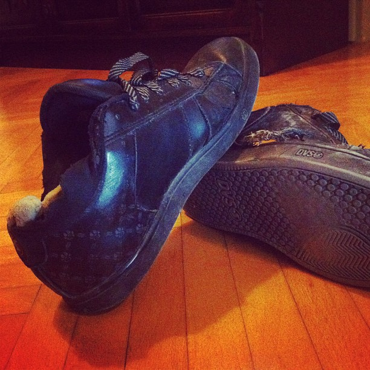

Shoes are wonderful technology, they protect our feet, they make us look good and there's a whole culture associated with wearing those things. A culture I, as a man, will _never_ understand. \[caption id="" align="alignright" width="367" caption="Shoes on their deathbed"]\[/caption] Apparently there is a million and one way to wear the wrong kind of shoes to the wrong kind of outfit. For instance, my scruffy shoes ... don't go with any outfit. Or so I've been told. I like to think they go with every outfit exactly _because_ they're scruffy and falling apart. Gives them a bit of character. But, they are about to die, so I have to find a replacement this week. The thing I don't understand is: Why do women need so many? A good pair of black leather sneakers covers pretty much every occasion.

1.  They're comfy, so you can use them for walking to places
2.  Because they're black leather, they look nice when clean and can be used for business
3.  Because they look kinda nice, they can be used for [semi-formal](http://en.wikipedia.org/wiki/Semi-formal "Semi-formal") stuff too. Anything that isn't black- or white- tie really.
4.  If you aren't a sissy most sport can be done in them as well

The only other pair of shoes you might need is a pair of [sandals](http://en.wikipedia.org/wiki/Sandal "Sandal"), if you're too sissy to go barefoot at the beach in the summer. And while some advocate using a pair of [water-proof](http://en.wikipedia.org/wiki/Waterproofing "Waterproofing") shoes for special weather, you don't actually need that. Shoes dry out over night and pretty much all types of shoe I've seen gets soaking wet the moment you start thinking of them as being water-proof. [Rubber boots](http://en.wikipedia.org/wiki/Wellington_boot "Wellington boot") old people use for gardening might be an exception, but those get soaking wet from the inside anyway, so what's the point? Last night I asked an internet about the need for multiple shoes and got a rather interesting answer from some girl:

> For me I think I have 3 pairs of heeled sandals (to wear with skirts, dresses, or summer clothes) 2 pairs of flip flops 4 pairs of black boots 1 pair of grey boots (for when black doesn't work with what I'm wearing) 2 pairs of black heels (for dress or black dress pants, ones more business then the other) 2 pairs of black low heeled shoes (business or going somewhere that might include walking) 1 pair of tennis shoes 1 pair of pink heels 1 pair of cobalt blue heels 1 pair of teal heels 2 pairs of low heeled dance shoes 2 pair of latin heeled dance shoes 1 pair of jazz 1 pair of highland 1 pair of low heeled sandals Those are the ones I can think of off hand.

That's just too many shoes! Where does she even keep them all? And who has time to buy all those things anyway? And the mental energy it takes to go out and look for shoes ... women are truly insane. An answer from the most well-dressed guy I know was far better in my view:

> In general, men don't need too many shoes short of shoes needed for hobbies. I have two pairs of black shoes, two pairs of brown shoes, and a pair of evening shoes; the rest are activity-specific. Riding boots, hiking boots, dance shoes, boat shoes, cold/wet-climate hiking boots, and so on are only necessary for specific purposes.

That makes sense, having shoes for specific purposes doesn't really count as having another pair of shoes does it? I certainly wouldn't think of listing my diving fins or rollerblades under "pairs of shoes" even though they are technically footwear ... Now excuse me while I go meditate on my misery of having to buy a new pair of shoes this week.

###### Related articles

-   [Fierce Obsession -15 Pairs of Irresistible Leopard-Print Shoes](http://www.fabsugar.com/Shop-Leopard-Print-Shoes-19318554) (fabsugar.com)
-   [The 2011 Autumn Guide to Good Value and In Style Shoes](http://www.savingsjunction.com/the-2011-autumn-guide-to-good-value-and-in-style-shoes/) (savingsjunction.com)
-   [Wardrobe Oxygen: Fall Fashion Footwear Trends - Splurge or Save?](http://www.savings.com/blog/post/Wardrobe-Oxygen-Fall-Fashion-Footwear-Trends-Splurge-or-Save.html) (savings.com)
-   [If the Shoe Fits](http://www.fabsugar.com/Shoe-Buying-Tips-8512313) (fabsugar.com)
-   [Look! They Got Toes!](http://anexerciseindiscipline.wordpress.com/2011/12/10/look-they-got-toes/) (anexerciseindiscipline.wordpress.com)
-   [Shoes in my Closet...~By Gabrielle Angel](http://autumnsunshineandgabrielleangel.wordpress.com/2011/10/01/shoes-in-my-closet-by-gabrielle-angel/) (autumnsunshineandgabrielleangel.wordpress.com)
-   [Which Shoes Were Made For Walking?](http://ask.metafilter.com/205313/Which-Shoes-Were-Made-For-Walking) (ask.metafilter.com)
-   [Giuseppe Zanotti No Heel Crystal-Studded Sandal](http://fortyoneplease.wordpress.com/2012/01/15/giuseppe-zanotti-no-heel-crystal-studded-sandal/) (fortyoneplease.wordpress.com)

