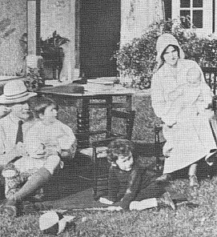

> The Boy Scouts have a rule: "Always leave the campground cleaner than you found it." If you find a mess on the ground, you clean it up regardless of who might have made the mess. /../ the original form by Robert Stephenson Smyth Baden-Powell, was "Try and leave this world a little better than you found it."
>
>
>
> What if we followed a similar rule in our code: "Always check a module in cleaner than when you checked it out." No matter who the original author was, what if we always made some effort, no matter how small, to improve the module. What would be the result?
>
>
>
> by [Uncle Bob](http://programmer.97things.oreilly.com/wiki/index.php/Uncle_Bob "Uncle Bob") at [O'Reilly commons](http://programmer.97things.oreilly.com/wiki/index.php/The_Boy_Scout_Rule)

\[caption id="" align="alignright" width="271" caption="Image via Wikipedia"]\[/caption]

When I first saw this rule in Clean Code I loved it! It's just such an awesome rule. You come into a file, you clean it up a little bit. Remove a stupid comment, indent something better ... anything.

It makes the world a better place and everyone a happy camper right?

Well, this might be great in theory and work well when you are employed by a company where you will spend the next few years of your life. The software you're working on will live and grow with you, with your team. _You_ are the guy shouting "Fuck this! Who the fuck made this code! This is bloody impossible to maintain!" a year from now.

For a freelancer the situation is a bit different.

Here you are, plomped into the middle of an ongoing project. Decisions have been made, rabbit holes have been followed. The deadline is in a month and as a crack team of one specialist on a tight deadline, you're making nice gold per hour.

Right there in front of you. A mess. Code so ugly, so horrible, it would make a grown man cry. You're just supposed to add a feature. Figure out the mess, add two or three lines of code, cross your fingers and hope for the best.

Or should you rewrite the whole function?

Rewriting would be the Right Thing (tm) to do. The code will be more maintainable, easier to test, it will save your client a bunch of money down the line. You won't be maintaining this so you have a responsible towards everyone coming after you to fix something.

But, right now, right this very instance, you are strong-arming the poor client to pay more. Sure, you're making the code better, but they care about that one feature. Should you really spend three hours rewriting the code instead of one hour adding something and hoping for the best?

On the other hand: When the messy code breaks, and it _will_ break, it will be your fault. You're the last guy who touched it. Not rewriting will come back to haunt you. The guy who maintains your code will curse you in their sleep and dream of delicious murder. And it's not even your code!

So what do you do?

Personally I always try to rewrite crappy code. Add testing suites. Anything I can do to make the [codebase](http://en.wikipedia.org/wiki/Codebase "Codebase") better. But I always carefully explain the situation to my client. _Why_ am I doing this, _how_ is it benefiting **the client**. It's \\important to make them understand I'm not just inventing work to rake in more gold.

Clients are surprisingly permissive most of the time and I can sleep better at night. win-win!

###### Related articles

- [Two nuggets from Coders at Work book](http://www.swaroopch.com/blog/coders-at-work/) (swaroopch.com)
- [Boy Scout Popcorn for the Troops](http://majorknitter.typepad.com/major_knitter/2012/01/boy-scout-popcorn-for-the-troops.html) (majorknitter.typepad.com)
- [Feature: Maniac Tentacle Mindbenders: How ScummVM's unpaid coders kept adventure gaming alive](http://arstechnica.com/gaming/news/2012/01/maniac-tentacle-mindbenders-of-atlantis-how-scummvm-kept-adventure-gaming-alive.ars) (arstechnica.com)
- [Code Cleanup Culls LibreOffice Cruft](http://developers.slashdot.org/story/12/01/14/008236/code-cleanup-culls-libreoffice-cruft) (developers.slashdot.org)

