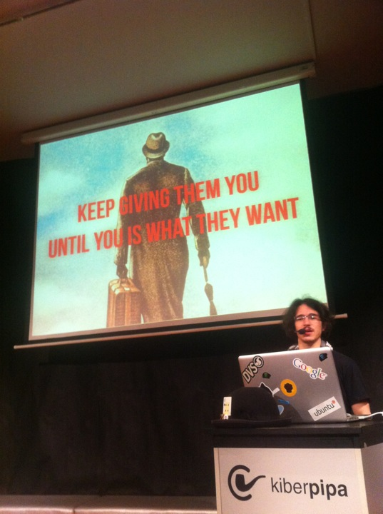

\[caption id="" align="alignright" width="376" caption="Presenting"]\[/caption] Yesterday I gave a talk at [Kiberpipa](<http://maps.google.com/maps?ll=46.056184,14.503798&spn=0.005,0.005&q=46.056184,14.503798 (Kiberpipa)&t=h> "Kiberpipa") on the awesome [#wwwh](https://twitter.com/#!/search?q=%23wwwh) weekly event. The talk was about this blog and how after [that one insanely popular post](http://swizec.com/blog/why-programmers-work-at-night/swizec/3198 "Why programmers work at night")everyone suddenly decided I know what I'm doing and should tell others how its done. _Video at bottom_ It's funny how difficult coming up with a talk is when somebody tweets you _Hey, you should totally come give a talk about blogging._ The problem with these kinds of talk is that you don't really know what you'll be trying to say. Every time you're up there on stage you should have a message - something to convince the audience of. Just giving a general talk _sucks_ for that. It invariably turns into something a bit like this post - a rambling conglomerate of sentences that sort of go together. Always reminds me of that one line in a movie: _You talk a lot, but you don't say much._ I guess the overall message of my talk was this: _Patience! It takes a lot of patience and sticking-to-it-ness, don't do if it isn't inherently fun for you._ Despite all of that I think the talk was a smashing success. Sure I forgot to even mention hats - was supposed to mention changing the blog's name from Cthulhu and Other Crazies to A Geek With a Hat ... oops? In general the talk ended up a bit rambley, even finished with "Wait, there was something else I wanted to say ... oh well. Questions?" That's not a very strong ending. The originally planned ending was: _But hey, at least I'm no longer The Author on hackernews, but Swizec_ All in all, rhetoric sucked, body language was attrocious, hands found their way into pockets several times, but people laughed a few times, asked a bunch of questions and I think everyone had fun. This one girl even asked for actual advice and I thank her for thinking I know enough to give advice about this stuff. The slides for [Blogging, hats, stuff](http://speakerdeck.com/u/swizec/p/blogging-hats-stuff) are over at Speakerdeck whose embeds don't work with Wordpress ... there is also a video. 

###### Related articles

- [Web Hour + Zemanta + Mozilla = Success](http://brian.kingsonline.net/talk/2011/10/web-hour-zemanta-mozilla-success/) (brian.kingsonline.net)
- [Sal Khan: The best advice I ever got](http://r.zemanta.com/?u=http%3A//money.cnn.com/2012/01/13/technology/sal_khan_best_advice.fortune/index.htm&a=71417522&rid=d059e249-7cef-4f9a-9287-844dce83e91a&e=23df49d4c5da66b3b023eda0ebdb9d56) (money.cnn.com)
- [6th anniversary of wwwh](http://markos.gaivo.net/blog/?p=807) (markos.gaivo.net)
- [Odd Like Us](http://doingthewritething.wordpress.com/2012/01/17/odd-like-us/) (doingthewritething.wordpress.com)
- [Video of my 433 MHz receiver talk](http://www.tablix.org/~avian/blog/archives/2012/01/video_of_my_433_mhz_receiver_talk/) (tablix.org)

