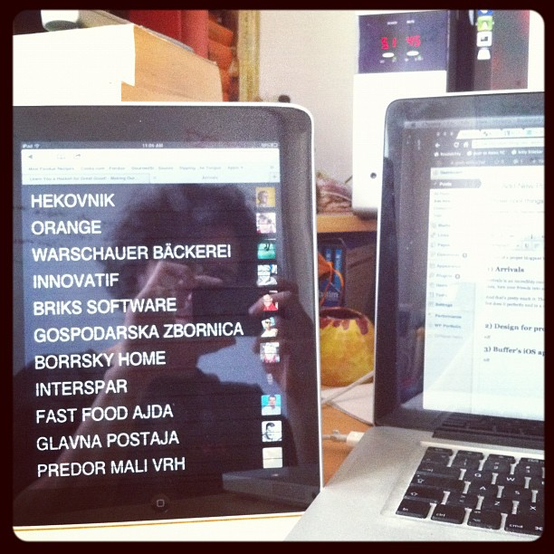

In lieu of a proper blogpost today you get three cool things, because I have to pass two exams an hour apart.

## 1) Arrivals

[Arrivals](http://www.iamdanw.com/wrote/arrivals-for-foursquare/) is an incredibly cool Foursquare app - probably the best I have ever seen. The idea is simple, take your foursquare data, turn your friends into aeroplanes, make an arrivals board like at an airport. And that's pretty much it. The app doesn't do a whole lot, it runs in a browser and I love it because it does a single thing, but does it perfectly and in a cool way. \[caption id="" align="alignnone" width="490" caption="Arrivals for Foursquare"]\[/caption]

## 2) Design for programmers

[Method of Action](http://method.ac/) is something I only discovered last night and haven't had the chance to play around with that much yet. It looks like a very promising way for programmers (people like me) to learn enough about design to hold their own in a conversation with a designer. But more importantly, looks like it will enable us to throw together mockups and to at least understand what designers _do_. We love ranting on and on about how none of those stupid [lusers](http://en.wikipedia.org/wiki/Luser "Luser") understand what a programmer's life is like - time to reciprocate ;) Oh and the [Kern](http://type.method.ac/), [Shape](http://shape.method.ac/) and [Color](http://color.method.ac/) games are already super fun to play. \[caption id="attachment_3605" align="alignnone" width="685" caption="Method of Action"]\[/caption]

## 3) Buffer's iOS app

My favourite twitter tool [Buffer has now got an iPhone app](http://blog.bufferapp.com/the-complete-guide-to-the-brand-new-buffer-iphone-app). If you don't know about Buffer yet, shame on you! It's only the tool that played a great role in increasing my blog traffic baseline by roughly 1000% last year. Yes, that's a thousand percent. Diminishing returns aside, it's still a very powerful tool. \[caption id="" align="alignnone" width="358" caption="Mine was just emptied so the screenshot was lame"]\[/caption]

###### Related articles

-   [Arrivals for Foursquare Displays Check-ins on Old-Style Airport Board](http://mashable.com/2012/01/30/arrivals-for-foursquare-displays-check-ins-on-old-style-airport-board/) (mashable.com)
-   [News: Foursquare update introduces Radar for iOS 5](http://www.ilounge.com/index.php/news/comments/foursquare-update-introduces-radar-for-ios-5/) (ilounge.com)
-   [Clear To Do App Has Some Surprising Design Inspirations](http://mashable.com/2012/01/30/impending-clear-interview/) (mashable.com)
-   [Foursquare is a Waste of Time](http://www.lockergnome.com/social/2011/12/05/foursquare-is-a-waste-of-time/) (lockergnome.com)

