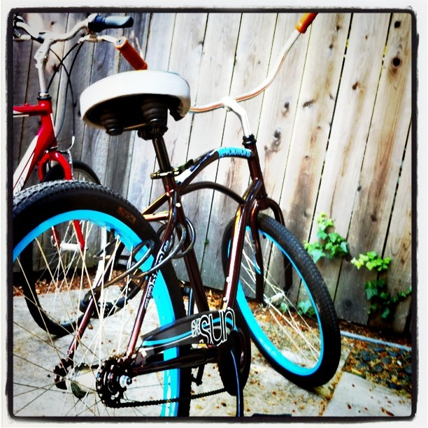

War veterans tell the best stories - testosterone-filled men crammed in compact spaces doing something dangerous/awesome produce the best stories.

\[caption id="" align="alignright" width="342" caption="The bike central to this story"]\[/caption]

Geeks? We have deployments to [Silicon Valley](<http://maps.google.com/maps?ll=37.37,-122.04&spn=1.0,1.0&q=37.37,-122.04 (Silicon%20Valley)&t=h> "Silicon Valley"), that's where our best stories come from.

The greatest story my life has to offer comes from my first stint at Silicon Valley - this summer, interning for a [YCombinator](http://www.ycombinator.com "Y Combinator") team. I've probably mentioned it before in passing, but it needs a proper writeup.

## The Story

After a month of being stuck in a four bedroom house with six guys and only going out once every week or so ... to [Palo Alto](<http://maps.google.com/maps?ll=37.4291666667,-122.138055556&spn=0.1,0.1&q=37.4291666667,-122.138055556 (Palo%20Alto%2C%20California)&t=h> "Palo Alto, California"), I needed something better.

Palo Alto is where fun goes to die. Marvelous for startups, venture capital just waiting to dump shitloads of money on hapless startups - shake a tree and money falls out.

It is a sea of guys. Nerdy, geeky, guys. Whatever girls there are, aren't looking for people like me. Why would they? I haven't cashed out of a startup and I don't even have a car, let alone a Porsche.

After a month it was finally time. I'm going to San Francisco and having some proper fun. Researched some clubs on [Google Maps](http://maps.google.com "Google Maps"), asked around a little bit, and found a place I liked - the [DNA Lounge](<http://maps.google.com/maps?ll=37.7710083333,-122.412694444&spn=0.01,0.01&q=37.7710083333,-122.412694444 (DNA%20Lounge)&t=h> "DNA Lounge").

Looked like a nice alter club with cool music, good people and a lack of gold-diggers. There might even be a girl in there wearing sneakers instead of high heels! Score!

Next Saturday I hopped on a bike, cycled to the nearest [Caltrain](http://en.wikipedia.org/wiki/Caltrain "Caltrain") station and when I got to San Francisco it was already dark. But hey, what could possibly go wrong? Just a lonesome guy on a bike in a huge city at night!

## The Club

The club was everything I had imagined and more. There was a line out the front just like in the movies, bouncers everywhere and I even had to show my ID! Sweet, right? They didn't even bat an eyelid when I showed them my expired [ID card](http://en.wikipedia.org/wiki/Identity_document "Identity document")from Slovenia; I love that in a bouncer.

\[caption id="attachment_3636" align="alignright" width="420" caption="Bootie at DNA Lounge"]\[/caption]

Inside ... a sea of women. There were women everywhere, bouncing to good music, drinking overpriced cocktails and the atmosphere was just amazing. For every guy in the club there were at least two chicks. A magnificent sight to behold!

But I'm kind of shy so when there is a sea of women I just enjoy the company and mostly dance by myself. And then I notice - hey, I'm dancing with someone! There is a cute chick and I think I'm dancing with her! Am I dancing with her? Hey she just grabbed my hand, I _am_ dancing with her! Awesome!!

Before I knew it, I was sitting on the sidelines chatting with a cute chick in my lap and her friend. I think I remember telling her about where I'm from and what I'm doing in the US. And she told me what she was studying and that she was soon leaving for Africa ... to study monkeys or something.

Doesn't matter. There was a chick in my lap and all I cared about was ... nothing. There were words coming out of her mouth and I just didn't care.

She may have told me her name too ...

Then. Last call. Club closes. Chick disappears into the night. Suddenly all alone in a huge foreign city in the middle of the night with nowhere to go.

The chick's words start coming back to me "Hey, you know, San Francisco is a pretty big place. You really don't want to be alone at night ... at least not in some areas"

I didn't remember what areas. There were boobs! How _could_ I remember!?

I didn't really have a plan for the rest of the night, so in my inebriated state it seemed like a cool idea to hop on the borrowed bike and cycle back to Palo Alto.

At 3am.

56 kilometers.

Roads I've never even seen before.

But hey, google maps can help right! Oh wait, I only have wi-fi on my phone, no 3G. Eh, the cache is good enough, I'll just cache the whole map.

Only 20% battery left. Marvelous!

Plotted a rough course, cached as much as I could, hopped on the bike and off I was into the night.

## An adventure!

\[caption id="attachment_3632" align="alignnone" width="514" caption="Adventure!"]\[/caption]

I cycled and I cycled. San Francisco was sleeping. Met three people all night. They seemed either too scary or too drunk to talk to.

I found myself near something resembling the docks. There was an ocean and what looked like peers and some ships - not the big kind, but still ships. Isn't this where a lot of people get killed in the movies?

But I pressed on and got into a more normal looking area. Single storey buildings everywhere, places that looked like businesses, not very residential. But hey, I wasn't worried, it didn't look too dangerous this time.

After about 40 minutes of cycling I was out in the open. No more houses, just distant lights. On one side was the ocean, on the other what looked like an open meadow with no discernible features.

And it was dark. So very very dark. No street lights anywhere. Just the full moon and stars - luckily California isn't a very cloudy place.

Without lights all I could use to navigate was a white line on the side of the road. A meter of white line disappearing into the night in front of me.

## Dark

Darkness. Black tarmac. White line.

\[caption id="attachment_3635" align="alignright" width="351" caption="Pretty much the view"]\[/caption]

That white line was the only thing keeping me alive. I hugged it as much as I could, veer too much to the right and you're out of road - can't even see the edge. Veer too much to the left and you're in traffic ... traffic that can't see you until they almost run you over.

A hill started. Now I was in deep shit. Small bump in the road and I'm eating tarmac - life slipping away by the drop most likely. I later checked the Runkeeper recording - I was doing 40 kilometers an hour.Enough to seriously die without a helmet on.

Oh and did I mention it was cold? Very cold! Hands wrapped in sleeves, holding the handlebars ... sort of. Scarf around my face. Nothing warmer but a sweater to wear. And I held on for dear life.

A few cars passed me. Some lorries. Scary.

There is so much roar coming from your tyres you can't hear approaching vehicles. Something just whizzes out of your peripheral vision and is gone before you fully realize what happened.

Every time you get spooked and veer to the right a bit. But there's an invisible road edge there. Veer too much and \*poof\*, gone.

I was very happy when street lights started somewhere around the [SFO airport](<http://maps.google.com/maps?ll=37.6188888889,-122.375&spn=0.03,0.03&q=37.6188888889,-122.375 (San%20Francisco%20International%20Airport)&t=h> "San Francisco International Airport"). I could see! But it felt like I was in some seedy part of town again. Switching from that big road to El Camino was pretty interesting.

A backroad somewhere near the airport. Strange crossroads. Gang cars everywhere. At least they looked like the typical car mexican gangs drive in movies, wouldn't know if they actually were gang cars. Might be a stereotype.

Oh and Google Maps didn't cache this bit.

El Camino is a good road. I like it. Just following it I would eventually come to Palo Alto and that nothing could possibly go wrong from this point onward.

Well, you know, other than getting run over by a car. Killed by some weirdo in a backtown. Or just dying from exhaustion.

I didn't even have a bottle of water with me! Nothing. Just my hat, the bike and sheer determination to get home and survive the greatest adventure I was ever on.

Eventually daylight started. The cold was replaced with just too much warmth for my clothes but not enough to take anything off. I could see! Life was simple again.

## Just keep pedalling.

By this point I was getting very tired. Had been cycling for hours and I'm not in the best of shapes - especially not for cycling.

This part of the trip is slightly hazy. I dozed off a couple times, but magically kept pedalling. It was muscle memory by now, didn't even have to think about it. Pedalling? Oh that's just something legs do on their own, not my business.

I got to Palo Alto, found the house and at 7am. 1% of battery left. An hour before the first Caltrain leaves from [San Francisco.](<http://maps.google.com/maps?ll=37.7793,-122.4192&spn=0.1,0.1&q=37.7793,-122.4192 (San%20Francisco)&t=h> "San Francisco")

After about two liters of Cedevita and a shower I collapsed into bed. Couldn't think straight to save my life.

The next day I was woken up at 10am. It was all hands on deck to help prepare a picnic for all the Silicon Valley friends of the startup.

How I survived that day, I'm not sure. All I remember is an all-consuming numbness in my legs and an inability to stand.

###### Related articles

- [Man punched during Palo Alto soccer game](http://www.mercurynews.com/breaking-news/ci_19906706) (mercurynews.com)
- [Wushu takes flight at Palo Alto's Nixon Elementary](http://www.mercurynews.com/peninsula/ci_19741327) (mercurynews.com)
- [New fatal on Caltrain line in Palo Alto](http://www.sfgate.com/cgi-bin/article.cgi?f=/c/a/2011/11/26/BA2L1M4JH5.DTL) (sfgate.com)

