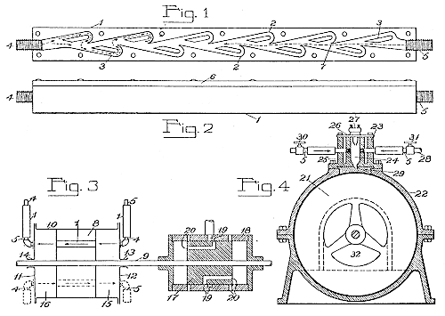
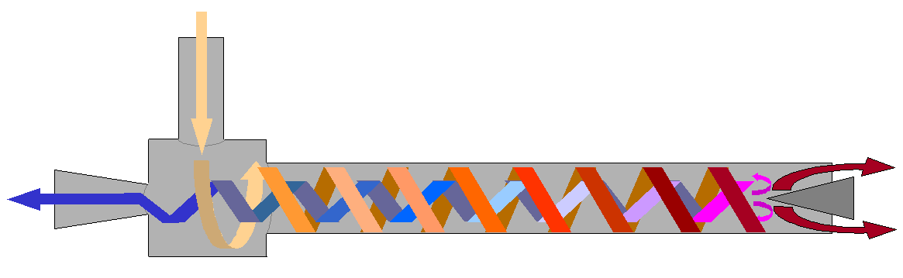
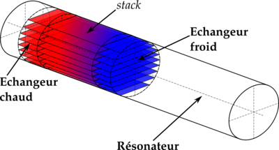

As a computer guy I often forget that there is a whole world out there beyond pictures of cats, big-O and trying to create things that should be impossible. When it strikes my fancy, I sometimes realize there's also mathematics.

But sometimes you come across something so simple, so very much in the realm of macro-physics, it blows your mind and you spend a couple of hours looking for even more pieces of remarkably simple, yet incomprehensible, technology.

## [Tesla valve](http://en.wikipedia.org/wiki/Tesla_valve "Tesla valve") with no moving parts

\[caption id="" align="alignnone" width="500" caption="Tesla valve patent"]\[/caption]

It lets some air through so it's not a perfect valve, but it is still perfectly useful for a lot of applications. Honestly, I don't understand _what_ goes on in there, but the idea seems to be to have the fluid back in on itself and pretty much stop itself. The stronger the force in one direction, the stronger the force in the opposite direction. Brilliant.

Somebody printed the valve and gave it a test

## [Vortex tube](http://en.wikipedia.org/wiki/Vortex_tube "Vortex tube")

Cool things you can do with air and no moving parts don't stop there though. There's also something called a Vortex tube.

\[caption id="" align="alignnone" width="816" caption="A vortex tube"]\[/caption]

The vortex tube accepts pressurised gas on one end and then with no moving parts separates this flow into a stream of very hot gas and a stream of very cold gas. It could potentially be used to both heat and cool some things ... completely without moving parts. Just cool, hardcore, flow dynamics.

It baffles the brain. It really does. So much so that physicists have yet to reach a consensus on how a vortex tube even works.

## Thermoacoustic [heat engine](http://en.wikipedia.org/wiki/Heat_engine "Heat engine")

And then it gets even better with a thermoacoustic heat engine - using high energy sound waves to pump heat from one end of a tube to another, or even using the heat difference to produce a loud noise.

\[caption id="" align="alignnone" width="400" caption="Thermoacoustics"]\[/caption]

> A thermoacoustic device basically consists of [heat exchangers](http://en.wikipedia.org/wiki/Heat_exchanger "Heat exchanger"), a [resonator](http://en.wikipedia.org/wiki/Resonator "Resonator"), and a stack (on standing wave devices) or [regenerator](http://en.wikipedia.org/wiki/Regenerative_heat_exchanger "Regenerative heat exchanger") (on travelling wave devices). Depending on the type of engine a [driver](http://en.wikipedia.org/wiki/Speaker_driver "Speaker driver") or [loudspeaker](http://en.wikipedia.org/wiki/Loudspeaker "Loudspeaker") might be used as well to generate sound waves.
>
>
>
> Consider a tube closed at both ends. Interference can occur between two waves traveling in opposite directions at certain frequencies. The interference causes [resonance](http://en.wikipedia.org/wiki/Resonance "Resonance") creating a standing wave. Resonance only occurs at certain frequencies called [resonance frequencies](http://en.wikipedia.org/wiki/Resonance "Resonance"), and these are mainly determined by the length of the resonator.
>
>
>
> The stack is a part consisting of small parallel channels. When the stack is placed at a certain location in the resonator, while having a standing wave in the resonator, a temperature difference can be measured across the stack. By placing heat exchangers at each side of the stack, heat can be moved. The opposite is possible as well, by creating a temperature difference across the stack, a [sound wave](http://en.wikipedia.org/wiki/Sound "Sound") can be induced. The first example is a simple heat pump, while the second is a prime mover.

## Jet engines with no moving parts

And apparently there's a whole subset of jet engines that don't use any moving parts. Of course you've heard of a [scram jet](http://en.wikipedia.org/wiki/Scramjet "Scramjet"), but there's more.

There exists such a thing as a [valveless pulse jet](http://en.wikipedia.org/wiki/Valveless_pulse_jet "Valveless pulse jet") - I don't know exactly what this means, but it sounds pretty amazing.

###### Related articles

- [5 Mind-Blowing Quantum Levitation Experiments](http://www.techeblog.com/index.php/tech-gadget/5-mind-blowing-quantum-levitation-experiments) (techeblog.com)
- [Guy Builds Awesome Twin Tesla Coil Setup at Home](http://www.techeblog.com/index.php/tech-gadget/guy-builds-awesome-twin-tesla-coil-setup-at-home) (techeblog.com)
- [DIY Solid State Tesla Coil](http://hackaday.com/2012/02/07/diy-solid-state-tesla-coil/) (hackaday.com)
- [Sing In The Rain!: Kid Makes Musical Tesla Coil Hat](http://www.geekologie.com/2011/11/sing-in-the-rain-kid-makes-musical-tesla.php) (geekologie.com)
- [MIT student creates tesla coil musical hat for Halloween, survives](http://www.engadget.com/2011/11/15/mit-student-creates-tesla-coil-musical-hat-for-halloween-surviv/) (engadget.com)

