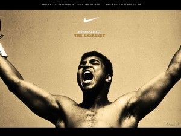
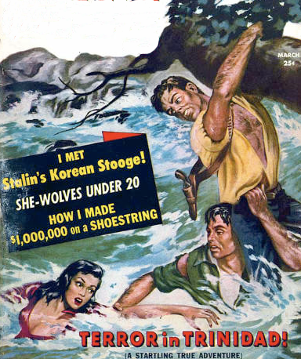

A [punch](http://en.wikipedia.org/wiki/Punch_%28combat%29 "Punch (combat)") to the face.

\[caption id="attachment_3648" align="alignright" width="300" caption="Victory"]\[/caption]

That's what it feels like when you release something and nobody likes it.

A hard punch to the face.

That's what it feels like when you miss a block in [boxing](http://en.wikipedia.org/wiki/Boxing "Boxing").

Launching products and boxing have so much in common they are pretty much the same thing. Both are about overcoming immense adversity through sheer skill, tactic and strategy. Both are simple and yet the hardest thing you have ever done. Ever.

## Boxing

Punch the other guy more than he punches you.

At your disposal are three simple attacking tools - a straight punch, a hook and an uppercut. You also have three defensive tools - a slip, a bob and a block.

That's it.

Your job is to combine all of these into a successful strategy that will ensure the other guy is in more pain than you are. All while making sure you can still move when you're done.

Physically, boxing is the hardest thing you have ever done. Imagine having sex for an hour. Now imagine compressing all that activity into 20 minutes. That's the kind of intensity boxers endure.

## Entrepreneurship

Make something people want.

At your disposal are three simple attacking tools - selling, coding and marketing. You also have three defensive tools - metrics, talking to users and investors.

Your job is to combine all of these into a successful strategy that will ensure you sell more stuff than your competitors. All while making sure there is enough money in the bank to pay for everyone's food.

Mentally, entrepreneurship is the hardest thing you have ever done. [Paul Graham](http://paulgraham.com "Paul Graham (computer programmer)") likened startup life to having one's whole career compacted into about three years of insane activity.

## What boxing can teach you

\[caption id="attachment_3652" align="alignright" width="360" caption="Kaput"]\[/caption]

> The nature of boxing, the nature of the sport, is never to quit.
>
>
>
> A man's fight to the death, short of the death preferrably. But sometimes to the death.
>
>
>
> On the other side, it's about you continuing on no matter how bad it looks. That's what the whole thing is about. ~ [Ferdie Pacheco](http://en.wikipedia.org/wiki/Ferdie_Pacheco "Ferdie Pacheco"), Ali's ringside guy

One of the defining moments of boxing, for me, is in the 13th round of [Thrilla in Manilla](http://en.wikipedia.org/wiki/Thrilla_in_Manila "Thrilla in Manila") - Ali and [Frazier](http://www.joefrazier.com/ "Joe Frazier")'s last fight - when Ali hits Frazier with such force his mouthpiece is shot out of his mouth into the fifth row of spectators.

Without batting an eye, Frazier just punches back. Then continues without a mouthpiece for the last two minutes of the round. Then comes back for more in 14th round. This time practically blind.

I'm not saying you need to go into a grueling 12 round professional boxing fight to learn about determination and forcing yourself through all obstacles - just your average boxing practice will suffice.

A minute of working furiously on a [punching bag](http://en.wikipedia.org/wiki/Punching_bag "Punching bag") will teach you plenty about determination and stick-to-itness.

The first twenty seconds are joyful, glorious, the next ten seconds you start to get tired, by the 40th second you can barely move your arms, by the 50th second you are breathing like a locomotive and can't memorize a 5 punch sequence. Come second 60 and all you can think about is collapsing to the floor.

You must do 20 pushups instead.

Launching a product follows a similar pattern - first comes jubilous coding and hacking marathons, you could go without sleep for years and just punch out code like a madman! After a week you're tired, you need sleep and the code you produce is ugly - done on autopilot.

Then you finish. The product is awesome! All you can think of is that warm bed of yours.

Now you must market.

## Immediate boxing benefits

Keeping fit and staying healthy is [pretty damn \\important for everyone](http://swizec.com/blog/why-you-dont-exercise-every-day/swizec/3456 "Why you don’t exercise every day"), not just entrepreneurs. This is something we can all agree on in 2012 right?

\[caption id="" align="alignright" width="269" caption="Real man"]\[/caption]

Boxing is an incredibly effective [anaerobic exercise](http://en.wikipedia.org/wiki/Anaerobic_exercise "Anaerobic exercise"). Constantly flailing your arms around, dancing on your feet and moving your body around like that is said to burn about 900 calories an hour - that's a whole pizza!

And it's fun!

What I really love about boxing is actually how relaxing it is for the brain. In that hour and a half in a boxing gym the rest of the world doesn't exist - there's nothing but me, my gloves and that guy trying to rearrange my face.

Whatever problems you have with the latest product, whatever fights you're in, any and all worries, they all vanish the moment you put on those gloves. There's no room for them anyway.

## Punch someone

But the greatest thing boxing gives you is that you get to punch someone in the face!

On the [Battlestar Galactica](http://www.hulu.com/battlestar-galactica "Battlestar Galactica") the crew would spar in the ring to settle personal grudges. Startups could benefit from the same - any organization where tensions run high and there's a lot of pressure from otuside could.

You love your cofounders, but sometimes you just want to punch them in the face, right?

###### Related articles

- [Legendary boxer Joe Frazier dies after fight with cancer](http://www.thegrio.com/sports/legendary-boxer-joe-frazier-dies-after-fight-with-cancer.php) (thegrio.com)
- [Teenage girl from Afghanistan to box at Olympics](http://www.mysanantonio.com/news/article/Teenage-girl-from-Afghanistan-to-box-at-Olympics-3238198.php) (mysanantonio.com)
- [Keidel: The Smoke of Smokin' Joe Frazier](http://newyork.cbslocal.com/2011/11/07/keidel-the-smoke-of-smokin%e2%80%99-joe-frazier/) (newyork.cbslocal.com)
- [You: Joe Frazier, Muhammad Ali: Why Historic Rivalry Will Never Be Matched](http://bleacherreport.com/articles/930529-joe-frazier-muhammad-ali-why-historic-rivalry-will-never-be-matched) (bleacherreport.com)

