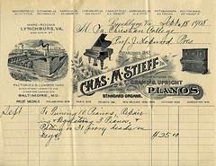

This post is aimed at my local readers, the rest can look at it as a curiosity from an awesome small country that is fumbling all over itself trying to be even awesomer.

## Slave labor

We don't have Mexicans, but we do have [students](http://en.wikipedia.org/wiki/Student "Student"). A whole [social caste](http://en.wikipedia.org/wiki/Caste "Caste") of people ripe for abuse because they don't realize their worth and hey, what better way to keep operating costs low than to employ a bunch of these guys, pay them below-minimum wage and tell them it's even worse elsewhere? \[caption id="" align="alignright" width="240" caption="Students in the incubation room at the Woodbine Agricultural School, New Jersey (Photo credit: Center for Jewish History, NYC)"]\[/caption] Not cool! Originally student work was invented to give students some degree of autonomy, to make getting through college cheaper and easier. It's since been quite corrupted ... whole companies running on nothing but [slave labor](http://en.wikipedia.org/wiki/Slavery "Slavery"). My recent survey about [how much money comp sci students make](http://swiz.ec/yhzzr7) shows that most make less than 10 euro an hour, glaringly obvious even on just a cursory glance. These aren't internships mind you. A lot of them are full blown computer engineers, often-times making companies' core products completely on their own or with a help of a couple other students. It's sickening. Even worse is that when I published the survey, a lot of students pinged me and said _"Hey, don't you think you set the bar somewhat high? Most of us don't even make the 7 euro lower bound you set up ..."_ No, for fuck's sake no! This is money we're talking about! You shouldn't be paid how much everyone else is being paid, this isn't some competition in fairness, this is cold hard cash! Demand to be fucking paid how much you are worth to the company. I can (sort of) understand a waiter working for 4 or 5 euro an hour. But anyone paying less than 10 for any nongeneric type of service should be laughed out of business. And [business people](http://en.wikipedia.org/wiki/Businessperson "Businessperson") ... shame on you! If you get a student who is any good and they timidly ask for 7 euro an hour because they consider that quite a bit of money. Tell them they're being stupid and demand to give them 15 euro. Congratulations, you just earned an extremely happy and loyal worker. And it's still cheaper than giving them full employment. When paying students, always keep in mind they rarely work more than half-time. They need to make a living off this!

## Speed of business

Another thing that really gets on my nerves in Slovenia is that everything is _so slow_. Sending an invoice to a client in Slovenia feels like sending it down a black hole. \[caption id="" align="alignright" width="240" caption="Invoice, Chas M Stieff Manufacturer of Grand & Upright Pianos (Photo credit: Lynchburg College Archives)"]\[/caption] The average response time I've experienced is ... _a long time_. Hell, I am legally mandated to give you two weeks of time to pay up and most [businesses](http://en.wikipedia.org/wiki/Business "Business") are very _very_careful not to pay anything sooner than that. The problem is so big the only thing [student unions](http://en.wikipedia.org/wiki/Students%27_union "Students' union") do is make sure people get paid quickly by just fronting the cash. I checked. There are [invoices](http://en.wikipedia.org/wiki/Invoice "Invoice") from _a year ago_ that are still marked as "fronted by student union". Sickening! You know what happens when you send an invoice to a proper country? You get paid the next day. Last night someone wired me the money literally 20 minutes after I clicked _send_ on the invoice email. Of course then I had to wait roughly 15 hours for my bank to actually process the transfer of a few electrons ...

## Conclusion

Slovenia is awesome and I love it to bits, but I sure as hell get the feeling it doesn't want me here. And hey, the top of the crop of our entrepreneurs, businesses and pretty much anyone worth their salt ... is leaving. I wonder why. PS: if looking at the data from that survey makes me any angrier I will hurt people.

###### Related articles

- [The Only Island In Slovenia May Be The Most Awesome Private Island In The World](http://www.businessinsider.com/the-only-island-in-slovenia-may-be-the-most-awesome-private-island-in-the-world-2012-2) (businessinsider.com)
- [Student Unions](http://studenteventsblog.wordpress.com/2012/02/06/student-unions/) (studenteventsblog.wordpress.com)
- [Slo(www)Bus for Playful Exploration of Slovenia](http://www.prweb.com/releases/2011/7/prweb8649378.htm) (prweb.com)
- [Record number of women in Slovenia parliament](http://seattletimes.nwsource.com/html/nationworld/2016937139_apeusloveniawomenmps.html?syndication=rss) (seattletimes.nwsource.com)

