Every couple of years I actively participate in our version of mardi gras and dress up in a costume. It's usually something mundane like dressing up as a living statue or a girl or whatever. \[caption id="" align="alignright" width="350" caption="Full costume"]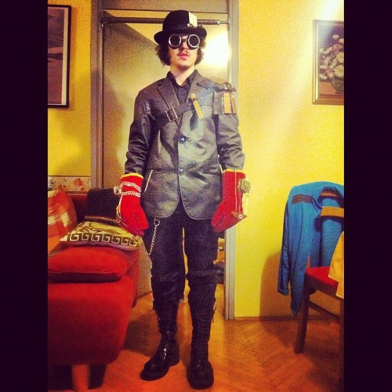\[/caption] This year, however, I decided to go full out. Finally, an excuse to make a steampunk costume! I'm not the handiest person in the world so the whole thing was a bit of a mess - not a single straight cut anywhere, parts of my room are now gold and there is trash everywhere. But I had a lot of fun working manually for two days. It's remarkably refreshing to do something in meatspace now and anon. All the manly work even made my fifth chest hair grow! Score! I'm quite pleased with the result, the costume turned out pretty decent and only cost about 30 euro in parts and another ~300 euro in time. Plus whatever old crap I found collecting dust around the house; like for instance, bits of my high school death metal outfit. \[caption id="" align="alignnone" width="500" caption="It begins with a pile of junk"]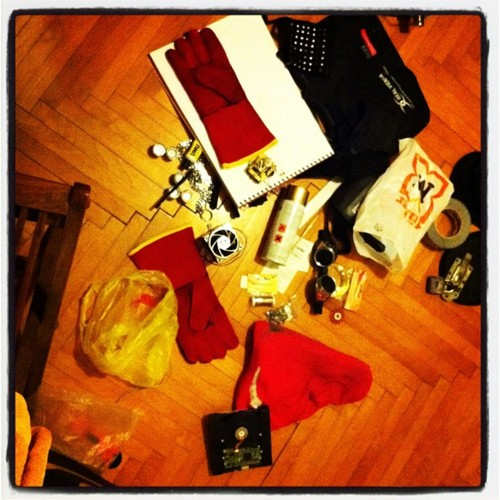\[/caption] \[caption id="" align="alignnone" width="500" caption="Regular welding glasses from a store, just added the fluff"]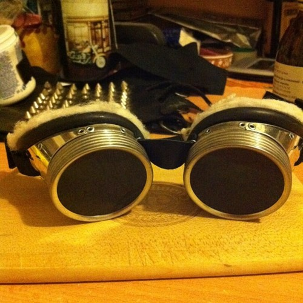\[/caption] \[caption id="" align="alignnone" width="500" caption="First stage of shoulder armor - an old belt, strip of cloth and leather tied on with aluminium wire"]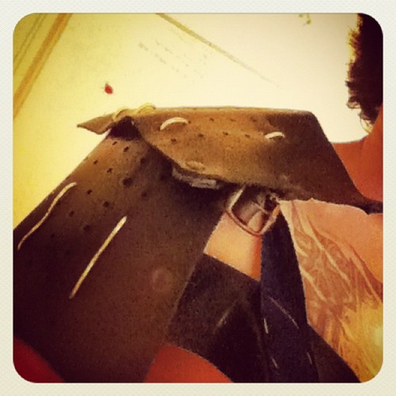\[/caption] \[caption id="" align="alignnone" width="500" caption="The hat is actually something I always wear"]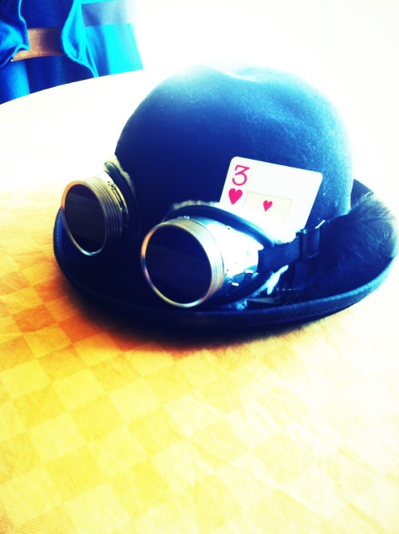\[/caption] \[caption id="attachment_3730" align="alignnone" width="614" caption="Normal welding gloves and some wire"][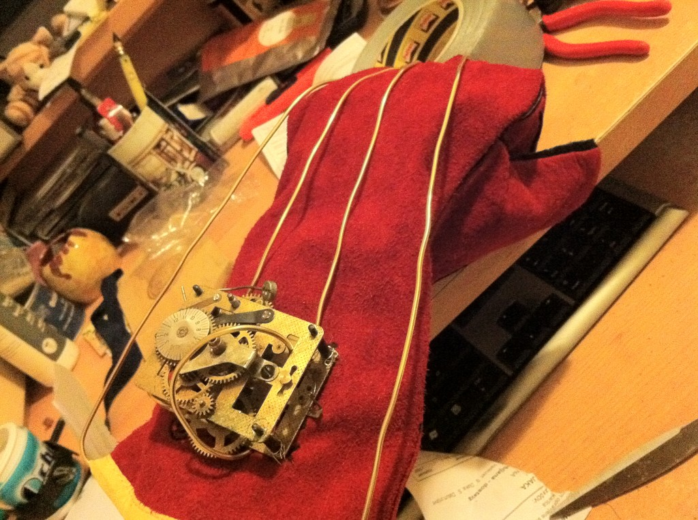](http://swizec.com/blog/wp-content/uploads/2012/02/photo1.jpg)\[/caption] \[caption id="attachment_3731" align="alignnone" width="614" caption="Took several tries to make symmetric wings"][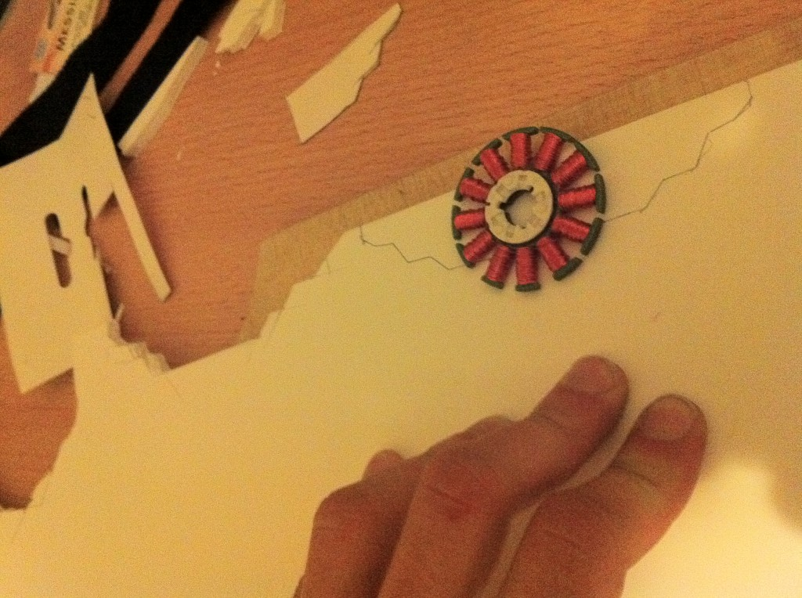](http://swizec.com/blog/wp-content/uploads/2012/02/photo-13.jpg)\[/caption] \[caption id="" align="alignnone" width="500" caption="The trick is to apply copper paint with a sponge"]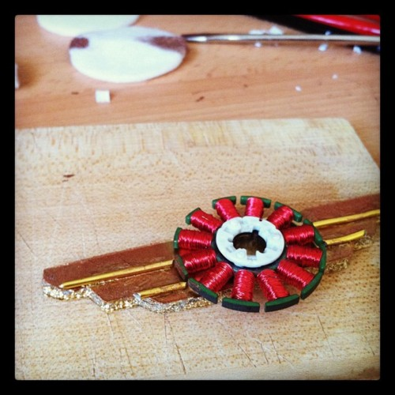\[/caption] \[caption id="" align="alignnone" width="500" caption="Armor panels"]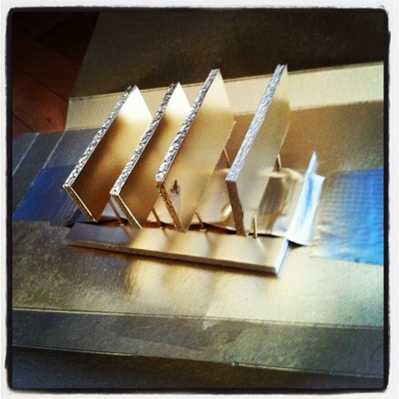\[/caption] \[caption id="" align="alignnone" width="500" caption="The finished shoulder armor drying"]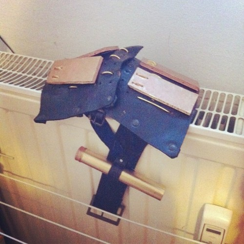\[/caption] \[caption id="" align="alignnone" width="500" caption="The gloves turned out quite well"]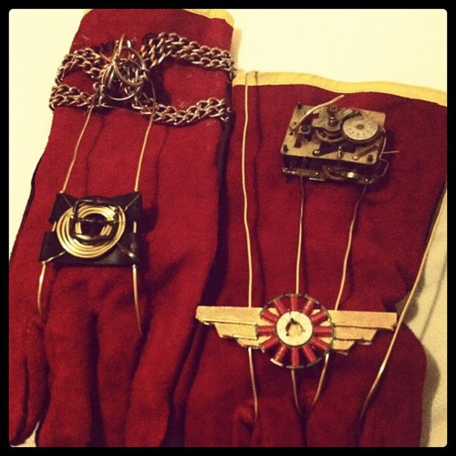\[/caption] \[caption id="attachment_3733" align="alignnone" width="535" caption="Manliest my desk has ever looked"][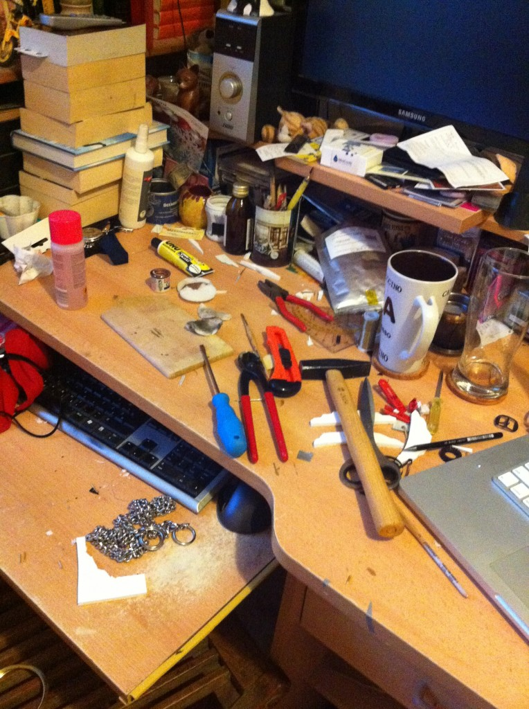](http://swizec.com/blog/wp-content/uploads/2012/02/photo-22.jpg)\[/caption] \[caption id="" align="alignnone" width="500" caption="Slightly bigger picture of full outfit"]\[/caption] Unfortunately the costume did not prevent me from accidentally getting way too drunk at the party. Lost my real glasses, the hat, my keys, even my moleskine. All in all, the most expensive party I've ever been to ... but at least the costume is cool :)

###### Related articles

- [Your NERF rifle love just got seriously steampunked](http://www.winextra.com/2012/02/your-nerf-rifle-love-just-got-seriously-steampunked/) (winextra.com)
- [Steampunk Nerf Gun of the Day](http://geeks.thedailywh.at/2012/02/22/steampunk-nerf-gun-of-the-day/) (geeks.thedailywh.at)
- [Steampunk Costume Update](http://darkrosedesign.com/2012/02/15/steampunk-costume-update/) (darkrosedesign.com)
- [Blast from the Past: Steampunk](http://mishidems.wordpress.com/2012/02/21/blast-from-the-past-steampunk/) (mishidems.wordpress.com)
- [Steampunk moves on](http://kasiajames.wordpress.com/2012/01/25/steampunk-moves-on/) (kasiajames.wordpress.com)
- [Awesome Steampunk'd Disney Character Art!](http://geektyrant.com/news/2011/12/19/awesome-steampunkd-disney-character-art.html) (geektyrant.com)
- [The Steampunk World's Fair 2012](http://laughingsquid.com/the-steampunk-worlds-fair-2012/) (laughingsquid.com)

