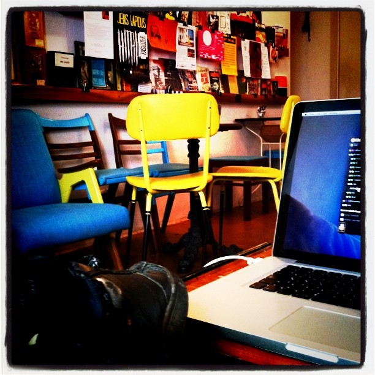

The oldest joke online is that geeks have never seen a girl.

\[caption id="" align="alignright" width="342" caption="Book at bikofe"]\[/caption]

Or that nice guys can't get a girl.

Variations of this story have been happening all my life, my fellow geeks tell similar stories and the internet is awash with rage comics saying the same thing. But this particular story happened last night, to me.

On my way home from class I went to a nearby coffee shop to read a book - it's a trick I use to get myself off the internets and reading proper books that are awesome.

Upon getting there, my regular spot, the only place with a good reading light, was occupied. Some girl was there, [reading a book](http://en.wikipedia.org/wiki/Reading_%28process%29 "Reading (process)"), minding her own business.

I plomped my arse down at a nearby table and tried to read. There wasn't enough light.

After a few moments of thought I got up and asked the girl, if I could sit at her table because the light was better. She looked up from her book, smiled, said she doesn't speak a word of [Slovene](http://en.wikipedia.org/wiki/Slovene_language "Slovene language"), but that I should totally sit next to her since she's hogging the only good light.

Sat down, thinking _"My, that girl was kinda cute. Foreign too, I bet she'd be super interesting to talk to! Wonder what she's doing here ..."_ And I started reading.

After about half an hour, the girl stopped reading and just sort of sat there, looking kind of lost for a couple of minutes. I could almost _feel_ her eyes peering through me ... but the book was really interesting. I kept reading.

\[caption id="" align="alignright" width="367" caption="Bikofe"]\[/caption]

She stood up and wandered about the coffee shop, looking at different things on the wall and just generally looking like a person loitering around waiting for someone to afford an opportunity to be spoken to.

I was the only other person there.

Finally she decided to leave. But before she did she came up to me, gave me a super warm smile and a cute good bye. All I did was a _Huh? Oh right, bye._

Opportunity squandered.

Here was a cute girl that would doubtlessly be really interesting to talk to, who actually _wanted_ to talk to me. But I just didn't give her a chance because I was there to read a book, damn it.

I think this is something us geeks do **a lot**. We pride ourselves on our laser-focused minds, being able to [construct glass castles in our heads](http://swizec.com/blog/why-programmers-work-at-night/swizec/3198 "Why programmers work at night") when tackling big problems, but we often shut ourselves out of random opportunities - what people call _serendipity_.

There was a line in my old startup pitch: _"[Serendipity](http://www.imdb.com/title/tt0240890/ "Serendipity (film)") is looking for a needle in a haystack and finding the farmer's daughter."_

Except for engineers the line would be: _"Serendipity is looking for a needle in a haystack and finding the farmer's daughter, then being pissed off that you couldn't find the needle and going home without even saying Hello to the daughter."_

And that's why the internet's oldest joke is that geeks have never seen a girl.

PS: this likely also has a lot to do with how different business-type founders are from engineer-type founders, that openness to random opportunities that pop up everywhere. Definitely something engineers should work on :)

###### Related articles

- [GeekOut on Jason and the Argonauts](http://berinkinsman.wordpress.com/2012/03/05/geekout-on-jason-and-the-argonauts/)(berinkinsman.wordpress.com)

  * * *

- [Books Geeks Should Read to Their Kids: Your Additions to Our List](http://www.wired.com/geekdad/2012/03/books-to-read-to-kids/)(wired.com)

  * * *

- [First steampunk bedtime story](http://r.zemanta.com/?u=http%3A//geekout.blogs.cnn.com/2012/03/05/the-worlds-first-steampunk-bedtime-story/&a=78744758&rid=867f674b-7187-44ee-8f19-618550443921&e=ee6f5798c6cc490b9a4a4724e57d38bb)(geekout.blogs.cnn.com)

  * * *

- ["Blessed are the geek, for they shall inherit the earth."](http://nerdgasmnoire.wordpress.com/2011/12/10/blessed-are-the-geek-for-they-shall-inherit-the-earth/)(nerdgasmnoire.wordpress.com)

  * * *

