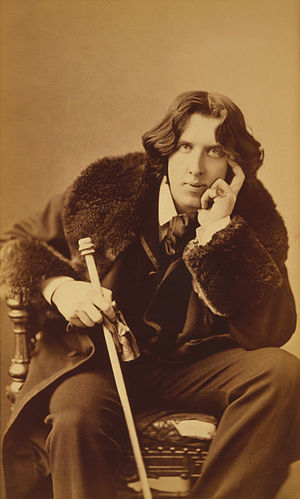
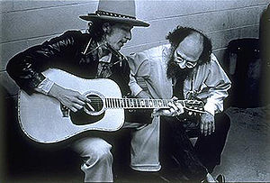
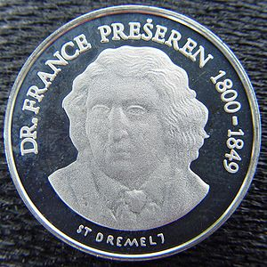
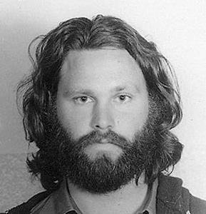

\[caption id="" align="alignright" width="300" caption="Image via Wikipedia"][](http://commons.wikipedia.org/wiki/File:Oscar_Wilde_portrait_by_Napoleon_Sarony_-_albumen.jpg)\[/caption]


[Towards A Computational Model of Poetry Generation](https://www.era.lib.ed.ac.uk/handle/1842/3460 "Towards a computational model of poetry generation") is a [paper](http://en.wikipedia.org/wiki/Paper "Paper") by Manurung, Ritchie and Thompson (whomever they are) published in May 2000 and so far seems to be the best starting point for [my graduation thesis](https://github.com/Swizec/Le-Thesis).


There are three main parts to this story:

1. why!?
2. what makes it hard
3. how it used to be done
4. how it should be done

Obviously my idea of how it should be done matches somewhat with the authors of this paper, otherwise I wouldn't hold it in such a high regard :P

## Why!?

> Poetry is a unique artifact of human [natural language](http://en.wikipedia.org/wiki/Natural_language "Natural language") pro- duction, with the distinctive feature of having a strong unity between its content and its form. The creation of poetry is a task that requires intelligence, expert mastery over world and linguistic knowledge, and creativity. Al- though some researchwork has been devoted towards cre- ative language such as story generation, poetry writing has not been afforded the same attention. It is the aim of this research to fill that gap, and to shed some light on what often seems to be the most enigmatic andmysterious forms of [artistic expression](http://en.wikipedia.org/wiki/Art "Art").

In short, this is a really cool problem to solve because it's something that hasn't _really_ been done before. And it just looks interesting when you give computers - strictly logical reasonable machines - even the most modest of abilities to create art.


When rationalization is required ... well somebody needs to create all those pop songs. Imagine if we could get a computer to write them, then sell them to all the [pop music](http://en.wikipedia.org/wiki/Pop_music "Pop music") labels to feed to the Spears and Aguileras of this world. Marvelous!

## What makes it hard

The problem with poetry is two-fold. On the one hand one finds themselves at a serious disadvantage in comparison to creating a traditional [NLG](http://en.wikipedia.org/wiki/Natural_language_generation "Natural language generation")(natural language generation) tool because poetry is less rigid. There is no message you are trying to convey and so the goal you are trying to achieve is a bit muddy.


\[caption id="" align="alignright" width="300" caption="Image via Wikipedia"][](http://commons.wikipedia.org/wiki/File:Ginsberg-dylan.jpg)\[/caption]


Furthermore, poetry possesses a certain unity between message and form. As Levin stated in 1962 _"In poetry the form of the discourse and its meaning are fused into a higher unity"_.


This creates a problem because traditional NLG systems are decomposed into simpler units of [content determination](http://en.wikipedia.org/wiki/Content_determination "Content determination"), text planning and surface realisation. In [poetry form](http://en.wikipedia.org/wiki/Poetry "Poetry") and message are too intertwined to allow this approach.


The only advantage we might have from creating poetry instead of informative text, is that readers expect to do a lot of interpretative work, but realistically this again only serves to make it more difficult to define a goal for our [algorithm](http://en.wikipedia.org/wiki/Algorithm "Algorithm").


Essentially: it's hard to decide what we _want_and traditional well researched approaches break down. Great.

## How it used to be done

\[caption id="" align="alignright" width="300" caption="Image via Wikipedia"][](http://commons.wikipedia.org/wiki/File:Slovenska_lipa_srebrnik_reverz.jpg)\[/caption]


As with a lot of [NLP](http://en.wikipedia.org/wiki/Natural_language_processing "Natural language processing")research, there were several attempts at a strictly academic approach to poetry generation back in the 80's. More recently, there have been several-ish web based attempts, but using similar techniques.


The problem with old approaches is that they were basically party tricks - humans generated extremely detailed grammars and poetic structures, so the computer ended up just semi-randomly filling in the words. While this produced good looking poetry and in case of [RACTER](http://en.wikipedia.org/wiki/Racter "Racter") even lead to publication.


Leaving aside considerations of whether the poetry at this point is even computer generated, all of these approaches completely ignored semantic meaning and most poetics as well - rhythm, rhyme and figurative language.

## How it should be done

Just as I'm planning to in my thesis, authors of this paper have decided to focus mostly on poetic form and ensure their results follow a strict verse, rhyming structure and other features usually attributed to classic poetry. Mostly because it is easy to pass off almost anything as modern experimental poetry and the more structure we can muster, the easier it becomes to actually verify results.


\[caption id="" align="alignright" width="289" caption="Image via Wikipedia"][](http://commons.wikipedia.org/wiki/File:Jim_Morrison_1970.jpg)\[/caption]


The approach they suggest is a stochastic hillclimbing algorithm - particularly an evolutionary approach where the algorithm follows this kind of loop:

1. Generate
2. [Evaluate](http://en.wikipedia.org/wiki/Evaluation "Evaluation")

Generation is done by mutating the best candidates from the previous cycle through three simple constructs: Adding, Changing and Deleting.


So if you had a verse _"John walked"_ it could become _"John walked **to the store**"_, or _"John **lumbered**"._ Or for instance _"John likes Jill and Mary_" it becomes _"John likes Jill"_.


Because of an integrated architecture (combining all of semantics, form, etc.) these changes can and should happen at any level so special care must be taken that changing the semantics of a verse, doesn't negatively affect its rhythm. Although from the paper I don't grok why exactly this is a problem, since the evaluation step should take care of negative mutations.


After we have a new population, these are then evaluated for correctness and the candidates with highest scores from the [fitness functions](http://en.wikipedia.org/wiki/Fitness_function "Fitness function") get to go into the next round of mutations.


The authors go into little detail about assessing the different poetic structures, mostly because they have not yet cracked how to implement all of them. Detecting rhythm seems to be where they've made the most progress and a solution is suggested where we give the algorithm a target [phonetic form](http://en.wikipedia.org/wiki/Phonetic_form "Phonetic form"), like this _limerick_:

```
w,s,w,w,s,w,w,s(a)
w,s,w,w,s,w,w,s(a)
  w,s,w,w,s(b)
  w,s,w,w,s(b)
w,s,w,w,s,w,w,s(a)
```

Where _w_ means a weak stress syllable and _s_ means a strong one. In parentheses the rhyming structure is described.


It is suggested that with the exception figurative language all the criteria can be dumbed down to numerical arguments that can be easily quantified through different means that are only loosely described.


They also go into a bit of formal detail explaining the sort of grammars that are used, but you should go read the actual paper if you're interested in such heavily theoretical things :)


Here is an example of what their algorithm can produce:


**Target semantics**

```
{john(1),mary(2), dog(3), bottle(4), love(5,6,7), slow(8), smile(9,10)}
```

**Target Form**

```
w,s,w,w,s,w,w,s,
w,s,w,w,s,w,w,s
```

**Surface**

```
the bottle was loved by Luke
a bottle was loved by a dog
```

**Stress**

```
w,s,w,w,s,w,s,
w,s,w,w,s,w,w,s
```

###### Related articles

- [HOAku (Of Poetry and Politics)](http://betsyandrewsetchart.wordpress.com/2011/11/29/hoaku-of-poetry-and-politics/) (betsyandrewsetchart.wordpress.com)
- [Faint Sigh](http://ceruleanmoon.wordpress.com/2012/02/26/faint-sigh/) (ceruleanmoon.wordpress.com)
- [Slight delay, with hints of things to come.](http://combatsteve.wordpress.com/2012/02/07/slight-delay-with-hints-of-things-to-come/) (combatsteve.wordpress.com)
- [I'm no Shakespeare, but...](http://navigatingcyberloss.wordpress.com/2012/03/03/im-no-shakespeare-but/) (navigatingcyberloss.wordpress.com)
- [My Thoughts on Poetry & Writing](http://ibawordmonger.wordpress.com/2012/02/07/my-thoughts-on-poetry-writing/) (ibawordmonger.wordpress.com)

[](http://www.zemanta.com/ "Enhanced by Zemanta")