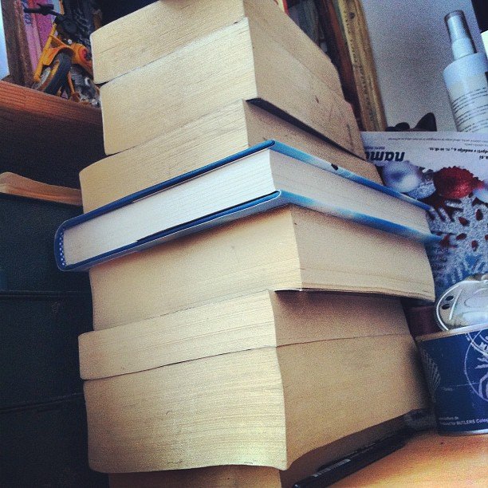
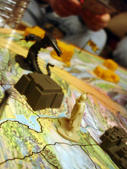
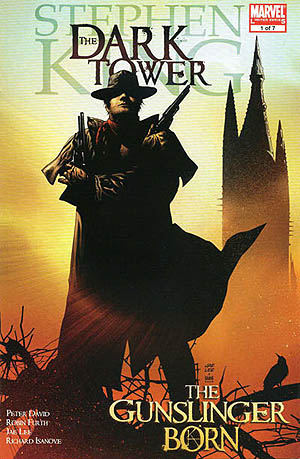

There is a stack of books on my desk waiting to be read. They're not bad books. Some are considered the height of [classical literature](http://en.wikipedia.org/wiki/Classics "Classics"), some are downright useful. \[caption id="" align="alignright" width="367" caption="Unread."]\[/caption] And yet, they linger, waiting for months upon months, some for years. I'll get to them ... eventually. I used to be a voracious reader, going through books as if they were cookies. I still remember being eight or nine years old, waking up at 5am to read a book for two hours before getting ready for school. Evenings looked pretty much the same, I'd go to bed at 9pm and just read. Anything. Everything. Nothing was safe from my reading appetite. _Just one more page! Please, mum?_ was my catchphrase.

## An internet

Then I got an internet. I was still reading books. Mostly when school forced it upon me. Then I would devour a piece of classical literature in two afternoons. Because, you know, everything is easier at the last minute. And I would _enjoy_ the book. Absolutely love it! After the deadline ... back to the internet. This has gotten progressively worse to the point I simply don't allow myself near a bookstore anymore. What's the point in buying books if you never find the time to read them?

## Brain snacking

Funny thing is, I'm still a voracious reader. I probably read, or at least scan, upwards of 50 blog posts every day. Count in all the [tweets](http://twitter.com "Twitter"), facebook updates, forum posts, [IRC](http://en.wikipedia.org/wiki/Internet_Relay_Chat "Internet Relay Chat") conversations and [HackerNews](http://news.ycombinator.com/ "Hacker News")comments and I probably read 50 pages of "books" a day. \[caption id="" align="alignright" width="180" caption="Dark Tower (Photo credit: fridayn)"]\[/caption] 50 pages. Time ... wasted. Of all those blogs and comments and tweets and everything, most of it is just interesting. Something to keep my mind occupied. A little candy to keep me happy while I go on about my day. Most of it isn't even that well written! But hey, it's always right there. At the tip of my fingers. Something new always coming along to satisfy my voracious appetite for brain food. Like crisps in the cupboard or chocolate in the fridge, who's got the time to prepare a meal when they can just barf down a snack?

## [The Dark Tower](http://www.amazon.com/Dark-Tower-Book/dp/1880418622%3FSubscriptionId%3D0G81C5DAZ03ZR9WH9X82%26tag%3Dageewitahat-20%26linkCode%3Dxm2%26camp%3D2025%26creative%3D165953%26creativeASIN%3D1880418622 "The Dark Tower (The Dark Tower, Book 7)")

[Stephen King](http://www.rottentomatoes.com/celebrity/stephen_king "Stephen King"). \[caption id="" align="alignright" width="300" caption="Image via Wikipedia"]\[/caption] Reading his _[On writing](http://www.amazon.com/Writing-Memoir-Craft-Stephen-King/dp/0684853523%3FSubscriptionId%3D0G81C5DAZ03ZR9WH9X82%26tag%3Dageewitahat-20%26linkCode%3Dxm2%26camp%3D2025%26creative%3D165953%26creativeASIN%3D0684853523 "On Writing:  A Memoir of the Craft")_ changed my style forever. He advocates a plain spoken style, people today don't have time to read. They don't even _want_ to read. You have to shove it down their throats. Tell them a cool story in a simple style and before they know it, they've just read a good book. Uh-oh! Head trick as Rausch would say. :) And The Dark Tower is one hell of a story. It reads just like a blog post! None of that high english nonsense, just plain words, lots of swearing, sex and violence. But hiding a very deep and meaningful tale if you care to look for one. The real winner is how the story is laid out. There's a break every two or three pages. Plenty of chapters. Every chapter almost meaninglessly divided into subchapters. Some a third of a page long. Some start in the middle of events. Sounds annoying, but it's brilliant. What's the biggest obstacle to [reading a book](http://en.wikipedia.org/wiki/Reading_%28process%29 "Reading (process)")? The commitment, before you is a bunch of text and you have to commit to reading all of it. Nobody wants to stop reading mid-sentence because the kettle is boiling. Rushing to finish the page so you can keep your place ... just because someone tweeted you and you have to respond. The worst part of reading a book is not knowing when the next break is coming and only having an hour of time to read. You might happen upon a break, or you might not. If you do, awesome, if you don't, you're left with a subconscious sense of guilt that you started something and didn't finish. With Stephen King that problem doesn't exist. You're guaranteed to finish _something_ every time you pick the book up. Even if you're just taking a shit. And the best part is, whenever you put the book down, it calls to you. It beckons in your dreams and you _want_ to get your arse offline and continue reading. So you _will_ go offline and finish the damn book.

###### Related articles

- [Stephen King's 'The Dark Tower' Reborn at Warner Bros.](http://www.hollywood.com/news/Stephen_King_Dark_Tower_Reborn_at_Warner_Bros/20284768) (hollywood.com)
- [Is Warner Bros and HBO about to pick up Ron Howard's adaptation of The Dark Tower?](http://www.aintitcool.com/node/54228) (aintitcool.com)
- [Media Fast](http://inspirationlocation.com/2012/03/09/media-fast/) (inspirationlocation.com)
- [If you don't read books you shouldn't be writing one](http://www.thepunch.com.au/articles/if-you-dont-read-books-you-shouldnt-be-writing-one/) (thepunch.com.au)
- [I've read a lot of books. Now I want to do something productive.](http://ask.metafilter.com/210313/Ive-read-a-lot-of-books-Now-I-want-to-do-something-productive) (ask.metafilter.com)

