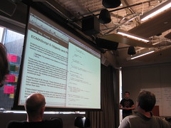

[ECMAscript](http://www.ecma-international.org/publications/standards/Ecma-262.htm "ECMAScript"), 6th edition might bring us fat arrow notation - [Douglas Crockford on fat arrows](http://www.yuiblog.com/blog/2012/03/30/what-is-the-meaning-of-this)

    function (x) {
        return x * x;
    }

    // becomes

    (x) => x * x

Douglas' post concerns itself mostly with the intricacies of how _this_ is bound to the [function object](http://en.wikipedia.org/wiki/Function_object "Function object")and what the fat arrow notation might bring, what I see is something completely different. \[caption id="" align="alignright" width="240" caption="vim (Photo credit: jwalsh)"]\[/caption] Proper lambdas! That's right, [functions](http://en.wikipedia.org/wiki/Function_%28mathematics%29 "Function (mathematics)") that implicitly return with none of that big ugly _function_ keyword! Hooray. A bit tricky when you need a named function, but so far this is just an unofficial proposal, I'm sure they'll figure something out by the time ECMA6 comes anywhere near being a standard (not in 2012). As I said on hacker news _[Javascript](http://en.wikipedia.org/wiki/JavaScript "JavaScript") is a beautiful language, trapped in bad syntax, peppered with poor semantic choices_. What is left of a language once you take syntax and semantics out of the picture? Quite a lot.

## What else is new

Spurred on by excitement I decided to poke around the [wiki for the ongoing specification work of Ecma](http://wiki.ecmascript.org/doku.php). Some of the "[tentatively approved](http://wiki.ecmascript.org/doku.php?id=harmony:harmony)" proposals include:

1.  **[Array comprehensions](http://wiki.ecmascript.org/doku.php?id=harmony:array_comprehensions) and [generators](http://wiki.ecmascript.org/doku.php?id=harmony:generator_expressions) and [iterators](http://wiki.ecmascript.org/doku.php?id=harmony:iterators)** - a natural notation for constructing lists from lists, used a lot in python and haskell.

        // mapping
        [ square(x) for (x of [1,2,3,4,5]) ]
        // filtering
        [ x for (x of a) if (x.color === ‘blue’) ]

    This naturally extends into generators, where you can have an object generating values according to a pattern - possibly until infinity. (the example given in the proposal are fibonacci numbers, obviously) [Iterators](http://en.wikipedia.org/wiki/Iterator "Iterator") are a similar beast - you get to define _how_ an object should be iterated over, which gives us nice abstractions for all sorts of things.

2.  **[Classes](http://wiki.ecmascript.org/doku.php?id=harmony:classes)**- although using prototypes, functions and instances is enough to do everything classes can do, it isn't very expressive and too much deep knowledge is required to understand the code.

    > A class defines four objects and their properties: a [constructor function](http://en.wikipedia.org/wiki/Constructor_%28object-oriented_programming%29 "Constructor (object-oriented programming)"), a prototype, a new instance, and a private record bound to the new instance. The body of a class is a collection of member [definitions](http://en.wikipedia.org/wiki/Definition "Definition").

3.  **[Block scoped bindings](http://wiki.ecmascript.org/doku.php?id=harmony:block_scoped_bindings)** - Javascript used to only be [lexically scoped](http://en.wikipedia.org/wiki/Scope_%28computer_science%29 "Scope (computer science)"), otherwise known to new programmers as _"Aaaaaah everything is global what the hell!?"_. With the addition of [let](http://wiki.ecmascript.org/doku.php?id=harmony:let), [const](http://wiki.ecmascript.org/doku.php?id=harmony:const) and block functions there will now also be block scope where you can define things to only exist inside two {}.

4.  **[Modules!](http://wiki.ecmascript.org/doku.php?id=harmony:modules)** What has traditionally been solved using require.js will now work similar to how python does it. You get to define modules and then import them where they are needed. Possibly the most earth shattering addition since dependency management in Javascript has devolved into an extreme sport lately.

        // module
        module math {
            export function sum(x, y) {
                return x + y;
            }
            export var pi = 3.141593;
        }

        // client
        // we can import in script code, not just inside a module
        import {sum, pi} from math;

        alert("2π = " + sum(pi, pi));

5.  **[Proxies](http://wiki.ecmascript.org/doku.php?id=harmony:direct_proxies)** - according to the proposal a _Proxy_ is an object that takes two objects - a target and a handler. Where, if I understand correctly, you call functions on the proxy (trigger them), which execute as traps on the handler object, using the target. This looks like a new way of handling events.Similar to what modern MVC frameworks are doing where you have a "view" that takes care of safely executing functions when events are triggered.

## When?

A lot more interesting stuff can be found in the [strawman section](http://wiki.ecmascript.org/doku.php?id=strawman:strawman) where completely far out ideas live, but the tentatively approved ideas already raise my hopes far too much without any assurance I'll ever get any of this. So much could change before any of this is solidifies into a standard. And even when it does become a standard ... how long before any of this reaches wide browser support? Mozilla's Javascript already includes a lot of this stuff - a lot of the proposals come from there actually - anyone else? Not really. At least there is some comfort in the fact all of this will quickly reach node.js :)

###### Related articles

-   [The Future of JavaScript - take a peek today!](http://blog.chromium.org/2012/02/future-of-javascript-take-peek-today.html) (chromium.org)
-   [The next JavaScript in Google Chrome](http://webdev360.com/the-next-javascript-in-google-chrome-40849.html) (webdev360.com)
-   [Javascript module pattern: When to use it and why](http://briancray.com/2012/02/23/javascript-module-pattern/) (briancray.com)
-   [Closure and currying magic for cleaner javascript](http://swizec.com/blog/closure-and-currying-magic-for-cleaner-javascript/swizec/3981) (swizec.com)
-   [Why I want Classes in JavaScript](http://www.davidflanagan.com/2011/11/why-i-want-clas.html) (davidflanagan.com)
-   ["Virtual" Functions in JavaScript](http://devblog.blackberry.com/2011/08/virtual-functions-in-javascript/) (devblog.blackberry.com)
-   [JavaScript Closures Explained](http://lostechies.com/derekgreer/2012/02/17/javascript-closures-explained/) (lostechies.com)

