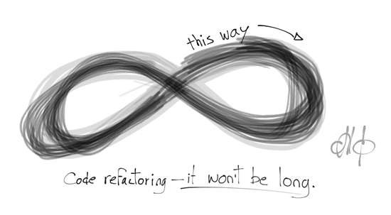

_This post is my first test of zemanta's Blogspire, please tell me if you find this style of reblogging useful and I should do more in the future, or maybe I \_should\_ reblog, but differently. Thanks :)_ \[caption id="" align="alignright" width="385" caption="Refactoring"]\[/caption] Nikos Maravitsas writes about _[What refactoring is and what it isn't](http://www.javacodegeeks.com/2012/04/what-refactoring-is-and-what-it-isnt.html)_ over at Java Code Geeks.

> Sometimes a programmer will come to me and explain that they don't like the design of something and that "we're gonna need to do a whole bunch of refactoring" to make it right. Oh Oh. This doesn't sound good. And it doesn't sound like refactoring either....
>
> 

_But that other guy before me was stupid! He did it wrong! All wrong! Wah wah wah ..._ Definitely something I've been guilty of throughout my coding career. Even went so far as justifying it in a blogpost where I asked _[Are you a boyscout coder?](http://swizec.com/blog/are-you-a-boy-scout-coder)_The gist of my question was whether clients should be charged for refactoring work or not. More importantly, what level of refactoring work is on par for getting any work done in a foreign codebase and what's taking aesthetics too far.

> [Refactoring](http://en.wikipedia.org/wiki/Code_refactoring "Code refactoring"), as originally defined by [Martin Fowler](http://martinfowler.com/ "Martin Fowler") and [Kent Beck](http://en.wikipedia.org/wiki/Kent_Beck "Kent Beck"), is _A change made to the internal structure of software to make it easier to understand and cheaper to modify without changing its observable behavior… It is a disciplined way to clean up code that minimizes the chances of introducing bugs._ /.../ Refactoring is supposed to be a practice that supports making changes to code. You refactor code before making changes, so that you can confirm your understanding of the code and make it easier and safer to put your change in.

And that's the gist of it. You are allowed to refactor as much as you want so long as the outside interface doesn't change and you make the code demonstrably easier to work with in the future. I think any client would be happy to pay for making their development process cheaper. Nikos goes on to explain _how_ to refactor:

> Refactoring is simple. Protect yourself from making mistakes by first writing tests where you can. Make structural changes to the code in small, independent and safe steps, and test the code after each of these steps to ensure that you haven’t changed the behavior – it still works the same, just looks different.

But there's a difference between refactoring things as you go, just polishing up some function names, changing a variable here and there, making things more readable. Those little things you have to get in order to make everyone's lives easier before you implement a new feature ... and changing the architecture of the whole system.

> “Large Scale Refactoring” changes can be ugly. They can take weeks or months (or years) to complete, requiring changes to many different parts of the code. They need to be broken down and released in multiple steps, requiring temporary scaffolding and detours, especially if you are working in short Agile sprints.

This isn't refactoring! Call redesigning and/or rewriting what it is - _redesigning_. If there's a business case for it, go ahead, if it makes sense to redesign now before things get messy, go ahead. For the sake of yourself and everyone around you, just don't do these things in the name of _Refactoring._ Don't be that guy.

###### Related articles

-   [How to refactor this simple code](http://stackoverflow.com/questions/9209530/how-to-refactor-this-simple-code) (stackoverflow.com)
-   [What Refactoring is, and what it isn't](http://www.javacodegeeks.com/2012/04/what-refactoring-is-and-what-it-isnt.html) (javacodegeeks.com)
-   [Bullets for legacy code](http://css.dzone.com/articles/bullets-legacy-code) (css.dzone.com)
-   [Refactored for Efficiency](http://collectiveidea.com/blog/archives/2012/01/17/refactored-for-efficiency/) (collectiveidea.com)

