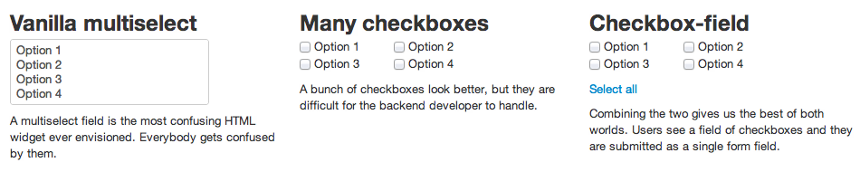

Sometimes you need to ask a users for multiple answers to a single question. But what's the best way to go about it? \[caption id="attachment_4176" align="alignnone" width="760"] Checkbox-field\[/caption] A multiselect input [field](http://en.wikipedia.org/wiki/Field_%28mathematics%29 "Field (mathematics)") is kind of strange for the user, sticks out and doesn't really behave like everything else on the web. A bunch of [checkboxes](http://en.wikipedia.org/wiki/Checkbox "Checkbox") is better for the user ... but have you ever tried handling a form with dynamically created checkboxes? Let alone creating useful tests and consolidating everything into a single list of values. No decent forms framework will let you do that easily. I had to solve this similar problem for a [time and attendance software](http://www.nextpunch.com/) I worked on, so I made a [Javascript](http://en.wikipedia.org/wiki/JavaScript "JavaScript") thing to convert a select field into a [checkbox-field](http://swizec.github.com/checkbox-field/). Then I made it into a simple jquery plugin thing for everyone to use :) [Check out the demo!](http://swizec.github.com/checkbox-field/) The idea is pretty simple:

-   take a select, turn it into a list of options
-   every option becomes a _Checkbox_ model in a collection
-   render each Checkbox as a _CheckboxView_
-   connect everything with some events

What I really love about the Backbone approach is that all of this works almost magically. Instead of bending over backwards to get checkboxes and the hidden multiselect synced up, all I had to do was create some models, some views and tell them how they are connected. This is how the field itself is created

    $multiselect.find("option").each(function (i, el) {
        var $el = $(el);
        // hidden behind the scenes here is that:
        // 1. creating a Checkbox, correctly binds together all needed events
        // 2. adding it to checkboxes, takes care of rendering and adding to the DOM
        checkboxes.add(new Checkbox({value: $el.val(),
                                     label: $el.html(),
                                     selected: $el.attr('selected')}));
    });

And to make sure data is synced up between its three representations (multiselect, visual checkboxes, the [data structure](http://en.wikipedia.org/wiki/Data_structure "Data structure") itself), all it takes is this:

    var Checkbox = Backbone.Model.extend({
        initialize: function () {
            this.bind("change:selected", this.toggled);

            this.attributes.id = this.cid;
        },

        toggled: function () {
            var $opt = $multiselect.find("option[value="+this.get('value')+"]");

            if (this.get('selected')) {
                $opt.attr("selected", "1");
            }else{
                $opt.removeAttr("selected");
            }
        }
    });

Yep, that's the whole model and that's all it takes to sync everything up. Pretty cool huh? I remember trying to do this with just [jQuery](http://jquery.com/ "JQuery") once ... I nearly stabbed my eyes out to end the misery. All in all the whole thing is just _123 sloc_, which can only mean one thing: Backbone is cool. If you use my [checkbox-field](http://swizec.github.com/checkbox-field/) library, it's only going to be a single sloc for you:

    $("#my_selector").checkboxField();

That's it :) Let me know what you think.

###### Related articles

-   [JQuery Multiselect - Abbreviation List](http://blog.ki6i.com/jquery-multiselect-abreviation-list/) (ki6i.com)
-   [Retrieving selected values from WPF ListBox with multiselect](http://stackoverflow.com/questions/8877080/retrieving-selected-values-from-wpf-listbox-with-multiselect) (stackoverflow.com)
-   [How can I get element state from appendchild checkbox in Javascript?](http://stackoverflow.com/questions/9025172/how-can-i-get-element-state-from-appendchild-checkbox-in-javascript) (stackoverflow.com)
-   [Controlling Checkboxes in HTML](http://stackoverflow.com/questions/9404605/controlling-checkboxes-in-html) (stackoverflow.com)
-   [Simulate Holding Ctrl Key](http://stackoverflow.com/questions/9396182/simulate-holding-ctrl-key) (stackoverflow.com)

