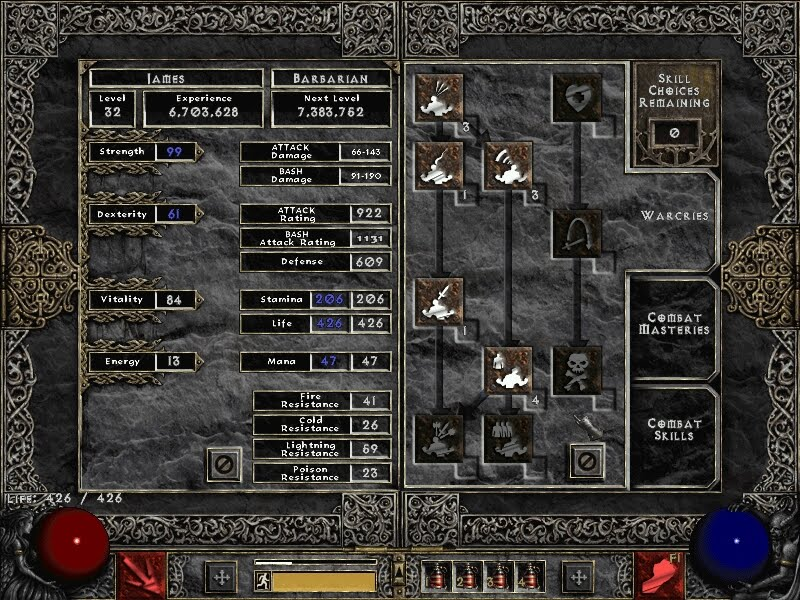

\[caption id="attachment_4231" align="alignnone" width="691" caption="Shiny Diablo 3 is shiny"]\[/caption]

[Diablo 3](http://www.gamespot.com/diablo-iii/ "Diablo III") [open beta](http://en.wikipedia.org/wiki/Software_release_life_cycle "Software release life cycle") weekend is happening _right now!_ Since Friday evening everyone has been invited to help [Blizzard](http://www.blizzard.com/ "Blizzard Entertainment") stress test their servers and let nostalgia rip through their brain with massively sexy graphics and cool sound effects.

Especially the sound effects! It almost feels like they used the exact same sound files from Diablo 2 and [Diablo 1](http://us.blizzard.com/en-us/games/legacy/ "Diablo (video game)") for opening a book, thrashing a barrel etc.

It. Is. _Magnificent._

Maybe I'm biased since I've been waiting for Diablo 3 to come out for the last ... oh I don't know, about ten years?

I was a huge fan of Diablo 1 back in primary school, finished that game about three or four times. Getting a ripped [CD](http://en.wikipedia.org/wiki/Compact_Disc "Compact Disc") with that game has probably been one of the best birthday gifts a friend's ever given me. Yes, we used to do that. Hand drawn covers and everything.

Diablo 2, I never managed to finish. The original was floating around my social circles this time. Not sure where it ended up, might have been me ... last played the game on Wine a couple years ago. In all its glorious 800x600 screen size in the midst of my 2560x1080 screen real-estate.

I didn't finish because of a bug with the random map generator ... didn't create a way to get to the next level. Ooops.

## Oh glorious Diablo 3

Luckily Diablo 3 works on a Mac and I have one of those Mac laptop thingies. I've heard people have huge problems trying to run the beta on Wine. This is one of those times I'm super happy I don't religiously go for open source stuff. :P

Unfortunately my poor laptop is a bit old and while the game runs mostly fine, the physics are a bit ... slow. Despite what I used to think in primary school, no this does not give you more time to think about your actions.

In a word, Diablo 3 is _**FUN!**_ And when I say fun, I mean vomiting rainbows and farting daisies fun.

My favorite new feature is definitely that you can _use the dungeon itself_ to kill monsters. Pull a lever and a chandelier falls down on a group. Marvelous!

The experience is in fact so awesome I will probably buy this game. Then crawl into a hole for a week and shut everything down. No Twitter. No facebook. No school. Nothing. Just Diablo 3.

Hell, I've never even bought a game before if it wasn't by an indie developer. And even that I only ever bought [World of Goo](http://www.worldofgoo.com "World of Goo") and [Machinarium](http://en.wikipedia.org/wiki/Machinarium "Machinarium").

## Not all is perfect :(

There are two things I don't like about Diablo 3 though.

It's too easy.

Might be nostalgia talking, but I remember the game used to be pretty challenging. Even at the very beginning. You had to stock up on health potions and make sure your inventory was empty before setting out from town.

\[caption id="" align="alignright" width="336" caption="The Diablo 2 skill tree"]\[/caption]

Nowadays monsters drop some sort of magical healing crystals. I mean, I managed to clean out a whole dungeon on three or four health potions ... as a weakling necromancer. Oh sorry, a necromancer is a Witchdoctor now.

The skill system is kind of lame, too.

Sure, this is very related to the being too easy part, they wanted to make it _super_ simple. Having played a lot of [RPG's](http://en.wikipedia.org/wiki/Role-playing_game "Role-playing game") in the past, it just seems confusing to me. It's too easy to understand.

Instead of a huge [skill tree](http://en.wikipedia.org/wiki/Technology_tree "Technology tree") where plenty of choices need to be made, there's just five or six tracks of linearly progressing skills. No choice, no exciting tactification, nothing. Just _"Yeah, sure, upgrade my skill"_. The only choice you really have is whether you're going to set the next skill level as the one you actually use or not.

That's it.

As a necromancerwitchdoctor once you take on a secondary skill you even lose the ability to do melee attacks, which is silly. Even ganked from all sides I have to resort to casting range spells ... everyone is an inch away and even as a weakling I could kill them with a dagger blow.

Maybe I'm missing something.

But! The game is super fun. The hours fly by and in a stroke of pure brilliance Blizzard was nice enough to include a clock in the game interface to make sure I, you know, remember to feed myself and stuff.

Oh and the characters are reset before official launch. I also suck at taking screenshots so no interesting battle scenes in the following pics.

\[caption id="attachment_4233" align="alignnone" width="691" caption="Even the login screen looks good"]\[/caption]

\[caption id="attachment_4234" align="alignnone" width="691" caption="Gets messy"]\[/caption]

\[caption id="attachment_4235" align="alignnone" width="691" caption="You even get to see into the next levels"]\[/caption]

###### Related articles

- [Diablo 3 beta throws open doors, this weekend only](http://www.csmonitor.com/Innovation/Horizons/2012/0420/Diablo-3-beta-throws-open-doors-this-weekend-only) (csmonitor.com)
- [Diablo 3 Open Beta Weekend](http://noobtard.wordpress.com/2012/04/21/diablo-3-open-beta-weekend/) (noobtard.wordpress.com)
- [Diablo 3: Took Long Enough!](http://rantsandrage.com/2012/04/21/diablo-3-took-long-enough/) (rantsandrage.com)
- [Diablo 3 Beta Appears To Be Opening Up?](http://www.rockpapershotgun.com/2012/04/18/diablo-3-beta-appears-to-be-public/) (rockpapershotgun.com)

