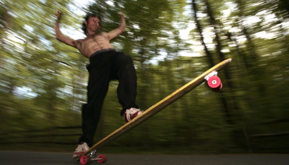

Two months ago the females in my life were becoming increasingly vocal about how skinny I was -> I decided to gain some weight.

-   

Sure, I wasn't really that skinny - a [body mass index](http://en.wikipedia.org/wiki/Body_mass_index "Body mass index") of ~21, smack in the middle of healthy - but hey, why not. Let's try to fatten up a bit. How hard could it be to gain 4kg in two months? Extremely hard! Since I was already tracking calories I only set myfitnesspal to _"[gain weight](http://en.wikipedia.org/wiki/Weight_gain "Weight gain")"_ and tried to stuff my face full of food every day. The first week I went down a whole kilogram. The next week I was almost back to before I started. Now I'm just under two kilograms heavier than I was two months ago. What? Whenever I get excited on twitter about gaining half a kilogram or so, a bunch of tweets fly in from people saying something to the effect of _"Oh how I wish I had your problem! How dare you make it sound so difficult to be fat?"_ Well, to those people I would say they can't really complain until they give my exercise regimen a try - 40 minutes of [body-weight](http://en.wikipedia.org/wiki/Body_weight "Body weight") and cardio every morning before breakfast, boxing practice two or three times a week, longboarding session as often as possible and using walking/longboarding as the main mode of transport. If you can do all that and be fat, tell me your secret! I'm trying to gain some weight here! The experiment wasn't a complete wash though. Some benefits include:

-   **infinite energy** - because I'm constantly stuffing my face, it seems I get tired later in the day and mornings are easier. Better yet, my morning boot up time shortened to almost instant. I'm dezombified almost immediately after waking up!
-   **less sleep** - somewhat related is the fact I seem to need less sleep. 6 hours a day has always been plenty, but I needed to recharge a bit on weekends (8 hours). Nowadays the 8 hour sleep only happens twice or thrice a month. Awesome.
-   **stable energy**_-_getting obvious here with the energy pattern - but I simply can't scoff down enough food in three sittings. This means I have to eat food, real food, none of that snacks crap, every two to three hours. This makes me constantly energized, without any of those afternoon lulls in energy levels.

While all of that is super awesome - and should have been completely obvious - there is one giant drawback to all of this. It seems I need to eat _constantly_. Every. Two. Freaking. Hours. Or three. This is a huge pain in the arse. Not only do I have to find a way to eat real food when I'm at class for six hours straight, it's also very distracting when I'm working. Imagine being fully immersed in the flow, working on an interesting problem and then juuuuust as you're about to crack the problem ... oh right, I have to eat again. And then you waste at least half an hour preparing and eating food. By the time you're done, the proverbial glass palace in your head has already shattered and it takes forever to get back to work. But hey, I can exercise much harder while getting less tired. That's good too :) 

###### Related articles

-   [Close Concerns: Stopping The Gain](http://www.drsharma.ca/obesity-close-concerns-stopping-the-gain.html) (drsharma.ca)
-   [Simple Ways to Gain Weight](http://www.everydayhealth.com/weight/simple-ways-to-gain-weight.aspx) (everydayhealth.com)
-   [One for the Weight Gainers...](http://jasonmachowsky.wordpress.com/2012/05/01/one-for-the-weight-gainers/) (jasonmachowsky.wordpress.com)
-   [Myth of the Week](http://sonjaolafs.wordpress.com/2012/04/30/myth-of-the-week/) (sonjaolafs.wordpress.com)
-   [Longer sleep times may counteract genetic factors related to weight gain](http://www.eurekalert.org/pub_releases/2012-05/aaos-lst042612.php) (eurekalert.org)
-   [That Girl: Longboards makes brunch a laid-back affair](http://www.pbpulse.com/dining/brunch/2012/03/30/that-girl-longboards-makes-brunch-a-laid-back-affair/) (pbpulse.com)
-   [All Aluminum Longboard Shows Its Mettle](http://hackaday.com/2012/04/17/all-aluminum-longboard-shows-its-mettle/) (hackaday.com)

