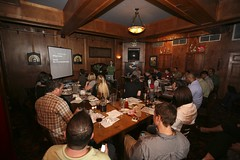

- 

Some mornings you wake up, check HackerNews, mindlessly scroll up and down ... you upvote a few things, sometimes you even open the link, other times you just read a few comments. Meh. As exciting as scratching your ass. Today was not one of those days! At the very top was a story by David Peter, [Being Deaf](http://davidpeter.me/stories/being-deaf).

> This is a cry for normalcy, when so many others wish to be abnormal.

It's a story by a deaf guy who got a chance to work at a startup, a chance most startups wouldn't be willing to give I bet. Fundamentally it is a story about feeling left out of the normal buzz in the office. Either because you don't understand what everyone is going on about because you're deaf, or maybe you're working remotely ... sometimes you're just not very fluent in the language. Either way, you feel left out. A whole bunch of things happen at the office and you're just not there to experience them.In a sense it must be similar to the alienation founders sometimes feel, when the weight of the world is on you, how the hell can everyone chat about fart jokes when there's so much at stake? Now imagine you don't even know they're fart jokes, or what the hell everyone is laughing at. You just see them laughing and have no idea what's going on ... Ok you know what, I'm done butchering the story, or trying to pretend I have anything to say. Truth is, I am completely dumbfounded because I will _never_ be able to undestand what it's like. I'm living [life at the lowest difficulty level](http://whatever.scalzi.com/2012/05/15/straight-white-male-the-lowest-difficulty-setting-there-is/). Do me a favor, read [David Peter's post](http://davidpeter.me/stories/being-deaf). Even if it's the only thing you read today.

