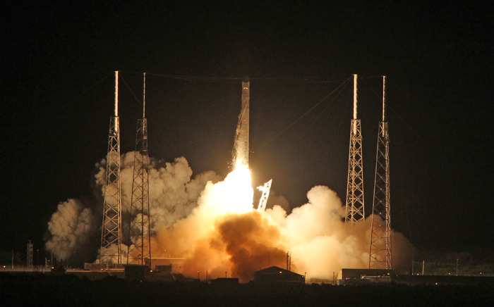

Two days ago [SpaceX launched a rocket](http://www.dailymail.co.uk/sciencetech/article-2147981/SpaceX-Falcon-9-launch-First-private-commercial-flight-takes-Cape-Canaveral-International-Space-Station.html). With it, hopefully, a new [space age](http://en.wikipedia.org/wiki/Space_Age "Space Age"). It's taken us **_70 years_** to go from _"Hey neat, our [V2 rocket](http://en.wikipedia.org/wiki/V-2 "V-2") can fly through space a bit"_ t_o_having the first commercial space mission - if I understand correctly the [Dragon capsule](http://www.spacex.com/dragon.php "Dragon (spacecraft)") is delivering some stuff to the [International Space Station](http://en.wikipedia.org/wiki/International_Space_Station "International Space Station"). Ever since I was a kid I have been watching science fiction promising all manner of stuff and watching the world of advanced science languishing at the point of [Space Shuttles](http://en.wikipedia.org/wiki/Space_Shuttle "Space Shuttle") ... then shutting down even that. Finally! Something is happening again, I'm as excited as a little kid! Sure, I can't expect to become a space pirate, hop on a [Firefly](http://www.imdb.com/title/tt0303461/ "Firefly (TV series)") and smuggle some freight around the galaxy any time soon. But at least it's something! \[caption id="" align="alignnone" width="672" caption="Firefly Serenity"]\[/caption] After the billion dollar acquisition of a photo sharing iPhone app, I felt a bit disappointed. Congratz to those guys for changing the lives of many, but do we really want to encourage that sort of behaviour? As I've said on [HackerNews](http://en.wikipedia.org/wiki/Hacker_News "Hacker News"): _"Definitely the best tech startup on the planet. Those of us doing "web stuff" can go hide in shame."_ The upvotes say many others agree too. And you have to keep in mind this is _the next big web app thingy_ central. Where all us "entrepreneurs" gather and shoot the shit. If those guys agree "web stuff" is kind of lame, you know there's something big going on here.We have refined everything, commoditized every tiny bit of technology we could. It's time for another big breakthrough - isn't that what the beginnings of new centuries are for anyway?I want something new and exciting to happen. The 19th century had its railroads. The 20th century had its airplanes (and to an extent cars). I want the 21st century to have _rockets_ and _space_. Wouldn't it be awesome if within our lifetimes we could make regular trips to the orbit? Now excuse me while I go work on "web stuff" so I'll be able to afford the rent of that first Space Orbit Hotel that's bound to spring up some time soon. \[caption id="" align="alignnone" width="560" caption="SpaceX launch"]\[/caption]

###### Related articles

- [SpaceX spaceship chasing space station in orbit](http://www.foxnews.com/scitech/2012/05/23/spacex-commercial-spaceship-chasing-space-station-in-orbit/?intcmp=features) (foxnews.com)
- [SpaceX capsule completes first tests before ISS docking](http://www.space-travel.com/reports/SpaceX_capsule_completes_first_tests_before_ISS_docking_999.html) (space-travel.com)
- [SpaceX Launches Falcon 9 Dragon on Historic Mission](http://www.space-travel.com/reports/SpaceX_Launches_Falcon_9_Dragon_on_Historic_Mission_999.html) (space-travel.com)
- [SpaceX in final countdown for second ISS Dragon attempt](http://www.slashgear.com/spacex-in-final-countdown-for-second-iss-dragon-attempt-22229300/) (slashgear.com)
- [SpaceX Dragon successfully launches: New age of private spaceflight](http://www.slashgear.com/spacex-dragon-successfully-launches-new-age-of-private-spaceflight-22229304/) (slashgear.com)

