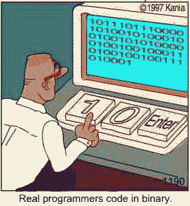

Programmers are the most optimistic bunch of people I have ever come across. Ask us how long something will take and chances are our estimates will be way off. \[caption id="" align="alignright" width="277" caption="English: Programmer (Photo credit: Wikipedia)"]\[/caption]It's not because we hate you. It's not because we didn't know any better, either. We're just very optimistic about everything. The project, our skills, the tech, your specs, the unknown unknowns ... Especially the unknown unknowns are a big problem - it's impossible to predict everything that might go wrong. The variables are just too many. Right now it looks like we can do This (tm) in an hour, but a weirdness or twenty and suddenly it's taking a whole day. As programmers we assume the least complications, even when multiplying by Pi. But there's another profession that gives a lot of predictions in the face of uncertainty - doctors. When a doctor gets their estimates wrong, people are often delighted. What? Let me tell you a tale of two estimates - a conservative and a programmer estimate.

## A tale of two estimates

Last Friday I messed up my shoulder, more specifically that tiny little joint between my clavicle and shoulder. I was longboarding, did something wrong and landed on tarmac. Hard. In the morning I had to use my left hand to eat breakfast. Couldn't even pick up a spoon. At the ER the doctors told me that hey, the bones and joint seem fine (no dislocation etc.), but I must have messed up my tendons something bad. What I can expect is three weeks of pain and problems. _"Just take some painkillers if it gets too bad"_, they said. Today, 6 days later, my shoulder is already at 90%. Clenching my teeth just a little, I could do 60 of my usual 150 pushups this morning. Even [jumping rope](http://en.wikipedia.org/wiki/Skipping_rope "Skipping rope") wasn't much of an issue. Yesterday I could even carry a four kilogram longboard in my right arm for extended periods of time. In a day or two I will be fully healed, but essentially **the doctor's estimate was off by almost a factor of 3_._** And I couldn't be happier, it's brightened my whole day up!

### A programmer's estimate

I'm working on [a web page segmentation algorithm](http://swizec.com/blog/web-page-segmentation/swizec/4364 "Web page segmentation"). The idea is to take a website and decide which parts are headers, sidebars and so on. It's an interesting problem since everyone else is only concerned with extracting the main juicy content. The algorithm finally started working earlier this week, just a matter of merging the results back into the original [HTML](http://en.wikipedia.org/wiki/HTML "HTML") so they can be useful. _I'll have it by Friday morning_, I said. I mean how hard can it be? I'm just using a language I hate (java), am not experienced with, a [paradigm I dislike](http://swizec.com/blog/my-brain-cant-handle-oop-anymore/swizec/4320 "My brain can’t handle OOP anymore") and try to avoid, and a library I only started poking at two weeks ago. Surely I can do a task I don't fully understand by Friday morning! It's the estimate that popped into my mind when I tried to pull something out of my arse, so it must be correct. I've been a programmer for ages! Nope, didn't get it done. Turns out I didn't understand the object hierarchy of [boilerpipe](https://code.google.com/p/boilerpipe/) - took me many hours just to extend the relevant functions of a particular object. Then I found out the HTML parser I'm using is linear, so there is no clear way of deciding which child nodes belong to what [parent node](http://en.wikipedia.org/wiki/Tree_%28data_structure%29 "Tree (data structure)"). In the end I spent all of my time just figuring out how to add the algorithm's results to the HTML in the crudest way possible - add a number in front of every node in [the DOM](http://en.wikipedia.org/wiki/Document_Object_Model "Document Object Model"). Well oops.

## Programmers are optimists

Whenever you talk to a programmer, just remember, they are an optimistic bunch. Yes, even the most disheartened scruffy old programmer is insanely optimistic. We are the kind of person who:

-   Dives into a project with a spec _that will change_
-   Grabs a bunch of unknown tools, applies them to an unknown domain ... and wins
-   Lies in a different world with every new project
-   Changes all their tools every couple of years

Anyone who isn't an optimist just can't survive as a programmer. How many other professions can say that about themselves?

###### Related articles

-   [Top 7 Programmers bad habits](http://www.javacodegeeks.com/2012/05/top-7-programmers-bad-habits.html) (javacodegeeks.com)
-   [The Unknown Unknowns](http://www.skepticblog.org/2012/05/22/the-unknown-unknowns/) (skepticblog.org)
-   [Be a Paranoid Pessimistic Programmer](http://grokcode.com/722/be-a-paranoid-pessimistic-programmer/) (grokcode.com)
-   [Unknown Unknowns...](http://caroldekkers.wordpress.com/2012/04/10/unknown-unknowns/) (caroldekkers.wordpress.com)
-   [On software communities, "Rock star" programmers, and... Linus](http://blog.samuellevy.com/index.php?p=post&id=15) (samuellevy.com)

