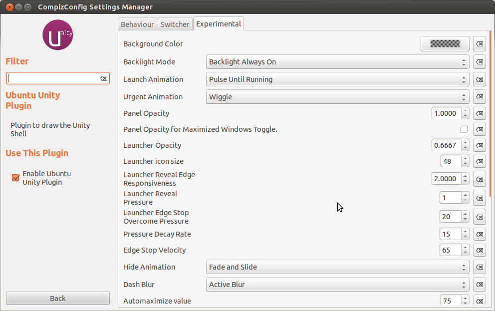

\[caption id="" align="alignright" width="300" caption="A Unix Desktop Environment (Photo credit: Wikipedia)"]\[/caption]

["Screw the power users"](http://nick.typepad.com/blog/2012/05/screw-the-power-users.html) wrote [Nick Bradbury](http://nick.typepad.com/ "Nick Bradbury") about catering both to power users and normal people. The more he improved his product and made it provably better, the more did power users complain about every new release and lost "feature". Loudly.

> Sales went up, but positive feedback went down.

His market targeting was off. But not in the way he thinks it was - the idea that power users need a lot of dials and knobs to play with to make a product juuuuust the way they like ... is wrong.

I am a power user. When a piece of software fits me, I _use_ it.

You know those mythical people who use your product every day, several hours a day, tell all their friends and publish blogs on the topic? That's me. I'm that kind of power user.

I **hate** changing settings with a passion.

Software is a tool. I'm using it to _do_ something. I don't want to play around with the tools I use, I want to use them.

When your software makes me want to change a setting, I want to punch you in the face. Every time I want to punch you in the face you lose me a little bit as a user. Too many punches and I _will_leave in search of greener pastures, looking for a tool that fits my use case perfectly.

There was a time when most of my days were spent configuring everything I use to make it juuuust right. At 15 I discovered [Linux](http://en.wikipedia.org/wiki/Linux "Linux"). Linux is awesome because it gives you more than enough rope to hang yourself with.

I could spend hours upon hours making sure my [desktop environment](http://en.wikipedia.org/wiki/Desktop_environment "Desktop environment") was using the perfect rendering engine. I would spend hours making sure all the effects were just right and that the toolbar was on the correct side and that my sound was just perfect and that the window decorations were perfect and ...

Nowadays I don't even change my wallpaper anymore. It took me two years to change the wallpaper on my iPhone from some random picture my sister set within 2 minutes of _"Ooooh, can I look at your new phone?"_

Tools should have defaults that are Good Enough (tm). If the tools you make aren't perfect out of the box, I will simply look for a tool where I'm the target user specifically.

Because when a maker is targeting _me_ as the user, then I can put my trust in them (usually expressed in terms of a credit card transaction). I can be sure a tool won't suddenly stop fulfilling my use case and go a different direction.

Being the target user is _awesome_.

In short, the more configuration you have, the less you know who your target customer is, the less confidence I have in you as a user.

\[caption id="" align="alignnone" width="694" caption="Seriously?"]\[/caption]

###### Related articles

- [Screw the power users](http://nick.typepad.com/blog/2012/05/screw-the-power-users.html) (nick.typepad.com)
- [The debate over share buttons on blogs](http://rc3.org/2012/05/30/the-debate-over-share-buttons-on-blogs/) (rc3.org)
- [Sandboxing will 'disadvantage Mac users,' say developers](http://www.macworld.com/article/1166997/sandboxing_will_disadvantage_mac_users_say_developers.html) (macworld.com)
- [Zemanta Power User - Stuart Aken](http://www.zemanta.com/blog/zemanta-power-user-stuart-aken-2/) (zemanta.com)
- [Are You A Facebook Power User? New Chart Will Tell You The Answer](http://www.simplyzesty.com/facebook/are-you-a-facebook-power-user-new-chart-will-tell-you-the-answer/) (simplyzesty.com)
- [Beta testers wanted for our new iOS app](http://blog.inklingmarkets.com/2012/05/beta-testers-wanted-for-our-new-ios-app.html) (inklingmarkets.com)

