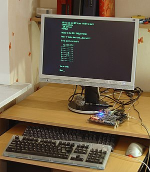

So you want to create a [programming language](http://en.wikipedia.org/wiki/Programming_language "Programming language")? Awesome! \[caption id="" align="alignright" width="300" caption="English: Male superhero placeholder with copyright symbol (Photo credit: Wikipedia)"]\[/caption] Should you do it? Definitely not. Better yet, go ahead, but don't take it lightly. When I created my first programming (scripting? is there even a difference?) language I was about 17 - a lovely templating language that through a series of regexes was transformed into PHP code. Had everything from variables to functions and loops. Wonderful. My next foray into language creation was about two years ago. Older and wiser, I knew I wanted to create _"a lisp without parentheses"_. Cool huh? Failed as soon as I realized I don't know how to parse "if this then if this then that else that" Remember, no parentheses.

## Building a real compiler

This semester I _jumped_ at the chance to take a compilers class - we built a compiler for a stripped down version of Pascal. Practically from scratch. Turns out that _"if this then if this then that else that"_cannot be parsed with a linear grammar - you need an "elif" construct or parentheses. Using a recursive grammar would be too slow. Writing a compiler is fun! And by fun I mean it makes you feel like driving a metal rod through your brain. It's fun in that rewarding _Holy crap, did I just survive that!? I survived \_that\_? Damn._ \[caption id="" align="alignright" width="300" caption="Parse tree of Python code with inset tokenization (Photo credit: Wikipedia)"]\[/caption] The complexity is immense. The difficulty of discovering there's a problem at all ... even immenser. A compiler works in several stages:

1. **Lexical analysis** - parses out comments and whitespace, unifies the language used (a list of lexemes, you use JFlex or something)
2. **[Syntactical analysis](http://en.wikipedia.org/wiki/Parsing "Parsing")** - checks the syntax is correct and builds the [Abstract Syntax Tree](http://en.wikipedia.org/wiki/Abstract_syntax_tree "Abstract syntax tree") (using a linear grammar with a tool like java_cup)
3. **[Semantic analysis](http://en.wikipedia.org/wiki/Compiler "Compiler")** - takes care of the semantics of the language (only call functions, supply correct parameters etc. - type checking)
4. **Frames** - essentially memory management. Give functions some breathing space, pointers to their memory and so on.
5. **[Intermediate code generation](http://en.wikipedia.org/wiki/Code_generation_%28compiler%29 "Code generation (compiler)")** - this stage turns the AST into a tree of assembler-like instructions
6. **Code linearization** - next step is to change that tree into a linear set of instructions, make sure registers are used well and so on. At this point you can run an interpreter.
7. There are a few more stages before reaching [machine code](http://en.wikipedia.org/wiki/Machine_code "Machine code"); luckily we stopped here.

The really fun part is that, given a random issue, any of those stages can be the problem. Even though separately they all look like they're working perfectly.

## The debugging

The debugging ... oh god the debugging. This relatively simple compiler is beyond a doubt the toughest little bastard I have ever had the pleasure of fixing. For starters, you don't even know if there is or isn't a bug. Your only chance at debugging (and finding the bugs in the first place) is to write code in the target language and hope they break something.

1. Compile the compiler, see Java devours it and all is well
2. Run the compiler, there are no runtime errors
3. Write some code in the target language
4. Compile+run with your compiler/interpreter

One of two things will happen. The code will run smoothly and output the correct result. \[caption id="" align="alignright" width="300" caption="FPGARetrocomputing (Photo credit: Wikipedia)"]\[/caption] Or there will be a syntax error. Or a semantic error. Or the result will be simply _wrong_. You now have to carefully look through the example code and decide that it is in fact correct, written properly and _should_ work. Remember, you cannot test it anywhere else, because you are creating the compiler. In a class setting, your mates can help with their compilers (which are also be buggy), if you're creating a new language - you're on your own. Once you've decided the target code is correct it's time to look through your compiler. In the case of syntax/semantic errors the task is simple - look at the output of the appropriate stage and decide that after several months of everything working, hey your grammar is actually wrong. Or hey, your [type checker](http://en.wikipedia.org/wiki/Type_system "Type system") is actually doing that one thing wrong. Or maybe your name checker is being silly ... whatever. Easily fixed. The really nasty buggers are those logical errors - the code didn't come up with the right result. There is no real symptom to look at. Your only hope of success is carefully inspecting the [intermediate code](http://en.wikipedia.org/wiki/Bytecode "Bytecode") and seeing if anything looks wrong. Even once you've found the problem, there's still the issue of what's actually causing it. For instance: I was chasing a bug for _days_. Arrays were overwriting their neighbours in a record ... turns out my sample code wasn't properly reserving memory and shouldn't be working anyway. That was fun.

## Superheroes

And keep in mind that finding the bugs in the first place is **really hard_._**The professor gave my very buggy compiler a 100%. Simply because every program _he_ ran worked. That's why it can take decades to discover a bug in a compiler used by millions of people. And how many buggy compilers are out there when people just assume their code is the problem and change it? Seriously, the people out there who make compilers and languages used by millions of people are _superheroes._ I can't imagine doing that and keep even a semblance of my fragile sanity. 

###### Related articles

- [A Neat Trick with Partial Evalutors](http://scientopia.org/blogs/goodmath/2012/06/10/a-neat-trick-with-partial-evalutors/)

  * * *

- [The Design of LLVM](http://www.drdobbs.com/architecture-and-design/240001128)

  * * *

- [Helvetica Superheros, Seriously](http://theindustry.cc/2012/05/14/helvetica-superheros-seriously/)

  * * *

- [Compilers](http://nearfetching.wordpress.com/2012/04/28/compilers/)

  * * *

- [Maximo Scripting: Script compilation and caching](https://www.ibm.com/developerworks/mydeveloperworks/blogs/a9ba1efe-b731-4317-9724-a181d6155e3a/entry/maximo_scripting_script_compilation_and_caching1)

  * * *

