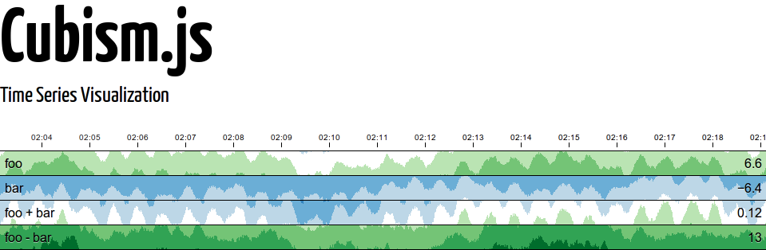

[StatsD](https://github.com/etsy/statsd) is "_A network daemon that runs on the [Node.js](http://nodejs.org/) platform and listens for statistics, like counters and timers, sent over [UDP](http://en.wikipedia.org/wiki/User_Datagram_Protocol) and sends aggregates to one or more pluggable backend services"_ I've previously mentioned StatsD in _[Your startup needs a dashboard](http://www.zemanta.com/fruitblog/your-startup-needs-a-dashboard/)_ over at Zemanta's fruitblog. The idea behind StatsD is this:

1. Stuff happens
2. Send metrics of "stuff" to a central service (StatsD)
3. StatsD acts as a buffer, forwards aggregated metrics every X seconds

Your architecture now has a central service that collects all of your metrics, then pushes them to appropriate software, that doesn't need to handle too much traffic and is guaranteed data will come from a single source in a sanitized format. \[caption id="" align="alignnone" width="367" caption="A software architect's dream"]\[/caption]

## Straight from the browser?

Collecting data into StatsD works wonderfully. It's fast, reliable, extremely robust and you can give it just about any data you can think of. Unless your client is a browser. See, StatsD only accepts UDP packets and browsers don't let you send UDP packets. There's a valid excuse for this - it doesn't matter if some packets are lost, as long as whatever you're measuring isn't slowed down by the measuring. To solve this I created a simple proxy in node.js. It accepts normal HTTP requests and pushes data onward to StatsD. The simplicity, I hope, ensures speed. The API is a simple tracking pixel:

```

```

Where _type_ is one of _c_(counter)_, t_(timer)_, g_(gauge)_._ As per StatsD naming convention. And _bucket_ is simply the name of your metric. [The source](https://github.com/Swizec/personal-dashboard/blob/master/collectors/js_proxy/server.js) is on github. Feel free to use it.

## Straight to the browser

Ok, so now we can collect data from the browser ... but I want to send it directly to a browser as well. None of that [Graphite](http://graphite.wikidot.com/) stuff - I want to use some other fancy graphs and visualisations. Just because. To solve this problem I implemented a socket.io backend for StatsD. It, also, can be found on github -> <https://github.com/etsy/statsd/pull/102> Hope the pull request gets merged soon, or at all for that matter. I really think this is a useful addition to StatsD because it means you can use whatever client-side javascript to do visualisations. In near real-time and all that. The data is sent over in a simple format:

```
{perSecond: {bucket1: 0.2,
             bucket2: 0.1
             },
 counts: {bucket1: 2,
          bucket2: 1
         },
 timers: {timer1: {upper: 2.4,
                   lower: 1.2,
                   count: 10}
         },
 gauges: {gauge1: 10
          },
 statsd: {numStats: 6},
 timestamp: }
```

## The goal?

If all goes well, I will soon be able to use cubism.js to draw a pretty timeseries of the traffic on this blog. And hey, who knows what else I can think of to add to a personal dashboard of my life ... I now have the basic framework. Time to start using it. [](http://square.github.com/cubism/)

###### Related articles

- [](http://www.zemanta.com/fruitblog/your-startup-needs-a-dashboard/)[Your startup needs a dashboard](http://www.zemanta.com/fruitblog/your-startup-needs-a-dashboard/)

  * * *

- [](http://www.slideshare.net/quipo/scalable-architectures-taming-the-twitter-firehose)[Scalable Architectures - Taming the Twitter Firehose](http://www.slideshare.net/quipo/scalable-architectures-taming-the-twitter-firehose)

  * * *

- [](http://oubiwann.blogspot.com/2011/06/txstatsd-preview.html)[txStatsD Preview](http://oubiwann.blogspot.com/2011/06/txstatsd-preview.html)

  * * *

- [](http://blog.artillerygames.com/2012/06/websocket-performance.html)[Experiments with WebSocket Performance (for HTML5 games)](http://blog.artillerygames.com/2012/06/websocket-performance.html)

  * * *

- [](http://obfuscurity.com/2012/05/A-Foolishly-Sensible-Proposal-for-Graphite)[A Foolishly Sensible Proposal for Graphite](http://obfuscurity.com/2012/05/A-Foolishly-Sensible-Proposal-for-Graphite)

  * * *

- [](http://37signals.com/svn/posts/3185-link-our-implementation-of-statsd)[LINK: Our implementation of Statsd](http://37signals.com/svn/posts/3185-link-our-implementation-of-statsd)

  * * *

[](http://www.zemanta.com/?px "Enhanced by Zemanta")