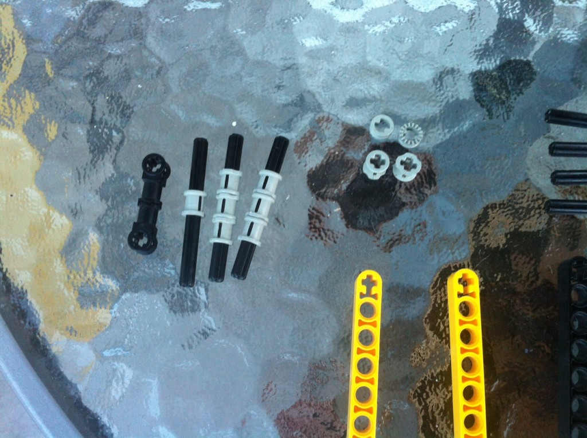
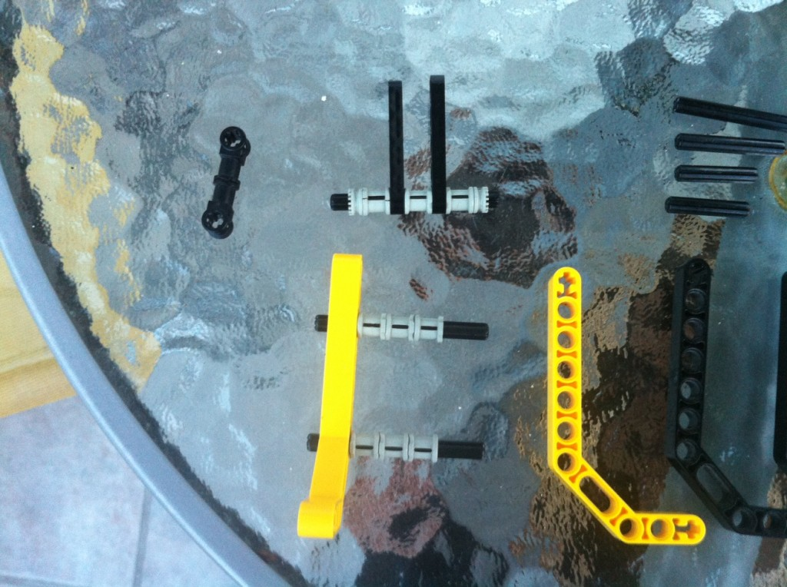
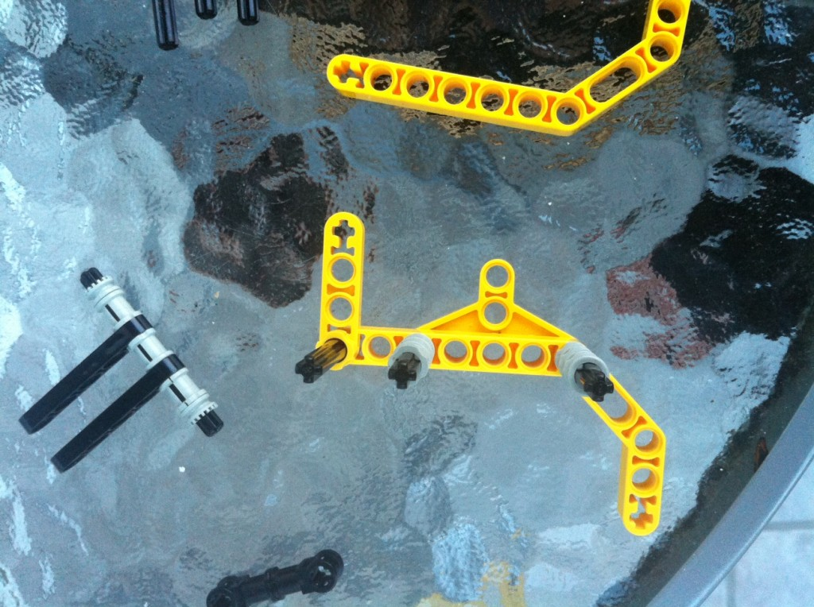
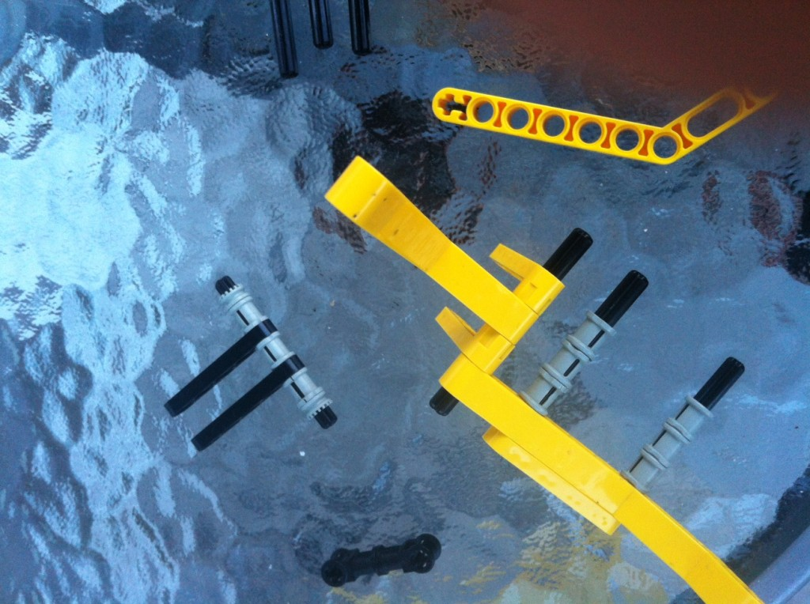
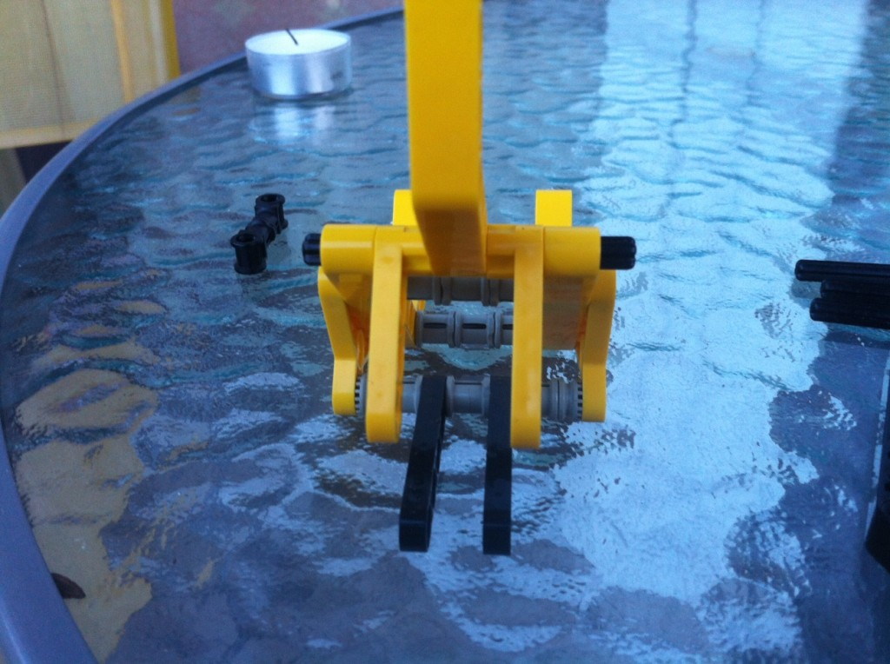
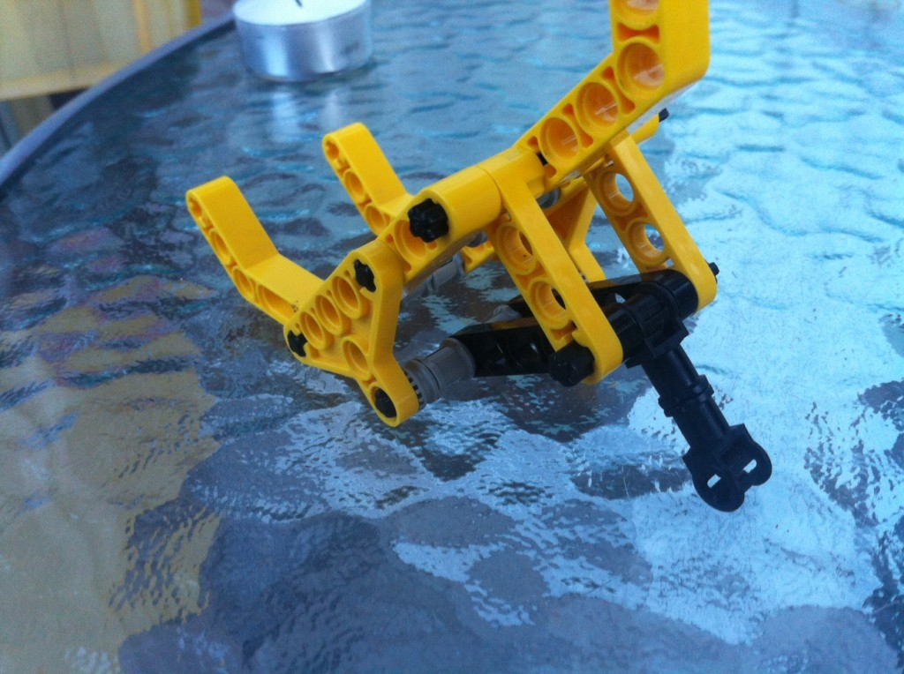
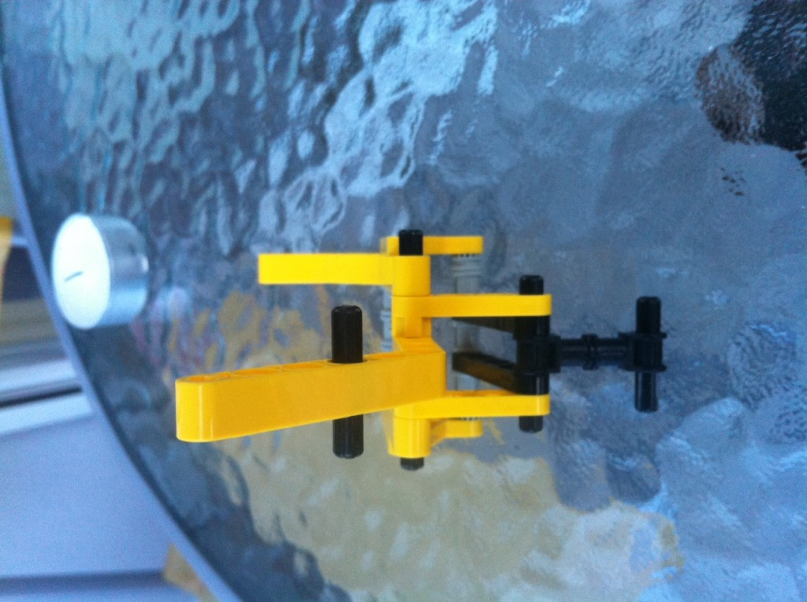
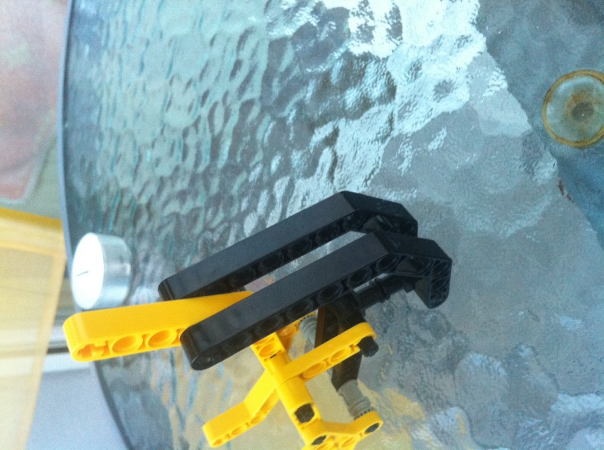
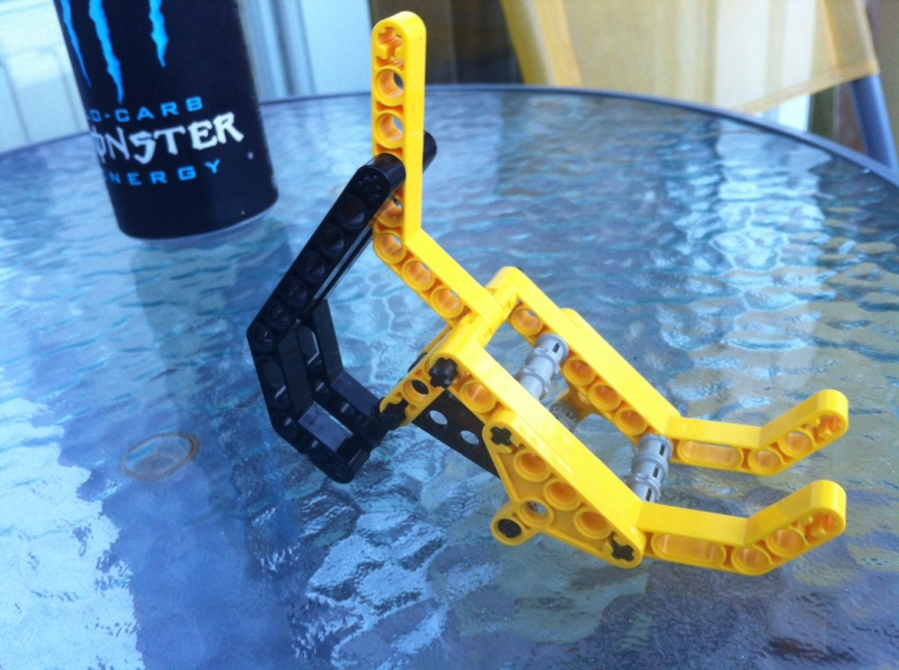

 Today I finally got fed up with the _"Make my [iPad](http://www.apple.com/ipad/ "iPad") stand up"_ dance. You know the one: _Leeeaaan the iPad ever so carefully against a stack of books. Slides. Falls. No good._ _Ok, maybe if I put some rubber bands under so it won't slip ..._ _Nope._ _Maybe if I wedge it juuuuust right between the notebook and the books ..._ After two years of dancing this dance - and being too cheap to buy a proper stand - I finally realized some of my [LEGO](http://www.lego.com/ "Lego")'s possess the perfect angles to prop it up just right.

## The LEGO iPad stand

After ~40 minutes of tinkering I had a stand. A simple, dare I say elegant?, stand. Only 30 pieces. Even the colours match so it's definitely the most beautiful LEGO creation I have ever made! The angle did in fact turn out perfect. The whole thing is even sturdy enough to withstand wild tapping and swiping conditions. For bonus points, an iPhone also fits (I didn't plan this one). Here's how you can make one yourself: \[caption id="attachment_4677" align="alignnone" width="717" caption="Step 0: Get some LEGO's"]\[/caption] \[caption id="attachment_4678" align="alignnone" width="717" caption="Step1: put some spacers together"]\[/caption] \[caption id="attachment_4679" align="alignnone" width="717" caption="Step2: Spacers go in the big yellow bit"]\[/caption] \[caption id="attachment_4680" align="alignnone" width="717" caption="Step3: Start assembling the legs"]\[/caption] \[caption id="attachment_4681" align="alignnone" width="717" caption="Step4: this is where the iPad rests"]\[/caption] \[caption id="attachment_4682" align="alignnone" width="717" caption="Step5: finish assembling the main body"]\[/caption] \[caption id="attachment_4683" align="alignnone" width="717" caption="Step6: attach the main leg"]\[/caption] \[caption id="attachment_4684" align="alignnone" width="717" caption="Step7: two more placeholders"]\[/caption] \[caption id="attachment_4685" align="alignnone" width="717" caption="Step8: add the main weight supports"]\[/caption] \[caption id="attachment_4686" align="alignnone" width="717" caption="Enjoy your new iPad stand"]\[/caption]

###### Related articles

-   [SPIGEN SGP Ultra Thin Case for the New iPad, Review](http://www.geardiary.com/2012/06/18/spigen-sgp-ultra-thin-case-for-the-new-ipad-review/)

    * * *

-   [LEGOs and iPhones in Infinite Combinations](http://techie-buzz.com/innovations/legos-iphones.html)

    * * *

-   [Usability Testing On The iPad | Loop11](http://www.loop11.com/testing-on-ipad/)

    * * *

-   [New iPad Accessories from SMARTdesks - armPad iPad arm and iDrawer iPad Security Compartment](http://www.prweb.com/releases/2012/6/prweb9580848.htm)

    * * *

