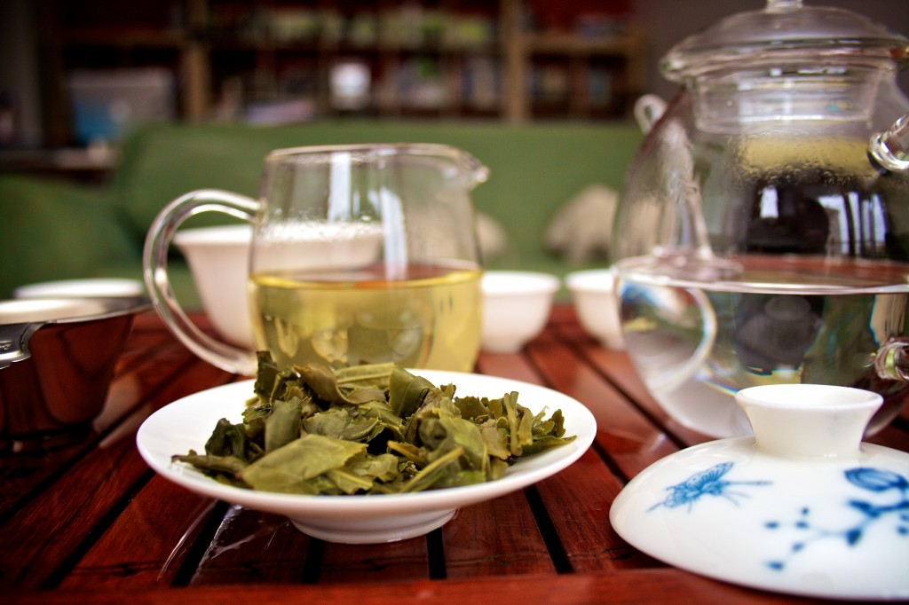
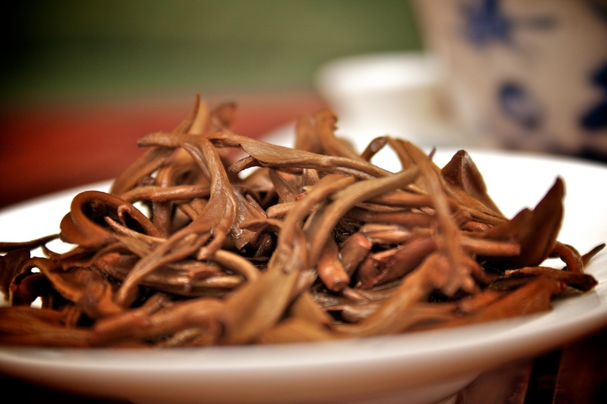

I rarely see an office without a coffee machine nowadays. Coffee machines are cheap. Some companies even provide them for free if you buy a certain amount of coffee from them on a regular basis. If there is no espresso machine at hand, office workers can get their daily fix the old school way - in the office kitchens. Freelancers who work at home and often struggle to meet crazy deadlines are no exception to this rule.

\[caption id="attachment_4740" align="alignnone" width="614" caption="Being a tea drinker is cool. Most people drink coffee, but you are not most people, right?"]\[/caption]

## Coffee as a routine

Coffee _de facto_ is the fuel on which a lot of IT folks, including designers and coders, rely on. This is due to this beverage’s caffeine levels, but also - and this is not to be neglected - making and drinking coffee becomes a habit. Following the daily routine alone delivers the “expected” stimulating effects. Try tricking your co-workers with a cup of decaf next time. Make sure it tastes the same as their regular brew, and you’ll see that it works. They’ll be happy and “energized”. Placebo is a powerful thing.

In a nutshell, drinking coffee at work is all about:

- Having a short break (stretching your legs while getting your fix of caffeine).
- Socializing with fellow co-workers (a cup of coffee can create a very cozy and friendly context).
- Enjoying the known taste, smell, and a warm feeling captured in a small cup (you’re used to certain stimulants which give you an instant pleasure).
- Caffeine intake and its effects on the body.

## All these can also be achieved with a cup of tea

More \\importantly, there are benefits which only tea can deliver, such as:

- Drinking tea is healthier and has more positive effects on your body than drinking coffee.
- With tea, you get several hundred different flavors and aromas to experiment with. It never gets boring.
- In addition to caffeine, tea contains theanine. This combination gives you a prolonged energizing boost and helps you concentrate during intellectually demanding activities like research, coding, etc.
- Being a tea drinker is cool. Most people drink coffee, but you are not most people, right?

## Tea. It's what winners drink

Tea originates from China and for thousands of years Chinese philosophers, leaders, and monks have been drinking tea in order to keep on top of their work and stay alert for long periods of time. Their choice was grounded in personal experience and tradition.

\[caption id="attachment_4741" align="alignnone" width="614" caption="Monks traditionally rely on tea in order to maintain a state of mindful alertness during meditation."]\[/caption]

Today science tells us that the unique combination of [L-theanine](http://en.wikipedia.org/wiki/Theanine "Theanine") and caffeine is what makes tea such an amazing beverage. L-theanine is an amino acid that promotes mental acuity. Caffeine _per se_ - from coffee or coke - is no match for the energizing power of the combination of theanine and caffeine. What is more, L-theanine will boost your brain’s alpha activity which will make you more creative and will increase your performance under stress.

Sip on your tea throughout the day and you’ll become a true multi-tasker. As a rule, three cups of tea is more than enough to achieve a high enough degree of alertness. Your ability to focus will gradually build up, peaking in about 80 minutes. After that just relax and put another kettle on.

## Tea bags and additives: adding value or losing it?

I ditched tea bags (aka tea filters) several years ago. You should do the same and go for loose tea. And here’s why.

First off, no paper is 100% fragrance-free, and it will always impact the smell and flavour of the original tea. I don’t like that. Also, when tea is processed on a huge scale, i.e. in tea factories, this is how it usually goes: 1st grade stuff is packed and sold as premium loose tea, 2nd grade as loose tea, and what is left - leaf and stalk fragments along with some tea dust - is chopped up and put into tea bags, usually as blends. I’m not saying that this is always the case. Some tea traders do put quality leaves into bags too, but, more often than not, tea bags in tea industry are akin to sausages in the realm of meat. Sausages can be good, but a real steak is always better if you’re into high-quality proteins and upscale cuisine.

Artificially flavoured teas are also a definite no-no for me. First of all, it just feels wrong to have anything synthetic in my cup of tea. Secondly, most artificially flavoured teas use low-grade leaves as a base into which they infuse the flavor. I don’t like drinking 3rd class tea, and I certainly don’t like strong artificial aftertaste in my mouth. Vanilla and chocolate extracts are commonplace in western cuisine. Unfortunately, this gets people hooked onto strong, overly exaggerated flavours, and many come to think of naturally flavoured foods as bland or watery. For some people it makes sense to use flavour enhancements in ice cream, desserts, etc. But, seriously, leave them teas alone!

Try to learn to appreciate the natural taste and fragrance of _Camellia Sinensis_ - [the plant which all teas come from](http://eng.daoli.eu/understanding-tea/ "All teas come from the same plant of the Camellia family."). With hundreds of different processing techniques that are available to modern tea manufacturers, the variations in taste, texture, and feel become virtually limitless. It takes time to develop an appreciation of the natural flavor of tea, but once you get into it, you’ll never go back.

If you really can't live without flavour enhancements, try looking for naturally flavoured teas, such as green tea with jasmine or _ginseng wulong_. Do make sure that these flavours are, in fact, natural, since a lot of such tea in stock is not organic.

I also never add milk or sugar to my tea. Try that in China and people might think that you are weird. The reason why they never do it is simply because they don’t need to. Chinese have the opportunity to enjoy some of the world’s best teas that taste just great without any additives. But if adding a bit mint, ginger, or even pieces of fruit to your cuppa helps you enjoy your tea even more, then good for you! This is, after all, a matter of personal preference.

## Which tea and where to buy?

You can't buy happiness, but you could buy tea. And in my book that's kind of the same thing. Just follow a few rules and you’re all set:

- Buy different kinds of loose tea (_green, wulong, black, pu’er_).
- Buy from several different sources on- and offline.
- Don’t let the price tag become the only decisive factor. Buy cheap and pricey tea (and you’ll be amazed how sometimes price has nothing to do with the quality).
- Feel free to experiment with steeping temperature and duration.
- Try to describe the taste, aroma, and “feel” of your tea. See how your impression compares to that of your friends, colleagues, and family.
- Sharing your tea with friends can lead to amazing discoveries in the world of tea and beyond.

## Are you uppa for a cuppa?

You can steep and enjoy your tea in a number of ways. At home, when there are friends around and no one’s in a rush, [_gongfu_ method](http://eng.daoli.eu/culture-of-tea-drinking-impressions-from-hosting-tea-parties/ "Try using gaiwan and let your teas shine.") is the way to go. People appreciate the traditional Chinese way of conducting a tea ceremony. Having a complete tea setup and knowing some basics of _gaiwan_ brewing can really let your teas shine.

The _gongfu_ method is supposed to take hours, so there is no way to incorporate it into the busy office life. I prefer using either a glass mug with filter or a classic one-liter glass bottle for my daily office brews. Mugs with filters are cool for desktop-based work. I just throw a spoonful of leaves into the glass filter, add some water, and that’s about it. If I use a glass bottle, I throw in the leaves and fill it with water. As long as it’s not a delicate _dianhong_ - or any other tea that goes bitter after extensive steeping - you can always keep the leaves in the bottle and just refill as you go. That’s how many Chinese drink their at work these days. Many of them care so little about appearances that they simply use the jars previously held jam of pickled cucumbers.

Do not complicate your office life with water temperatures and steeping times. The most \\important thing is that you give your tea leaves enough room to open. And as long as you don’t over-steep it and make it bitter, it’s ok. If you want to deepen your understanding of any particular tea, take your time and do it the _gongfu_ way. But in the office - anything goes.

\[caption id="attachment_4742" align="alignnone" width="614" caption="Dianhong buds after brewing. They require enough room and water to open."]\[/caption]

## Hot or Iced?

People often ask me “How can you drink hot tea in summer?”. To which I usually say “How can you drink hot coffee in summer?”. :) Even the Bedouins in the desert take their tea (and coffee) hot, so why shouldn’t we do the same?

Most of the time I drink my tea hot, but I like it iced too, especially on hot summer days. Here’s how you make it: throw some loose tea leaves into a bottle, pour a bit of hot water over them and let them steep for about 45 secs. Then fill the bottle with cold water and put it in the fridge. Let it cold-steep for an hour or two, and your iced tea is ready.

## Office tea in Slovenia

As an office worker and a tea aficionado, I am interested in how the culture of tea drinking is evolving in the cubicle world. In my office, tea is always available, but when I go out for meetings, it’s sometimes difficult to get.

In Slovenia, I’m always offered coffee, and if I ask for tea instead, I usually get a tea bag or a herbal infusion, not a real tea. Some office kitchens do stock “classic” \[put a name of your favourite tea multinational here] bagged blends and aromatized teas in their drawers. However, expecting your Slovene business host to serve you quality loose and unflavoured tea in their offices is more a wish than reality.

This is kind of sad. Tea is such an amazing beverage. It’s got rich traditions and interesting history. It’s healthy and it makes you feel good. It’s also a perfect choice for an office environment. That’s why I’d like to make tea a part of your life too.

I’d love to hear about how and where you brew your cuppa. Feel free to leave comments, questions, and suggestions below this post.

\*

_This guest blogpost was written by [Miha Jesenšek](https://plus.google.com/115689353638738570665?rel=author "Miha's G+"). Miha runs a [Slovene media, research and counseling agency](http://ithinkthereforeiam.si/english/ "I think, therefore I am") devoted to helping his customers use new media and creative solutions in their businesses. With his friend Roman, he also co-runs Daoli - a small [tea business](http://daoli.eu "Daoli online Chinese tea shop") which deals directly with Chinese farmers and brings the best teas China has to offer to EU._

_Roman Kaplunov contributed reporting from Kunming, China._

All photos © by Miha Jesenšek

###### Related articles

- [Caffeine & Edibles : Incred-a-brew Direct Immersion Coffee Maker](http://www.thinkgeek.com/caffeine/accessories/ecf3/?cpg=wnrss)

  * * *

- [Vicodin with caffeine](http://christianabney.typepad.com/blog/2012/06/vicodin-with-caffeine.html)

  * * *

- [Tea](http://bunintheovens.wordpress.com/2012/06/20/tea/)

  * * *

