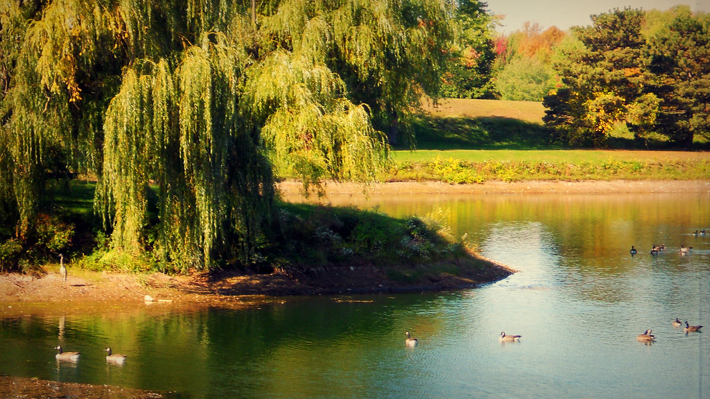

When somebody asks _"So what's The Valley like? Learned anything good?"_ I always respond with _"Yeah, the weather was awesome!"_

This disappoints people. They expect something ... profound ... something about startups, or products, or building companies. Anything but the weather.

But I really think the weather is a significant competitive advantage [Silicon Valley](<http://maps.google.com/maps?ll=37.37,-122.04&spn=1.0,1.0&q=37.37,-122.04 (Silicon%20Valley)&t=h> "Silicon Valley")'s got beyond others. Good weather for thinking is why Silicon Valley is the startup hub of the world. Not [London](<http://maps.google.com/maps?ll=51.5072222222,-0.1275&spn=0.1,0.1&q=51.5072222222,-0.1275 (London)&t=h> "London"). Not [Berlin](<http://maps.google.com/maps?ll=52.5005555556,13.3988888889&spn=0.01,0.01&q=52.5005555556,13.3988888889 (Berlin)&t=h> "Berlin"). Not [Ljubljana](<http://maps.google.com/maps?ll=46.0555555556,14.5083333333&spn=0.1,0.1&q=46.0555555556,14.5083333333 (Ljubljana)&t=h> "Ljubljana"). Not [New York](<http://maps.google.com/maps?ll=40.7166666667,-74.0&spn=0.1,0.1&q=40.7166666667,-74.0 (New%20York%20City)&t=h> "New York City"). Silicon Valley.

I'm in Ljubljana right now.It's early afternoon. 31°C outside. 33°C in the coldest room of the apartment. Around me - two large screens, a PC and a laptop. A fan is trying to blow my face off with warm air.

My mind reels in horror trying to think. It feels like I've smoked a gram of marijuana. Thoguhts aren't making sense. Sequence of events is meaningless. The passage of time barely detectable.

Here I am, sitting suspended in time with a keyboard and a word editor. I have rewritten the beginning of this post three times. After scrapping a whole post. Nothing I write makes any sense.

Now imagine I was an engineer working on a core part of your startup's architecture.

Or a marketer trying to write compelling copy to get new users.

Or a CEO trying to come up with a strategy.

Hell, an investor trying to decide if you're any good.

Imagine all those people acting stoned 16 hours out of every day. For two to three months. Every single year. The fact this heat makes most of them flee the city doesn't help either. Ljubljana looks like a deserted town right now. Everyone is either hiding or off to the seaside.

Everywhere in the world things grind to a halt in the summer - it's just too hot to think. Suddenly you have to multiply your plans by Tau rather than just Pi. Silicon Valley doesn't suffer from this problem. Mornings greet you with a nice 15°C and it gets up to about 26°C every day.

My room never goes under 25°C in the summer. Not even at night.

###### Related articles

- [There are six types of startups...](http://www.zdnet.com/blog/foremski/there-are-six-types-of-startups/1958)

  * * *

- [Silicon Valley Investor's TV Special Looks for Next Mark Zuckerberg](http://mashable.com/2012/07/01/20-under-20-transforming-tomorrow/)

  * * *

- [Silicon Valley vs. Silicon Alley -- Does it Matter?](http://www.forbes.com/sites/bhrigupankajprashar/2012/06/26/silicon-valley-vs-silicon-alley-does-it-matter/)

  * * *

- [Silicon Valley to Get New Patent Office](http://www.patspapers.com/story_stack/item/silicon_valley_to_get_new_patent_office/)

  * * *

- [10 Up-And-Coming Startup Hubs From Around The World](http://grasshopper.com/blog/2011/01/10-up-and-coming-startup-hubs-from-around-the-world/)

  * * *

